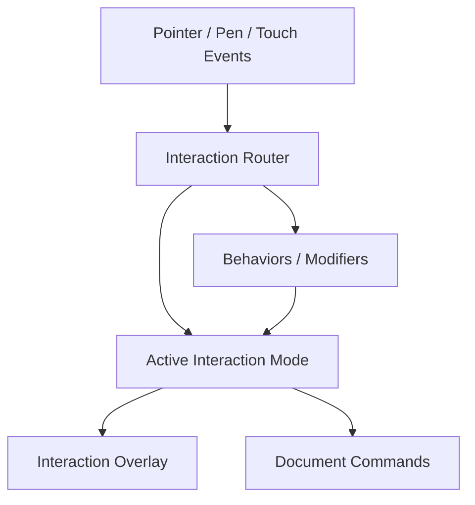
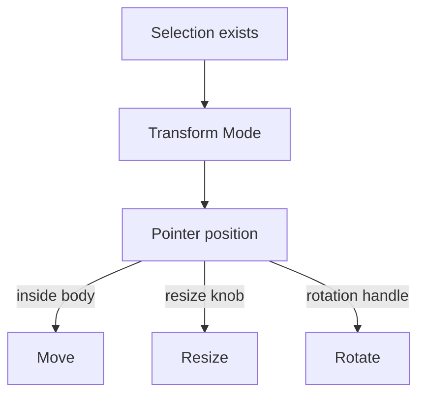
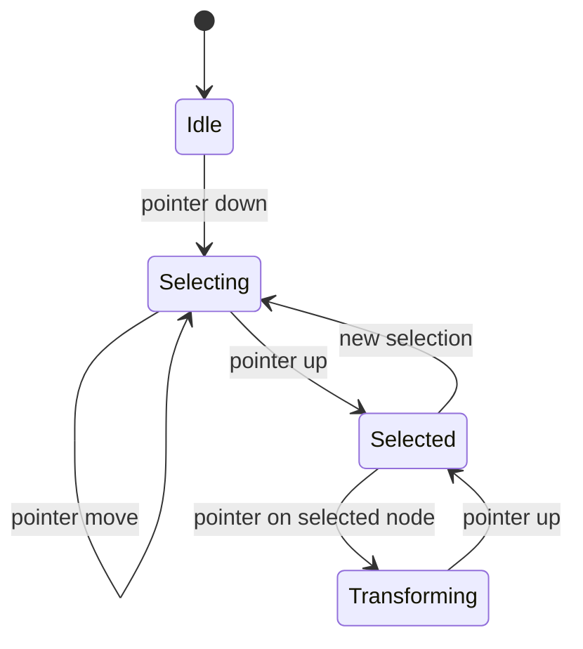
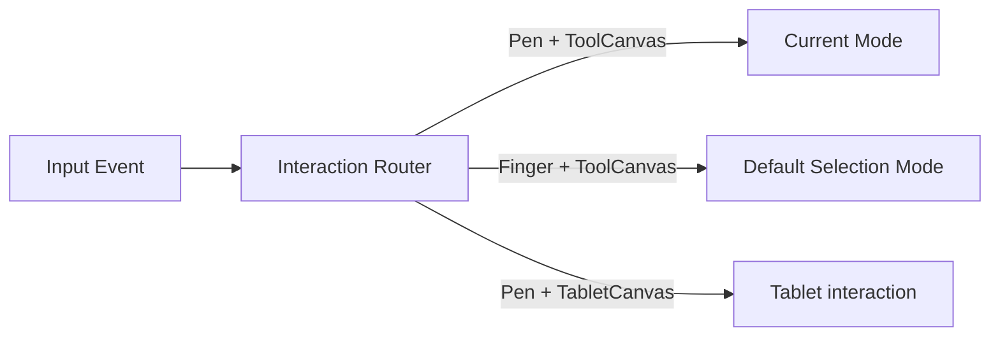
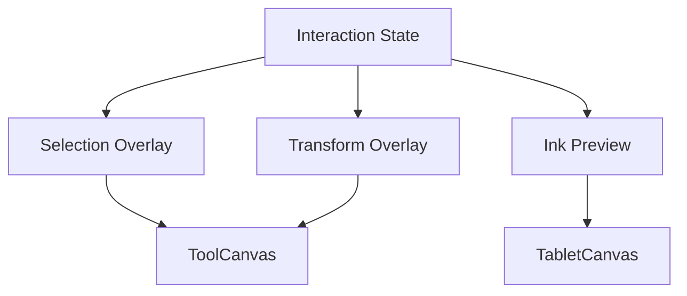
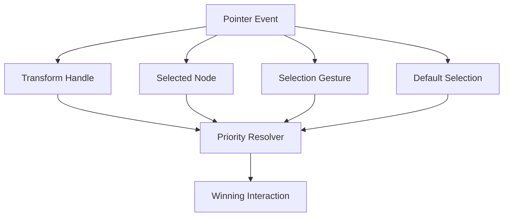
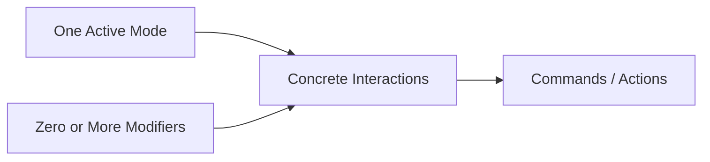

Implementation catalog and current type names (code is truth):
[`.docs/modules/epaper/tool-system/`](../modules/epaper/tool-system/index.md). This ADR stays the
conceptual overview. Host-ports working contract: [ADR-0035](./ADR-0035-tool-context-is-host-ports.md)
and [principles.md](../modules/epaper/tool-system/principles.md). Where names drifted (`PenMode` →
`InkMode`, HandTouch profiles → `PointerRole` + Mode allow-lists, Transform as exclusive Mode →
Move/Resize Operations, `ToolCanvasContext` → `ToolContextImpl`, `ToolChrome` → `SelectionOverlay`),
follow the implementation view.

# Question

Context: We have a primary toolbar. Each tool will have different logic. We need to analyze the abstraction before going deeper and adding more tools.

- Selection tools
  + On primary toolbar: Yes
  + Rendering: 
    - During selection: On-going selection boundary (lasso, marquee) on ToolCanvas
    - After selection: None - It depends on actual node selected
  + Exclusive: Yes
  + Accept: 
    * Pen on ToolCanvas: Need to choose a selection tool
    * Finger on ToolCanvas: Automatically trigger a default selection tool
- Pen tool
  + On primary toolbar: Yes
  + Rendering: Ink preview on TabletCanvas (and later commit to document) 
  + Exclusive: Yes
  + Accept: Pen on ToolCanvas (note how event handlers is wired)
- Hand touch:
  + On primary toolbar: Yes
  + Kind: A param that affect operation of other tools -> 
  + Rendering: None
  + Exclusive: No
- Inkbox recognizer / Connector recognizer:
  + On primary toolbar: Yes
  + Kind: A param that enable inkbox / connector recognizer upon pen up
  + Rendering: None (it supports pen tool)
  + Exclusive: No
- Move/Resize/Rotate tools
  + On primary toolbar: No
  + Rendering: 
    - After selection: Settled selection rect (not the lasso or marquee during selection)
    - Transparent area that receive pointer events for moving the underlying node
    - 8 resize knobs: Receive pointer events for resizing the underlying node
  + Exclusive: Yes
  + Depends: Only activate after Selection Tool
- (traditional) Eraser tool 
- Marquee Eraser tool
- Copy/Cut/Paste:
  + On primary toolbar: No
  + Rendering:
    - After selection: Selection rect (not the lasso or marquee during selection)
    - Context toolbar (copy, cut, paste)
  + Depends: 
    - Copiable node 
    - Only activate after Selection Tool
...

Abstraction aspects:
- Event handlers, matching rule, with priority...
- Rendering
- Access to toolCanvas, tabletCanvas
- Special intervention to event routing 
- ...

Target: No more mixed logic of different tools in 1 file. 

- Each tool have its own UI/Logic and access to shared context.
- Easily register new tools

# Answer

The key abstraction problem is that you are currently calling **everything a “tool”**, but the behaviors you listed actually belong to several different categories.

If you force all of them into one `Tool` abstraction, the abstraction will become a large conditional interface:

```text
Tool
 ├── event handlers
 ├── rendering
 ├── activation
 ├── selection dependency
 ├── gesture routing
 ├── canvas access
 ├── recognition
 ├── context toolbar
 └── ...
```

That is exactly how the mixed logic you want to eliminate will come back.

## 1. First split the concepts

I would model the system around **four concepts**:



### A. Interaction Mode

A mode owns the **primary interaction semantics**.

Examples:

* `SelectionMode`
* `PenMode`
* `EraserMode`
* `MarqueeEraserMode`
* `TransformMode`

This is what I would normally call the actual **tool**.

A mode answers:

> “Given this pointer event, what operation is currently being performed?”

---

### B. Modifier / Behavior

These are things that alter another tool's behavior.

Examples:

* `HandTouch`
* `InkboxRecognizer`
* `ConnectorRecognizer`

They should **not** be modeled as exclusive tools.

For example:

```text
PenMode
   +
   ├── HandTouchBehavior
   ├── InkboxRecognitionBehavior
   └── ConnectorRecognitionBehavior
```

This distinction is important because otherwise you get nonsense like:

```text
ActiveTool = Pen
ActiveTool = HandTouch
ActiveTool = InkboxRecognizer
```

when the actual state is:

```text
Mode = Pen
Modifiers = { HandTouch, InkboxRecognizer }
```

---

### C. Interaction Overlay

Rendering associated with interaction should be separated from document rendering.

Examples:

* lasso boundary
* marquee rectangle
* settled selection rectangle
* resize knobs
* move hit area
* pen ink preview

These aren't necessarily "the rendering of the tool". They are **interaction visuals**.

For example:

```text
SelectionMode
    └── SelectionOverlay

TransformMode
    └── TransformOverlay

PenMode
    └── InkPreviewOverlay
```

This becomes particularly useful because your `SelectionMode` itself doesn't need to know how a lasso is drawn.

---

### D. Document Command

Operations that actually modify the document should be separate:

```text
Delete
Move
Resize
Rotate
InsertInk
Copy
Cut
Paste
Erase
```

For example:

```text
PenMode
    -> collects pen points
    -> renders InkPreview
    -> PenUp
    -> InsertInkCommand
```

rather than having the Pen tool directly manipulate the document.

---

# 2. The biggest distinction: mode vs operation

Your "Move/Resize/Rotate tools" are interesting.

I would **not necessarily make these three separate primary tools**.

They are better understood as one interaction mode:

```text
TransformMode
 ├── Move
 ├── Resize
 └── Rotate
```

The selected node determines which transform operation is possible based on where the pointer lands.



This is a very useful boundary:

> **Tool selection determines the interaction mode; pointer hit-testing determines the operation inside that mode.**

That prevents the primary toolbar from eventually exploding into:

```text
Select
Pen
Move
Resize
Rotate
...
```

---

# 3. Selection deserves its own state machine

Selection is more complicated than Pen because it has multiple phases.

I'd explicitly model that.



The selection mode therefore owns:

```text
SelectionMode
 ├── Idle
 ├── Selecting
 │    └── SelectionGesture
 └── Selected
      └── SelectionModel
```

But importantly:

**the selected object's transform UI does not need to be implemented inside `SelectionMode`.**

Instead:

```text
SelectionMode
    ↓ selection completed
SelectionState
    ↓
TransformInteraction
```

You can therefore have:

```text
SelectionMode
    └── creates selection

TransformMode
    └── operates on current selection
```

with the activation dependency:

```text
TransformMode.canActivate(context)
    =
    context.selection.hasSelection
```

---

# 4. Your "Accept" property is actually an input policy

This part:

> Pen on ToolCanvas: Need to choose a selection tool
> Finger on ToolCanvas: Automatically trigger a default selection tool

should **not** be a property like:

```kotlin
tool.accept(...)
```

It is a **routing / activation policy**.

You have multiple input sources:

```text
Pen
Finger
Mouse
...
```

and different routing rules.

I'd make this explicit:



This is one of the "special intervention to event routing" aspects you mentioned.

It should live **above individual tools**.

Otherwise every tool eventually starts asking:

```text
if pen...
if finger...
if selection...
if tablet...
if tool canvas...
```

and you are back to mixed logic.

---

# 5. Canvas access should be capability-based

I would avoid giving every tool the entire application context.

For example, don't start with:

```kotlin
interface Tool {
    fun handle(event: PointerEvent, context: AppContext)
}
```

where `AppContext` contains everything.

That becomes a service locator.

Instead, give the tool a narrowly defined interaction context:

```kotlin
interface InteractionContext {
    val selection: SelectionState
    val document: DocumentAccess
    val toolCanvas: ToolCanvas
    val tabletCanvas: TabletCanvas
    val input: InputState
}
```

But even that can become too broad.

A better direction is capability interfaces:

```kotlin
interface SelectionContext {
    val selection: SelectionState
}

interface DocumentContext {
    val document: DocumentAccess
}

interface ToolCanvasContext {
    val toolCanvas: ToolCanvas
}

interface TabletCanvasContext {
    val tabletCanvas: TabletCanvas
}
```

Then:

```kotlin
class PenMode(
    private val document: DocumentAccess,
    private val tabletCanvas: TabletCanvas
)
```

while:

```kotlin
class SelectionMode(
    private val selection: SelectionState,
    private val toolCanvas: ToolCanvas
)
```

This gives you a very useful architectural property:

> **A tool can only access the surfaces it actually needs.**

---

# 6. Rendering should not be a giant `render(tool)` switch

Avoid:

```kotlin
when (activeTool) {
    PEN -> renderPen()
    SELECT -> renderSelection()
    ERASER -> renderEraser()
    ...
}
```

Instead, each interaction participant contributes its own visual layer.

Something like:

```kotlin
interface InteractionVisual {
    fun render(target: Canvas, context: InteractionContext)
}
```

Then:

```text
InteractionState
 ├── SelectionOverlay
 ├── TransformOverlay
 └── InkPreviewOverlay
```

The renderer just renders the active overlays.

Conceptually:



This also handles your important distinction:

> "After selection: none — it depends on actual node selected."

Selection itself doesn't need to render anything after completion.

The **selection result** can cause another interaction visual to appear.

---

# 7. Event handling should have explicit priority

Your "event handlers, matching rule, with priority" is probably the most important part of the architecture.

Don't make tools simply register:

```text
onPointerDown(...)
onPointerMove(...)
onPointerUp(...)
```

because eventually multiple things will match the same event.

Instead think in terms of:

```text
Event
 ↓
Candidate interactions
 ↓
Match
 ↓
Priority
 ↓
Winner
 ↓
Capture
```

For example:



For a pointer-down on a resize knob:

```text
TransformResize      priority 100
TransformMove        priority 80
Selection             priority 50
DefaultSelection      priority 10
```

The winning handler can then **capture the pointer**.

That is much cleaner than every tool independently deciding whether it should consume the event.

---

# 8. Separate "matching" from "handling"

This is another boundary I'd strongly recommend.

```kotlin
interface InteractionHandler {
    fun match(event: PointerEvent, context: InteractionContext): MatchResult
    fun handle(event: PointerEvent, context: InteractionContext)
}
```

But conceptually:

```text
match()
    ↓
"Can I handle this?"

priority
    ↓
"Who should handle it?"

handle()
    ↓
"Perform the interaction."
```

The matcher should be cheap and side-effect-free.

For example:

```text
ResizeHandleInteraction
    match:
        active selection exists
        AND pointer is inside resize handle
        AND pointer is pen
```

Then:

```text
TransformMoveInteraction
    match:
        active selection exists
        AND pointer is inside transform body
```

This makes event routing declarative.

---

# 9. I'd model your current things like this

| Your concept          | Abstraction                                              |
| --------------------- | -------------------------------------------------------- |
| Selection             | `InteractionMode`                                        |
| Pen                   | `InteractionMode`                                        |
| Traditional Eraser    | `InteractionMode`                                        |
| Marquee Eraser        | `InteractionMode`                                        |
| Move/Resize/Rotate    | `InteractionMode` or sub-interactions of `TransformMode` |
| Hand touch            | `Behavior / Modifier`                                    |
| Inkbox recognizer     | `Behavior / Modifier`                                    |
| Connector recognizer  | `Behavior / Modifier`                                    |
| Lasso                 | `InteractionGesture + Overlay`                           |
| Marquee               | `InteractionGesture + Overlay`                           |
| Selection rectangle   | `InteractionOverlay`                                     |
| Resize knobs          | `InteractionOverlay + HitTarget`                         |
| Move transparent area | `HitTarget`                                              |
| Copy/Cut/Paste        | `Command / Action`, not really a tool                    |
| Context toolbar       | `ActionSurface`                                          |
| Pen ink preview       | `InteractionOverlay`                                     |
| Document insertion    | `DocumentCommand`                                        |
| Pen/finger routing    | `InputRoutingPolicy`                                     |
| Priority              | `InteractionResolver`                                    |
| Canvas access         | `Capability / Context`                                   |

This is the key conceptual cleanup.

---

# 10. A possible top-level architecture

I would aim for something approximately like:

```text
ToolSystem
│
├── Toolbar
│    ├── SelectionTool
│    ├── PenTool
│    ├── EraserTool
│    ├── HandTouchModifier
│    ├── InkboxRecognizerModifier
│    └── ConnectorRecognizerModifier
│
├── InteractionRouter
│    ├── InputMatcher
│    ├── PriorityResolver
│    └── PointerCapture
│
├── ActiveInteraction
│    ├── SelectionInteraction
│    ├── PenInteraction
│    ├── EraserInteraction
│    └── TransformInteraction
│
├── InteractionVisuals
│    ├── SelectionBoundary
│    ├── SelectionRect
│    ├── TransformHandles
│    └── InkPreview
│
├── Actions
│    ├── Copy
│    ├── Cut
│    ├── Paste
│    ├── Delete
│    └── ...
│
└── SharedContext
     ├── Selection
     ├── Document
     ├── ToolCanvas
     ├── TabletCanvas
     └── InputState
```

The important thing is that **the toolbar is not the architecture**.

The toolbar merely changes:

```text
ToolSystem.activeMode
ToolSystem.modifiers
```

---

# 11. The "tool" interface should therefore be small

I'd intentionally resist creating a giant interface.

Something closer to:

```kotlin
interface Tool {
    val id: ToolId
    fun activate(context: ToolContext)
    fun deactivate(context: ToolContext)
}
```

Then the actual interaction behavior can be supplied separately:

```kotlin
interface InteractionProvider {
    fun interactions(context: InteractionContext): List<Interaction>
}
```

And visuals:

```kotlin
interface InteractionVisualProvider {
    fun visuals(context: InteractionContext): List<InteractionVisual>
}
```

So Pen can naturally compose:

```text
PenTool
 ├── PenInteraction
 ├── InkPreview
 └── [recognizer modifiers]
```

while Selection can compose:

```text
SelectionTool
 ├── LassoInteraction
 ├── MarqueeInteraction
 └── SelectionBoundary
```

And Transform:

```text
TransformInteraction
 ├── MoveInteraction
 ├── ResizeInteraction
 ├── RotateInteraction
 └── TransformOverlay
```

---

# 12. One particularly important distinction

I would **not make "exclusive" a fundamental property of every tool**.

Instead distinguish:

### Mode

Exactly one active mode:

```text
Selection
OR
Pen
OR
Eraser
OR
Transform
```

### Modifier

Zero or more active:

```text
HandTouch
InkboxRecognizer
ConnectorRecognizer
```

### Action

Triggered temporarily:

```text
Copy
Cut
Paste
Delete
```

### Interaction

A concrete event handler:

```text
ResizeHandle
MoveSelectedNode
LassoSelection
PenStroke
```

This gives you a much cleaner mental model:



---

## 13. What I would do before adding more tools

Don't implement another tool yet.

First establish these **five contracts**:

1. **`Tool`** — lifecycle and toolbar identity.
2. **`Interaction`** — event matching, priority, handling, capture.
3. **`InteractionVisual`** — transient rendering.
4. **`Modifier`** — behavior that composes with a mode.
5. **`Command/Action`** — document/application operation.

Then establish the event pipeline:

```text
Raw Input
   ↓
Input Routing
   ↓
Interaction Candidates
   ↓
Match + Priority
   ↓
Pointer Capture
   ↓
Interaction
   ↓
Command / State Mutation
   ↓
Interaction Visual Update
```

If those contracts are right, adding **Marquee Eraser**, another selection mode, rotation, snapping, multi-selection, keyboard modifiers, touch gestures, etc. should mostly mean adding new classes rather than modifying a central `ToolManager` with another branch.

That is the architectural test I would use:

> **Adding a new tool should primarily add code; it should not require modifying the event router, renderer, or existing tools.**

And one more test is particularly relevant to your target:

> **Can I open `PenTool.kt` and understand Pen behavior without reading Selection, Transform, Eraser, or toolbar-specific conditionals?**

If yes, you have probably found the right abstraction boundary.

---

# Decision

Accepted for epaper device implementation (2026-08-26).

**Current names and registration:** [tool-system architect view](../modules/epaper/tool-system/index.md)
(`epaper/drawing/tools/`). Historical working notes:
[`.docs/memory/plan_epaper-tool-system-refactor.md`](../memory/plan_epaper-tool-system-refactor.md)
(not the catalog).

## Locks

1. **`ToolCanvasItem` + `InputHub`** are the **Interaction Router**. Qt handlers stay in `ToolCanvas.qml`; tools never bind Qt listeners.
2. **Interaction Mode** is an **object** (`id` enum + state), not enum-only. Toolbar / `ChipModel.exclusive` maps to Mode id.
3. **Operation** is the locked gesture lifecycle object (`Lasso`, `Marquee`, `Move`, `Resize`, `InkStroke`, `Navigation`, …). Each gesture is its own Operation class.
4. Operations declare **`OperationDescriptor`**: `matchOn` / `receive` **StrategyKind** (`RawPointer`, `Drag`, `Tap`, `Pinch`, `HitTarget`). Router demuxes; Op implements one narrow sink. `matchOn` may differ from `receive` (e.g. Resize: HitTarget → RawPointer).
5. **Modifiers** (never exclusive): **HandTouch** (finger/pinch; profiles per Mode id → allowed Operation kinds + **`postHandling` as `std::function`** — dynamic, e.g. switch to Selection only when select/move actually selected something); **InkBoxRecognizer** + **ConnectorRecognizer** (Pen Mode pen-up behaviors, latch on pen-down).
6. **SelectionOverlay hits** use **HitTarget** + visual-only chrome (not per-knob DragHandlers) — including future connector knobs.
7. Capability ports: **`InkSink`**, **`DocContext`**, **`ToolContext`** (SelectionOverlay Tool UI), **`SelectionContext`**. Activate bag = **`HostCaps`**.
8. Durable selection state lives in **SelectionContext**; ephemeral gesture geometry on the locked Operation.
9. Code lives under `epaper/drawing/tools/`.

## Consequences

- Adding a tool/gesture = new Mode and/or Operation + registration; Router/HandTouch dispatch stays stable.
- Migrating off the `toolcanvasitem.cpp` monolith is phased; behavior must stay preserved at each phase.
- ADR-0019 chrome layers remain: ToolContext never blits the document.
