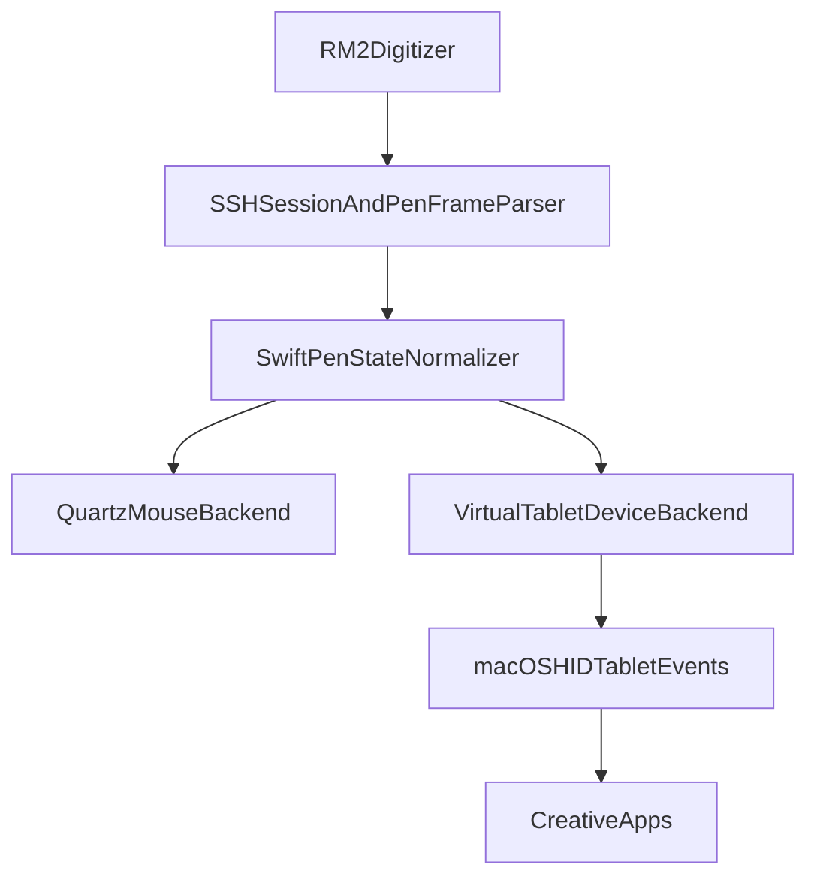

# reMarkable RM2 -> macOS Pen Driver - Technical Reference

This document describes the internal architecture, data flow, implementation
details, and engineering history of the native Swift `reawa` macOS app. For
product behavior and user-facing setup, see [product.md](product.md).

---

## Table of Contents

1. [Goals](#goals)
2. [High-Level Architecture](#high-level-architecture)
3. [Project Layout](#project-layout)
4. [Data Model](#data-model)
5. [Pen Event Pipeline](#pen-event-pipeline)
6. [Planned Native Pen Device Mode (Swift)](#planned-native-pen-device-mode-swift)
7. [Driver Layer](#driver-layer)
8. [Absolute Mode and Window Snapping](#absolute-mode-and-window-snapping)
9. [Coordinate Systems](#coordinate-systems)
10. [UI Architecture](#ui-architecture)
11. [Services](#services)
12. [Threading Model](#threading-model)
13. [Storage](#storage)
14. [RM2 Device Constants](#rm2-device-constants)
15. [Dependencies](#dependencies)
16. [Entry Points](#entry-points)
17. [Key Design Decisions](#key-design-decisions)
18. [Bug Fix History](#bug-fix-history)
19. [Known Limitations](#known-limitations)
20. [Related Documents](#related-documents)

---

## Goals

- Stream pen events from a reMarkable 2 over SSH and translate them into macOS
  input events.
- Support multiple saved connections (devices) with per-connection SSH keys and
  device settings.
- Offer two mouse-emulation output modes: RELATIVE (pen deltas) and ABSOLUTE
  (screen-mapped region snapped to a window).
- Preserve an optional Native Stylus backend path when the required Apple
  entitlement and signed app-bundle environment are available.
- Run as a menu bar-only app (Dock icon only while the settings window is open).
- Auto-detect the device when plugged in via USB Ethernet.

---

## High-Level Architecture

```
┌────────────────────────────────────────────────────────────────────────────┐
│ AppController (NSApplicationDelegate / status bar app)                    │
│ ├── ConnectionManager        - connect/disconnect, live config, statuses   │
│ ├── USBWatcher               - reachability polling + auto-connect         │
│ ├── NotificationService      - local user notifications for bundle runs    │
│ ├── PickerOverlayController  - window selection overlay                    │
│ ├── RegionOverlayController  - region border + resize handles              │
│ ├── WindowSnapController     - AX window move/resize + lifecycle           │
│ ├── SettingsWindowController - NSWindow hosting SwiftUI settings UI        │
│ └── AppLogger                - behavior log + pen event log                │
└────────────────────────────────────────────────────────────────────────────┘
                                     │
                                     ▼
┌────────────────────────────────────────────────────────────────────────────┐
│ DriverSession (background Thread)                                         │
│ SSH pen stream -> PenFrameParser -> RelativePenDriver | AbsolutePenDriver │
│                                        | NativeStylusBackend              │
└────────────────────────────────────────────────────────────────────────────┘
                                     │
                                     ▼
┌────────────────────────────────────────────────────────────────────────────┐
│ SSHSession.swift - key setup, /usr/bin/ssh stream, /dev/input/event1      │
│ parsing, session/backend selection                                         │
└────────────────────────────────────────────────────────────────────────────┘
```

### App-Level State Machine (Absolute Mode)

```mermaid
stateDiagram-v2
    PICKING:
    RELATIVE:
    ABSOLUTE:

    [*] --> RELATIVE: start in RELATIVE
    [*] --> PICKING: start in ABSOLUTE
    ABSOLUTE --> RELATIVE: user selects RELATIVE
    PICKING --> RELATIVE: Esc
    PICKING --> RELATIVE: no window selected
    RELATIVE --> PICKING: user selects ABSOLUTE
    PICKING --> ABSOLUTE: window selected
```

App-level flags:

| Flag                  | Meaning                                                             |
| --------------------- | ------------------------------------------------------------------- |
| `picking`             | Snap picker is active; pen input paused                             |
| `snappedConnectionID` | Connection ID that completed a successful snap this session         |
| `snappedWindowState`  | `"normal"` or `"minimized"` - tracks overlay visibility transitions |

`updateOverlay()` is the central orchestrator: it shows/hides the region
overlay, starts the picker when mode is ABSOLUTE but `snappedConnectionID` is
unset, and starts the window-follow timer when snapped.

---

## Project Layout

| Path                                  | Responsibility                                                        |
| ------------------------------------- | --------------------------------------------------------------------- |
| `Sources/ReawaApp/main.swift`         | `NSApplication` bootstrap and delegate wiring                         |
| `Sources/ReawaApp/AppController.swift` | Menu bar entry, snap-flow orchestration, overlay lifecycle, menu UI  |
| `Sources/ReawaApp/Models.swift`       | `Connection`, `DeviceConfig`, `AbsoluteConfig`, `PenFrame`, enums     |
| `Sources/ReawaApp/Storage.swift`      | JSON persistence, per-connection SSH key paths, legacy migration       |
| `Sources/ReawaApp/ConnectionManager.swift` | Active session, connect/disconnect, live config cache, statuses  |
| `Sources/ReawaApp/SSHSession.swift`   | SSH connection, RSA key install, pen event parsing, session loop       |
| `Sources/ReawaApp/InputDrivers.swift` | Relative/Absolute mouse-emulation backends and Quartz mouse output     |
| `Sources/ReawaApp/NativeStylusBackend.swift` | Experimental virtual stylus backend and HID report design       |
| `Sources/ReawaApp/WindowSnap.swift`   | `CGWindowList` enumeration, AX move/resize, lifecycle handling         |
| `Sources/ReawaApp/Overlays.swift`     | Full-desktop picker overlay and click-through region overlay           |
| `Sources/ReawaApp/SettingsUI.swift`   | SwiftUI settings UI, drafts, tabs, and `NSWindowController`            |
| `Sources/ReawaApp/Logging.swift`      | Behavior log, pen-event log, snapshot publishing                       |
| `Sources/ReawaApp/Discovery.swift`    | Network discovery, USB watcher, user notifications                     |
| `Sources/ReawaApp/Utilities.swift`    | Process runner, coordinate conversion, helpers                         |
| `Tests/ReawaTests/`                   | Parser, model compatibility, logging, driver, and native-stylus tests  |

---

## Data Model

### Connection

```swift
struct Connection: Codable, Identifiable, Equatable, Sendable {
    var id: String
    var name: String
    var ip: String
    var autoConnect: Bool
    var deviceConfig: DeviceConfig
}
```

Persisted in `~/Library/Application Support/Reawa/connections.json`.

On first run, `ConnectionStore` copies legacy data from
`~/Library/Application Support/remarkable-rm2/` when the new Swift-native store
does not exist yet.

### DeviceConfig

| Field                             | Type      | Notes                                                                |
| --------------------------------- | --------- | -------------------------------------------------------------------- |
| `outputMode`                      | `OutputMode` | `.relative`, `.absolute`, `.nativeStylus` persisted as `"RELATIVE"`, `"ABSOLUTE"`, `"NATIVE_STYLUS"` |
| `scale`                           | `Double?` | Points per digitizer unit; `nil` = auto from display PPI             |
| `swapXY`, `invertX`, `invertY`    | `Bool`    | Axis transforms before mapping                                       |
| `absolute`                        | `AbsoluteConfig` | Region geometry + snap metadata                                 |

The settings UI presents tablet-orientation controls at a higher level, but the
persisted model still stores the axis transforms directly.

### AbsoluteConfig

Region stored in Quartz global coordinates (see
[Coordinate Systems](#coordinate-systems)):

| Field                                                        | Purpose                                                      |
| ------------------------------------------------------------ | ------------------------------------------------------------ |
| `regionX`, `regionY`, `regionWidth`, `regionHeight`          | Snapped mapping rect (RM2 aspect locked via `lockAspect()`)  |
| `borderColor`, `borderStyle`                                 | Overlay border (`solid` or `dashed`)                         |
| `snapWindowEnabled`                                          | Whether a window is bound                                    |
| `snappedWindowRef`                                           | Window title (or `pid N`) for display                        |

Persistence uses legacy-compatible snake_case JSON keys such as `region_x` and
`snapped_window_ref`.

RM2 aspect ratio: `PEN_X_MAX / PEN_Y_MAX = 20967 / 15725`.

### ConnectionStatus

Derived state (not persisted):

| Status      | Condition                                   |
| ----------- | ------------------------------------------- |
| `offline`   | Device IP not reachable                     |
| `online`    | IP reachable, no active pen stream          |
| `connected` | Active `DriverSession` with open SSH stream |
| `error`     | Last connect attempt failed                 |

---

## Pen Event Pipeline

```
RM2 digitizer (/dev/input/event1)
  -> /usr/bin/ssh "dd bs=16 if=/dev/input/event1"
  -> PenFrameParser.append() -> PenFrame
  -> DriverSession loop
       -> [paused? cleanup/skip]
       -> read live DeviceConfig snapshot
       -> swap backend if output_mode changed
       -> RelativePenDriver | AbsolutePenDriver | NativeStylusBackend.handle(frame:)
  -> MouseController.postMouseEvent() (Quartz CGEvent)
     OR NativeStylusBackend.dispatch() (virtual stylus report)
```

### PenFrame

```swift
struct PenFrame: Equatable, Sendable {
    let tvSec: UInt32
    let tvUsec: UInt32
    let x: Int
    let y: Int
    let pressure: Int?
    let touching: Bool
    let inProximity: Bool
    let stylusButton: Bool
    let distance: Int?
    let tiltX: Int?
    let tiltY: Int?
    let rawEvents: [PenRawEvent]
}
```

### SSH and Key Setup (`Sources/ReawaApp/SSHSession.swift`)

- Connect with an RSA key; fall back to password-assisted `setupKey(...)` on
  auth failure.
- `ensureKeyPair(...)` generates a 3072-bit RSA key with `/usr/bin/ssh-keygen`.
- `setupKey(...)` writes a temporary `SSH_ASKPASS` helper, then uses the system
  `ssh` client to install the public key into `authorized_keys` on the device.
- Pen stream command: `dd bs=16 if=/dev/input/event1` over SSH.
- Event format: little-endian Linux `input_event` fields
  `(tv_sec: UInt32, tv_usec: UInt32, type: UInt16, code: UInt16, value: Int32)`.
- Frames are assembled on `EV_SYN` + `SYN_REPORT` once both X and Y are known.

---

## Planned Native Pen Device Mode (Swift)

This section describes the Swift-native pen-device backend direction. The
repository now contains an experimental `Native Stylus` backend, but the
broadly supported path still ends in Quartz mouse events unless the signed app
bundle and Apple entitlement requirements are satisfied.

### Goal

Add a second output backend that publishes reMarkable pen input to macOS as a
generic HID digitizer / stylus device, so drawing apps can receive pen data
directly instead of seeing only mouse movement and clicks.

### Core design rules

1. Reuse the existing Swift SSH/event parser pipeline as the input source of
   truth.
2. Do not emulate a specific Wacom driver identity; expose a generic macOS
   tablet/stylus device.
3. Keep the current Quartz mouse path as a fallback backend.
4. Avoid classic kernel extensions; the target implementation is a modern Swift
   virtual-HID / DriverKit-compatible path.

### Planned high-level flow



### Intended backend split

- Current mouse-emulation backends: `InputDrivers.swift` posts Quartz `CGEvent`
  mouse events through `RelativePenDriver` and `AbsolutePenDriver`.
- Current experimental stylus backend: `NativeStylusBackend.swift` creates a
  virtual digitizer device and submits stylus reports into macOS when the
  runtime environment allows it.
- Selection model: backend choice is explicit and runtime-switchable, so the app
  can fall back to mouse emulation on machines where tablet-device mode is
  unavailable.

### Data the tablet backend must carry

The current Swift `PenFrame` now carries the RM2 data needed for richer
diagnostics and a future tablet-class backend:

- `x`, `y`
- `pressure`
- `touching`
- `inProximity`
- `stylusButton` (`BTN_STYLUS`)
- `distance` (`ABS_DISTANCE`)
- `tiltX`, `tiltY`
- `rawEvents` captured until each `SYN_REPORT`

For the planned tablet backend, the implementation should preserve and forward
this metadata rather than collapsing the stream down to mouse-only semantics.

That means the planned implementation should build on:

- `Sources/ReawaApp/Models.swift` - already-expanded `PenFrame`, `PenRawEvent`,
  and `PenStateSnapshot`
- `Sources/ReawaApp/SSHSession.swift` - current RM2 event parsing and per-frame
  raw-event retention
- `Sources/ReawaApp/InputDrivers.swift` or a sibling backend file - normalize
  `PenFrame` into either Quartz mouse output or virtual tablet reports

### Preferred implementation path

Primary target:

- Implement the feature in Swift as a user-space virtual HID device backend when
  the necessary Apple entitlement is available.

Current repository state:

- The Swift app now contains a Native Stylus backend spike using
  `CoreHID.HIDVirtualDevice`.
- The code path is useful for integration work, HID report design, fallback
  behavior, and packaging preparation.
- However, actual virtual HID device creation is still blocked until Apple
  approves `com.apple.developer.hid.virtual.device` for the signing team and the
  app is launched as a signed `.app` bundle with that entitlement.
- `swift run reawa` cannot exercise this feature because the SwiftPM-built
  executable is not a provisioned app bundle with the restricted entitlement.

Fallback / advanced path:

- If the user-space virtual-HID path is insufficient, move the tablet backend
  into a HIDDriverKit / DriverKit system extension while keeping the existing
  Swift app as the controller and SSH event source.

Explicitly avoided:

- classic kernel extensions
- Quartz mouse emulation as the only output path for drawing-app compatibility
- spoofing Wacom branding instead of publishing a generic digitizer

### Expected integration points in the Swift codebase

| Swift area                              | Planned change                                                       |
| --------------------------------------- | -------------------------------------------------------------------- |
| `Sources/ReawaApp/Models.swift`         | Reuse the richer `PenFrame` / `PenRawEvent` model for a tablet backend |
| `Sources/ReawaApp/SSHSession.swift`     | Reuse the current RM2 parser, raw-event retention, and richer pen-frame emission |
| `Sources/ReawaApp/InputDrivers.swift`   | Keep Quartz mouse output cleanly separated from tablet-device output |
| `Sources/ReawaApp/NativeStylusBackend.swift` | Iterate on HID report shape, runtime checks, and capability exposure |
| `Sources/ReawaApp/ConnectionManager.swift` | Carry backend selection and fallback status into the live session   |
| `Sources/ReawaApp/SettingsUI.swift`     | Expose backend choice and capability / availability state            |
| `Sources/ReawaApp/Logging.swift`        | Surface tablet-backend startup and entitlement errors                |

### Verification targets

Recommended validation order:

1. Krita - use Tablet Tester first to verify that macOS and the app see a pen
   device instead of a mouse.
2. A browser pointer-events test page - quick sanity check for pen/pressure/tilt
   reporting where supported.
3. Photoshop or another production drawing app - end-to-end validation after
   Krita works.

### Major delivery risk

The biggest non-code risk is Apple entitlement approval for virtual HID /
DriverKit capabilities. The product should therefore treat native pen-device
output as an optional backend and preserve mouse emulation as a supported
fallback.

Practical implication:

- Without Apple approval, local development can prepare the code, app bundle,
  signing flow, and entitlement files, but it cannot make macOS accept the
  process as a real Virtual HID publisher in the supported path.

---

## Driver Layer

### DriverSession

Runs on a dedicated background `Thread`. One session per active connection.

Key behaviors:

1. Live config - each pen frame reads the latest `DeviceConfig` snapshot from
   `DriverSession.currentConfig`, which is updated by `ConnectionManager` without
   per-frame disk I/O.
2. Live backend swap - when `outputMode` changes, the session calls `cleanup()`
   on the old backend and instantiates the new one without tearing down SSH.
3. Pause / resume - `pause()` sets a flag so frames are discarded (used during
   window picking). SSH stays open. `resume()` clears the flag.
4. Native Stylus fallback - if `NativeStylusBackend` fails to start, the session
   emits a fallback event and switches back to the last working mouse-emulation
   mode.

```swift
// Simplified session loop
while !shouldStop() {
    let data = try stdout.read(upToCount: RM2.eventSize * 8) ?? Data()
    for frame in parser.append(data) {
        if isPaused() {
            backend?.cleanup()
            continue
        }
        let config = snapshotConfig()
        if config.outputMode != currentMode {
            backend?.cleanup()
            backend = makeBackend(mode: config.outputMode, config: config, fallbackMode: lastMouseMode)
        }
        backend?.updateConfig(config)
        backend?.handle(frame: frame)
    }
}
```

### RelativeDriver

- Computes pen deltas from successive `PenFrame` values.
- Applies scale (`effectiveScale`: auto PPI / RM2 DPI ~= 2531), swap, invert.
- Clamps cursor to union of all display bounds.
- Hover -> `kCGEventMouseMoved`; touch down/up/drag -> left-button events.
- Releases button on proximity loss.
- Swift port note: `RelativePenDriver` synthesizes a gesture lifecycle from
  `PenFrame.inProximity` / `touching`: hover-start -> hover-move -> hover-end,
  and touch-start -> touch-drag -> touch-end. Each gesture captures both the
  pen anchor `(x, y)` and the live cursor position at the start of the gesture
  (or phase transition), then computes cursor motion relative to that anchor.
  This preserves the scale fix without depending on a continuously refreshed
  live cursor baseline.
- If the live cursor diverges from the gesture's expected cursor (for example
  from a trackpad or mouse move), the current relative gesture is rebased to the
  live cursor using the latest pen point as the new anchor. That prevents the
  next pen move from teleporting back to an older synthetic cursor position.

### AbsoluteDriver

- Maps pen `(x, y)` linearly into the configured region rectangle.
- Clamps synthesized cursor position to the region via `clamp(_:to:)`.
- Region updates every frame from live config (supports resize/follow without
  reconnect).

### MouseController

Thin wrapper over Quartz `CGEventCreateMouseEvent` / `CGEventPost`. Also
provides:

- `desktopBounds()` - union of active displays (Quartz)
- `displayID(at:)` / `effectiveScale(at:)` - PPI-based auto scaling for
  RELATIVE mode
- `mapPenCoordinates(...)` / `mapDelta(...)` - axis transforms

### NativeStylusBackend

- Converts `PenFrame` into a generic HID stylus report with tip, barrel button,
  in-range, X/Y, pressure, and tilt.
- Requires macOS 15+, a signed `.app` bundle, the virtual HID entitlement, and
  HID post-event permission.
- Publishes user-facing capability / failure state back to `ConnectionManager`
  via `DriverSessionEvent.nativeStylusStatus`.
- Uses the mouse-emulation backend as a runtime fallback when the stylus backend
  is unavailable.

---

## Absolute Mode and Window Snapping

### Snap Picker (`Sources/ReawaApp/Overlays.swift`)

One borderless overlay window per display at `NSScreenSaverWindowLevel`. A
single window spanning all displays is only event-interactive on the display
holding the majority of its area (with "Displays have separate Spaces" enabled),
so clicks on other displays never reach the view. Cursor polling is global,
which masked this bug because highlighting worked everywhere.

Flow:

1. Poll `CGEventGetLocation` every 50 ms (global cursor).
2. Hit-test against on-screen windows via `windowUnderPoint(...)` (Quartz
   coords).
3. Broadcast the hovered window's highlight to every per-screen view; each view
   converts the global Cocoa rect into view-local coordinates.
4. Click on whichever screen's view is under the cursor -> `onPick(WindowInfo)`;
   Esc -> `onCancel()` -> revert to RELATIVE.

`PickerWindow.constrainFrameRect(_:to:)` returns the frame unchanged; otherwise
AppKit shrinks borderless windows away from the primary display's menu bar.

### Window Enumeration (`Sources/ReawaApp/WindowSnap.swift`)

Uses `CGWindowListCopyWindowInfo` (not per-process `NSRunningApplication`
enumeration):

- Filters: `kCGWindowLayer == 0` (normal windows), excludes own PID, min size
  40x40.
- Returns front-to-back list with bounds in Quartz top-left global coordinates.
- Resolves the chosen window to an Accessibility element by PID + frame
  proximity for move/resize.

`WindowSnapController` methods:

| Method                   | Purpose                                                               |
| ------------------------ | --------------------------------------------------------------------- |
| `pick(from:)`            | Resolve `CGWindowList` entry to AX element, bind element, store title ref + window number + pid |
| `restoreWindow()`        | Un-minimize / un-stage and focus the picked window; poll until frame stabilizes (~0.5 s) |
| `snapRegionToWindow()`   | Align region to window top-left, fit RM2 aspect inside window bounds |
| `syncWindowToRegion()`   | AX set position/size so snapped window matches region                 |
| `syncRegionToWindow()`   | Align region to current window bounds (aspect-fit inside)            |
| `currentWindowFrame()`   | Read AX position/size for follow timer                               |
| `snappedLifecycleState()` | `"closed"` / `"minimized"` / `"maximized"` / `"normal"`              |

`syncWindowToRegion()` wraps position/size in `AXValueRef` via
`AXValueCreate`. Sets size -> position -> size so a window being shrunk is not
clamped by its current larger frame while moving.

`axWindowFrame(...)` unwraps `AXValueRef` handles via
`AXValueGetValue(.cgPoint / .cgSize)` before reading coordinates.

### Region Overlay (`Sources/ReawaApp/Overlays.swift`)

Two layered UI pieces:

1. Overlay window - spans all displays (Cocoa-framed). Click-through
   (`ignoresMouseEvents = true`). Draws border only - no dim fill.
2. Corner handle windows - 18x18 pt at each corner; receive mouse drags;
   aspect-locked resize syncs the snapped window via `onRegionChanged` ->
   `syncWindowToRegion(...)`.

The old PyObjC selector-collision workarounds are no longer relevant in the
Swift app; the picker and overlay are plain AppKit controllers with custom
`NSWindow` / `NSView` subclasses.

### Window Follow and Lifecycle

`Timer.scheduledTimer` in `AppController` (0.4 s) polls the snapped AX window:

| State         | Detection                                                                                                                                            | Action                                                                                                    |
| ------------- | ---------------------------------------------------------------------------------------------------------------------------------------------------- | --------------------------------------------------------------------------------------------------------- |
| `normal`      | Default; window on screen with ordinary size                                                                                                         | Overlay visible. Region follows window moves; external resizes re-fit region and `syncWindowToRegion()` |
| `minimized`   | `kAXMinimizedAttribute` OR absent from OnScreenOnly list (Cmd+H, off-stage/Space) OR Stage Manager strip (CG on-screen area << AX frame area)      | Hide overlay. Stay in ABSOLUTE                                                                            |
| `restored`    | Was off-screen, now back in OnScreenOnly list                                                                                                        | `syncRegionToWindow()`, show overlay                                                                      |
| `maximized`   | `AXFullScreen` attribute or frame ~= screen `visibleFrame` (6 pt tolerance)                                                                         | `snapRegionToWindow()` for largest aspect-fit rect, then `syncWindowToRegion()`                          |
| `closed`      | AX element reports `kAXErrorInvalidUIElement`                                                                                                        | `revertToRelative(...)`                                                                                   |

Close detection uses AX validity, not the window list. Stage Manager removes
minimized windows from every `CGWindowList` query even though they still exist.
Close is detected from AX element validity - `elementAlive(...)` reads
`kAXRoleAttribute` and treats only `kAXErrorInvalidUIElement` as closed.

Stage Manager minimize detection compares on-screen CG area to AX frame area;
ratio below `stageAreaRatio` (0.5) means staged.

Restore-on-pick: when a Stage Manager thumbnail is picked, `restoreWindow()`
clears `kAXMinimizedAttribute`, performs `kAXRaiseAction`, activates the owning
app, and polls until the frame stabilizes.

### Picker Lifecycle (`cancelPick()`)

Exiting the snap picker through switching to RELATIVE (settings toggle or menu
bar) or Choose window (not only Esc or a successful click) must call
`cancelPick()` to stop the overlay and clear `picking`. Otherwise the flag stays
`true`, `startPick(...)` becomes a no-op, input stays paused, and the user
cannot re-enter the picker.

---

## Coordinate Systems

macOS uses two global coordinate spaces. Mixing them breaks picking, pen
output, and overlay drawing.

| Space             | Origin                               | Used by                                                                                  |
| ----------------- | ------------------------------------ | ---------------------------------------------------------------------------------------- |
| Quartz global     | Top-left of primary display, Y down  | `CGEventGetLocation`, `CGEventCreateMouseEvent`, `CGWindowList` bounds, AX position/size |
| Cocoa global      | Bottom-left of primary display, Y up | `NSScreen.frame`, `NSWindow` frames, `NSView` drawing                                    |

Design rule: store `AbsoluteConfig` region and all window geometry in Quartz.
Convert via the helpers in `Utilities.swift` only when placing/drawing AppKit
UI:

```swift
let cocoaY = primaryScreenHeight() - quartzY - height
```

`desktopBoundsCocoa()` returns the Cocoa union of all `NSScreen` frames for
sizing overlay windows.

---

## UI Architecture

### Menu Bar App (`Sources/ReawaApp/main.swift` + `AppController.swift`)

- Icon is provided by `NSStatusItem` using the SF Symbol
  `pencil.tip.crop.circle` when available.
- The menu is rebuilt on each status change by `refreshMenu()`.
- Menu actions route through `AppController` selectors for connect/disconnect,
  output mode switching, window picking, opening settings, about, and quit.

### Dock Policy (`AppController.swift`)

- Default: `NSApplicationActivationPolicy.accessory` (menu bar only).
- Settings window open: `NSApplicationActivationPolicy.regular` (Dock icon).
- `setDockVisible(_:)` switches policy and activates the app when opening the
  settings window.

### Settings Window (`Sources/ReawaApp/SettingsUI.swift`)

Native `NSWindow` hosting SwiftUI, with:

- A tabbed settings surface: Connections, App Behavior Log, and Pen Event Log
- A two-pane connection editor: discovered devices and saved connections on the
  left, active connection form on the right
- Immediate-apply editing for existing connections; new connections still use
  Add connection
- Segmented Relative / Absolute / Native Stylus mode control; switching to
  Absolute still enters the snap-picker flow when that connection is active
- A higher-level tablet-orientation picker replacing raw `swapXY` / `invertX` /
  `invertY` controls
- Absolute-mode context such as the snapped-window reference and border color in
  the same editor
- `window.isReleasedWhenClosed = false` in `SettingsWindowController`, so
  reopening the window reuses the controller safely

### Logging / Diagnostics (`Sources/ReawaApp/Logging.swift` + log tabs)

The Swift app has two separate in-memory log channels:

- Behavior log - always on; intended for mode changes, settings changes,
  connection/session/SSH events, notifications, device detection, and
  Absolute-mode picker / snapped-window lifecycle
- Pen event log - off by default; enabled from the UI and intended for RM2
  event debugging

Pen-event presentation is driven by the richer parser state:

- Raw Linux event names such as `EV_KEY BTN_STYLUS 1`
- Accumulated semantic state such as `PEN TOUCH (x, y) = (...)`
- Recognized gesture-state labels such as `START`, `MOVE`, `END`, and `OUT`
- Observed capability chips (`BTN_STYLUS`, `ABS_TILT_X`, `ABS_DISTANCE`, etc.)
  which can also be clicked in the UI to prefill log search

---

## Services

### AppLogger

`AppLogger` is a small logging hub rather than a single flat list:

- `behaviorEntries` - capped, always-on stream for product / app behavior
  debugging
- `penEntries` - separate capped stream for high-frequency pen diagnostics
- `penLoggingEnabled` - runtime toggle, off by default
- `penCapabilityLabels` - observed event-family / capability labels derived from
  the RM2 stream

High-frequency pen logs are appended through a locked background-safe store and
then published back to SwiftUI as debounced main-actor snapshots. This keeps
the pen log usable without pushing every event directly through a main-thread-only
observable list.

### ConnectionManager

- Single active connection and `DriverSession`.
- Published `connections`, `discoveredIPs`, `activeConnectionID`, and
  `nativeStylusStatuses` drive the menu bar and settings UI.
- `updateConnection(...)` persists JSON, refreshes in-memory state, and pushes
  live config into the active session.
- Tracks reachability, session failures, and the last working mouse-emulation
  mode for Native Stylus fallback.

### USBWatcher

Background poll (~3 s):

1. Scan USB Ethernet subnets for SSH hosts (`discoverUSBSSHHosts()` preferring
   non-primary `en*` interfaces).
2. Update discovery and reachability state.
3. Auto-connect or notify when a saved device appears/disappears.
4. Disconnect the active session when the device goes offline.

### KeychainStore

Passwords are keyed by connection ID. The current service name is `Reawa`, with
legacy fallback to `remarkable-rm2`.

Passwords are used only for first-time public-key installation when a local
private key does not already exist.

### NetworkDiscovery

Parses `ifconfig` for `en*` interfaces (skips `lo0`, `utun*`, `bridge0`, etc.),
derives subnets, and probes port 22 with a concurrent worker pool (max 64
hosts, 0.35 s timeout per host). Gateway (`.1`) is probed first.

### NotificationService

- Uses `UNUserNotificationCenter` for bundled `.app` runs.
- Suppresses local notifications when running outside an app bundle (for
  example from `swift run`) and logs the suppression instead.

---

## Threading Model

| Thread / Context                     | Work                                                               |
| ------------------------------------ | ------------------------------------------------------------------ |
| Main (`AppKit` / `SwiftUI` / `@MainActor`) | Menu bar, settings window, overlays, snap picker, timers      |
| `DriverSession` thread               | SSH read loop, parser, pen -> backend translation                  |
| `USBWatcher` timer + main-actor coordinator | Schedule periodic discovery polls                            |
| Discovery detached task              | Interface scan, subnet probing, reachability calculation           |
| Async Native Stylus dispatch tasks   | Submit HID reports without blocking the session thread             |

Cross-thread rules:

- UI mutations always happen on the main actor.
- Config changes go through `ConnectionManager.updateConnection(...)`, which
  updates the active session; the session sees changes on the next pen frame.
- Do not disconnect/reconnect SSH to change output mode - live backend swap
  handles it.
- Pen-event logs are appended off the session thread into a locked store, then
  surfaced to SwiftUI as main-actor snapshots.
- Session events are emitted back to `ConnectionManager` via `Task { @MainActor
  in ... }`.

---

## Storage

```text
~/Library/Application Support/Reawa/
  connections.json
  keys/<connection-id>/id_rsa
  keys/<connection-id>/id_rsa.pub
```

Legacy migration:

- If the new Swift-native store does not exist yet, `ConnectionStore`
  automatically copies `connections.json` and per-connection key directories from
  `~/Library/Application Support/remarkable-rm2/`.
- `KeychainStore` also reads passwords from the legacy service name
  `remarkable-rm2`, then re-saves them under `Reawa`.

---

## RM2 Device Constants

| Constant       | Value               | Meaning                                  |
| -------------- | ------------------- | ---------------------------------------- |
| `PEN_X_MAX`    | 20967               | Digitizer X range                        |
| `PEN_Y_MAX`    | 15725               | Digitizer Y range                        |
| `RM2_ASPECT`   | 20967/15725         | Portrait aspect                          |
| `RM2_DPI`      | 2531                | Digitizer DPI for scale auto-calculation |
| `RM2_USER`     | `root`              | SSH user                                 |
| `RM2_PEN_FILE` | `/dev/input/event1` | Pen input device                         |
| `SSH_KEY_BITS` | 3072                | RSA key size                             |
| `EVENT_SIZE`   | 16                  | Linux input-event record size            |

---

## Dependencies

| Package / Framework / Tool | Role                                                      |
| -------------------------- | --------------------------------------------------------- |
| `Foundation`               | Core runtime, files, processes, threading                 |
| `AppKit`                   | Status item, windows, overlays, menu bar app shell        |
| `SwiftUI`                  | Settings UI and log tabs                                  |
| `Combine`                  | UI observation / refresh plumbing                         |
| `ApplicationServices`      | `CGEvent`, `CGWindowList`, `AXUIElement*`                 |
| `CoreGraphics`             | Display bounds, coordinate math, geometry                 |
| `Network`                  | TCP reachability probes                                   |
| `Security`                 | Keychain storage and entitlement inspection               |
| `UserNotifications`        | Local notifications for bundled app runs                  |
| `CoreHID` (optional)       | Native Stylus virtual device backend on supported systems |
| `/usr/bin/ssh`             | SSH to RM2 and remote `dd` pen stream                     |
| `/usr/bin/ssh-keygen`      | Local RSA key generation                                  |
| `/sbin/ifconfig`           | Network-interface discovery                               |

There are no Python runtime dependencies in the active Swift app.

---

## Entry Points

```bash
swift run reawa
swift test
open Package.swift
sh scripts/build-macos-app.sh --configuration debug
```

Notes:

- `swift run reawa` launches the menu bar app directly from SwiftPM.
- `swift test` exercises the parser, model compatibility, logging, driver, and
  native-stylus test targets.
- Opening `Package.swift` in Xcode gives a native app/debugging workflow.
- The packaging script builds a local `.app` bundle; signing is still required
  for the restricted Native Stylus path.

---

## Key Design Decisions

### 1. Live backend swap instead of SSH reconnect

Early versions reconnected SSH after snapping or changing mode. That caused
races: overlay state reset while the new session was still connecting, leaving
input paused and the picker re-triggered. The session now swaps
`RelativePenDriver` / `AbsolutePenDriver` / `NativeStylusBackend` in place.

### 2. ABSOLUTE always requires a snapped window

There is no standalone absolute region. Entering ABSOLUTE always runs the
picker; cancel reverts to RELATIVE. See [product.md](product.md) for product
rationale.

### 3. Pause input during picking, not disconnect

`DriverSession.pause()` discards pen frames while the user selects a window. SSH
stays connected so resume is instant.

### 4. `CGWindowList` for enumeration

Per-app `NSRunningApplication` enumeration was unreliable for z-order and
multi-display bounds. `CGWindowListCopyWindowInfo` gives correct stacking and
global bounds.

### 5. In-memory live config cache

`ConnectionManager` pushes config changes directly into the active session so
the session does not need to read `connections.json` every pen frame.

### 6. Main-actor AppKit overlay controllers

`PickerOverlayController` and `RegionOverlayController` run on the main actor as
AppKit controllers. The old Python/PyObjC selector-collision constraints no
longer apply, but the code still keeps the overlay controllers structurally
separate from the AX/window-follow logic.

### 7. Picker lifecycle via `cancelPick()`

Exiting the snap picker through Relative toggle or Choose window must call
`cancelPick()` to clear `picking`. See [Bug Fix History](#bug-fix-history).

### 8. AXValue unwrapping for window frames

Accessibility position/size attributes may return opaque `AXValueRef` objects.
`axWindowFrame(...)` unwraps them with `AXValueGetValue` before reading
coordinates.

### 9. Per-screen picker windows

One overlay window per `NSScreen` ensures every display receives mouse events
for window selection. See [Bug Fix History](#bug-fix-history).

### 10. Close detection via AX, not `CGWindowList`

Stage Manager removes windows from all `CGWindowList` queries when staged, so
window-number absence is not a reliable close signal. AX element invalidity
(`kAXErrorInvalidUIElement`) is the authoritative close check.

---

## Bug Fix History

These issues blocked ABSOLUTE mode end-to-end in the original implementation
and during the Swift port. They remain documented here for engineering context
and porting reference.

| #   | Symptom                                                                                             | Root Cause                                                                                                                                                                                                                                                                                                                                                                       | Fix                                                                                                                                                                                                             |
| --- | --------------------------------------------------------------------------------------------------- | -------------------------------------------------------------------------------------------------------------------------------------------------------------------------------------------------------------------------------------------------------------------------------------------------------------------------------------------------------------------------------- | --------------------------------------------------------------------------------------------------------------------------------------------------------------------------------------------------------------- |
| 1   | Primary-display windows not pickable (only secondary worked)                                        | A single full-desktop picker window is only click-interactive on the display holding most of its area ("Displays have separate Spaces"); the larger secondary display captured all clicks. Cursor polling is global, so highlighting worked everywhere and hid the routing failure. The `constrainFrameRect:toScreen:` override fixed overlay geometry but not event routing | Create one picker window per `NSScreen` so every display receives mouse events; broadcast the highlight to all per-screen views                                                                              |
| 2   | Snapped window never resized/moved to the region                                                    | `syncWindowToRegion()` passed raw `CGPoint` / `CGSize` to `AXUIElementSetAttributeValue`; AX requires `AXValueRef`, so writes were silently dropped                                                                                                                                                                                                                            | Wrap with `AXValueCreate(.cgPoint / .cgSize, ...)`; set size -> position -> size to avoid clamping                                                                                                           |
| 3   | "Choose window" / re-entering Absolute did nothing                                                  | `picking` stayed `true` after leaving picker via Relative / Choose window                                                                                                                                                                                                                                                                                                        | `cancelPick()` in the Relative / restart-pick flows                                                                                                                                                              |
| 4   | Clicking a window did not snap; UI stuck on "selecting..."; no pen output                          | Window-frame reads crashed because AX position / size values were treated as direct structs instead of `AXValueRef` wrappers                                                                                                                                                                                                                                                     | Unwrap the AX values before reading coordinates                                                                                                                                                                  |
| 5   | Session stayed paused after failed snap                                                             | Exception in the pick handler before `resumeInput()`; picker already stopped                                                                                                                                                                                                                                                                                                      | Fixed by AX unwrap (#4); `cancelPick()` prevents stuck picker state on other exit paths                                                                                                                        |
| 6   | Relative worked; Absolute had wrong/stale region                                                    | Mode saved via settings without a successful snap; stale region coords used                                                                                                                                                                                                                                                                                                       | Successful snap now completes the flow; region set from picked window bounds                                                                                                                                     |
| 7   | Settings window crash or misbehavior on reopen                                                      | Releasing the window controller on close caused the controller/view hierarchy to be invalid on reopen                                                                                                                                                                                                                                                                            | Keep `SettingsWindowController` alive and set `isReleasedWhenClosed = false`                                                                                                                                     |
| 8   | Paste (`Cmd+V`) failed in settings text fields in the legacy menu-bar shell                         | The old status-bar shell never built the app's main Edit menu                                                                                                                                                                                                                                                                                                                     | Install a standard Edit menu / responder-chain path in the native app workflow                                                                                                                                    |
| 9   | Minimize to Stage Manager reverted to RELATIVE                                                      | Close detection used `CGWindowList` membership; Stage Manager removes staged windows from every list query even though the AX element is still valid                                                                                                                                                                                                                             | Close only via AX element validity; never treat window-number absence as closed                                                                                                                                   |
| 10  | Stage Manager minimize did not hide overlay (`Cmd+H` worked)                                        | `kAXMinimizedAttribute` stays false; window remains in `kCGWindowListOptionOnScreenOnly`; per-window `kCGWindowIsOnscreen` flag is often absent                                                                                                                                                                                                                                  | First attempt: strip-thumbnail delta on same display + loss of frontmost (see #11-12)                                                                                                                           |
| 11  | Overlay stuck after minimizing target to Stage Manager when another window was minimized first (R1) | Strip-delta heuristic required `targetIsFrontmost = false`; after minimizing the other window the target app stayed frontmost, so staging was never detected                                                                                                                                                                                                                     | Rejected strip-delta-only approach; see #12                                                                                                                                                                       |
| 12  | Overlay hidden when focusing another visible window in the same Stage Manager group (R2)            | Lingering `newStrip` delta from unrelated windows + `not frontmost` matched staging even though target CG bounds were still full-size                                                                                                                                                                                                                                            | Final fix: compare live CGWindow on-screen area to AX frame area; staged when ratio below `stageAreaRatio` (0.5). Target-specific; unaffected by other windows or focus                                    |
| 13  | Full-screen detection crashed on some older bindings                                                | The legacy implementation could not rely on a stable exported constant for `kAXFullScreenAttribute`                                                                                                                                                                                                                                                                              | Use the raw attribute string `"AXFullScreen"`                                                                                                                                                                      |
| 14  | Picking a Stage Manager thumbnail snapped to tiny bounds                                            | Picker lists strip thumbnails as on-screen windows; pick returns thumbnail-sized bounds                                                                                                                                                                                                                                                                                           | `restoreWindow()` on pick: clear minimized, raise, activate app, then await a stable restored frame before snapping                                                                                             |
| 15  | Swift relative mode felt under-scaled compared with the previous implementation                     | The Swift port re-read `CGEventGetLocation` on every pen frame. Posted Quartz mouse events may not advance the live cursor immediately, so each new frame sometimes started from a stale cursor position and lost part of the intended delta accumulation                                                                                                                        | Stop using the live cursor as the per-frame movement baseline; compute relative motion from gesture anchors instead                                                                                               |
| 16  | Swift relative mode teleported back after trackpad / mouse interference                             | The first scale fix kept a synthetic cursor alive across pen hover frames. If another input device moved the real cursor mid-gesture, the next pen move resumed from the stale synthetic cursor and jumped back before continuing                                                                                                                                              | Model explicit hover/touch gesture lifecycles in `RelativePenDriver` and rebase the current gesture to the live cursor whenever external input moves the cursor away from the gesture's expected position         |

Verified working after fixes: snap picker opens on all displays, window hover
highlight, click-to-snap, pen -> mouse in ABSOLUTE mode, window move -> region
follow, minimize/restore/maximize/close lifecycle, Stage Manager thumbnail
restore-on-pick, Stage Manager minimize/restore with other windows on screen
(R1/R2 scenarios).

For the full investigation narrative (signals tried, runtime evidence, rejected
approaches), see
[macos-window-lifecycle.md](issues-history/macos-window-lifecycle.md).

---

## Known Limitations

- Window picking lists normal layer-0 windows only (no menu bar, dock, or
  overlay windows).
- AX window resolution matches by frame proximity; untitled or duplicate frames
  may pick the wrong element.
- Stage Manager and some full-screen spaces may affect window enumeration.
- Region resize handles use Quartz math; extreme multi-display layouts may need
  further coordinate testing.
- Single active connection: connecting to B disconnects A.
- Some apps enforce minimum/maximum window sizes, so the snapped window may not
  match the region exactly even after `syncWindowToRegion()`.
- `borderStyle` is configurable in the data model but not yet surfaced as a UI
  picker.
- Native Stylus requires macOS 15+, a signed `.app` bundle, and Apple-approved
  virtual HID entitlement; `swift run reawa` cannot activate it.

---

## Related Documents

- [product.md](product.md) - product description, user-facing behavior, and
  product decisions
- [macos-window-lifecycle.md](issues-history/macos-window-lifecycle.md) - how we detect
  minimize/maximize/close/restore under Stage Manager
- [native-stylus-packaging.md](issues-history/native-stylus-packaging.md) -
  signing, entitlements, and packaging notes for Native Stylus
- [swift-porting.md](issues-history/swift-porting.md) - notes from the Python to
  Swift port
