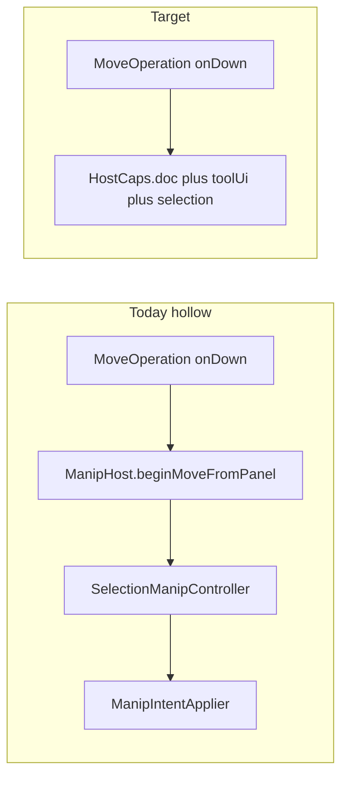

# Operations own logic; HostCaps is only ports

## Diagnosis (why the bags exist)

[`MoveOperation`](epaper/drawing/tools/operations/move_operation.hpp), [`ResizeOperation`](epaper/drawing/tools/operations/resize_operation.hpp), [`NavigationOperation`](epaper/drawing/tools/operations/navigation_operation.hpp), [`SelectOperation`](epaper/drawing/tools/operations/select_operation.hpp) are **forwarders**. Real work is in:

- `ManipHost` / `FingerHost` / `SelectionStrokeHost` — lambda walls back into ToolCanvasItem
- `FingerIntentApplier` / `SelectionIntentApplier` / `ManipIntentApplier` — bitmask → side effects
- `SelectionManipController` — the old ToolCanvasItem gesture bodies

That is not “push complexity into Operations.” It is **the same ToolCanvasItem methods, relocated**. Intent+applier was the previous Tablet/Tool split (`Session` mutators return bits; canvas applies). ADR-0033 Operations **replace** that: the locked Op **is** the place that calls `DocContext` / `ToolContext` in order.

Contrast [`InkStrokeOperation`](epaper/drawing/tools/operations/ink_stroke_operation.hpp): `HostCaps*`, private helpers, `onDown` does the work. That is the pattern.



## Can we eliminate the bags? Yes

A `*Host` only existed because the Op refused to hold state and refused to call ports. Nothing in those bags is a new capability:

| Bag field | After |
|---|---|
| `std::function` back to host | Inlined as `m_caps->doc->…` / `m_caps->toolUi->…` inside the Op |
| `ManipSession*` / marquee pts / panOrigin | **Members of the Operation** (ephemeral; die on unlock) |
| `FingerGestureMachine*` shared | Split: Nav owns pan/pinch; modifier owns `armed` / `lockedUntilLift` only |
| `applyIntent` | Deleted. Op performs the sequence that the applier used to switch on |

**Shared-but-not-HostCaps** stays a short list:

- **SelectionContext** — durable ids + phase for toolbar/chrome. Not live T/B, not lasso pts.
- **ToolContext** — overlay + panel↔world (canvas view). Not camera.
- **HandTouchModifier** — armed + lock-until-lift (input policy). Not pan math.
- **InputHub** — match/lock/feed. Not gesture bodies.

If two Ops need the same **document** query (containment, pick AABB), that is a function on `DocContext` or a free function on `DeviceDocument` — not a Host bag.

HostCaps does **not** grow. `setExclusiveTool` stays the one extra callback (Mode postHandling).

---

## Retire intent + appliers

[`ManipIntent`](epaper/drawing/manip_session.hpp) / [`SelectionIntent`](epaper/drawing/selection_session.hpp) / `FingerIntent` + the three appliers were “session is Qt-free; host applies bits.” Operations already run on the interaction thread and already have HostCaps. They should call ports **directly**:

Move `onMove` today: `applyDragFromPanel` → controller → `manip.apply()` → `ManipIntentApplier` switches 12 bits.

Move `onMove` after: compute live T/B on the Op; then the same calls the applier already makes, inlined:

- `doc->applyLiveSmartGeometry(...)`
- `doc->previewManipulationFrame()` / `refreshConnectorsBoundTo`
- `toolUi->sendManipPreview` / `redrawLiveManip`

No bitmask, no applier class. Order stays explicit in the Op (that **is** the logic). Shared “commit transform command” can be a **private method on Move/Resize** or a small free function `commitSmartTransform(DocContext&, …)` — not a HostCaps field and not an applier object.

Delete: `manip_intent_applier`, `selection_intent_applier`, `finger_intent_applier`.

---

## Per Operation (state + logic inside)

### MoveOperation

- Members: live `ManipSession` (or the fields it wraps), ghost clock.
- `onDown`: pick via `doc->hitMoveTarget(toolUi->panelToWorld(panel))`; `selection->setIds`; `doc->beginGesture`; suppress ids.
- `onMove` / `onUp` / `cancel`: geometry + DocContext + ToolContext as above.
- Finger “arm sel_freeform”: `caps.setExclusiveTool` on down if device==Finger (today’s host lambda).

Chrome abort (pinch / second contact): hub already has the locked Op → `op->cancel()`. No need for SelectionContext to own ManipSession.

### ResizeOperation

- Same transform members as Move (or a private `TransformGesture` helper **used by both files**, not a Host). Only one Op locked, so one live session.
- Match: HitTarget on InputHub (regions from ToolChrome). `onDown` maps hit token → handle; rest like Move with resize bounds.

### LassoOperation / MarqueeOperation

- Members: points / corners (today on `SelectionSession`).
- `onDown`: `toolUi->setStrokeWaveform(true)`; start pts.
- `onMove`: append; `toolUi->damageChromeSegment`.
- `onUp`: containment on `doc->document()`; `selection->setIds`; waveform off; chrome refresh.
- Delete `SelectionStrokeHost` and host `m_selectStroke`.

### SelectOperation

- No machine, no FingerHost. Tap only.
- `onTap`: world pick; if hit `selection->setIds({id})`; else `selection->clear()`; `toolUi->requestChromeRefresh`. PostHandling on PenMode still switches exclusive tool from `HandTouchCommitInfo`.

### NavigationOperation

- Members: pan origin AABB, two-finger contacts, preview clock, pinch arm — **absorb** the nav paths of [`FingerGestureMachine`](epaper/drawing/finger_gesture_machine.hpp) into this Op.
- `onDown`/`onMove`/`onUp` (empty canvas): pan keep-world-under-finger; `applyCamera` + viewport/rasterize via a **Navigation-local** viewport sink (factory-injected Tablet/session). Not DocContext; not HostCaps.
- PinchSink: two-finger pan/pinch in the same Op.
- Delete shared FingerGestureMachine once Select/Move/Resize no longer poke `m_finger.gesture = Move`.

### InkStrokeOperation

- Already the template. Unchanged.

---

## Hub / HandTouch audit — not enough yet

[`InputHub`](epaper/drawing/tools/input_hub.cpp) already has match/lock/feed for **finger down** and **pen selection down**, and move/up/cancel **only if an Op is already locked**. [`HandTouchModifier`](epaper/drawing/tools/hand_touch_modifier.hpp) is still a Phase-0 stub: `armed` + profile map + `postHandling`. It does **not** own `FingerGestureMachine`, two-finger, or ignore-one-finger.

So the host still implements a **second internal event system** beside the hub. That is why `onPointerMove` / `cancelHandTouch` / `endTwoFingerTouch` exist.

### What Hub can do today

| API | Behavior | Gap |
|---|---|---|
| `dispatchFingerDown` | match allow-list, lock, `onDown` | Host must precompute `knobHit`/`boxHit` |
| `dispatchSelectionPointerDown` | HitTarget then Move | Same; unused if host then calls `beginSelectionGesture` |
| `dispatchPointerMove` | feed locked RawPointer **or return false** | Host falls through to ink / `selectionGestureActive` |
| `dispatchPointerUp(s, commit)` | `onUp` + **host-built** `HandTouchCommitInfo` | Host switches on Move/Resize/Select kinds |
| `dispatchPointerCancel` | `onCancel` locked Op | Host still cancels `m_inkStroke` / `m_selectStroke` / machine in parallel |
| `dispatchFingerTap` | **stub, always false** | Tap still synthesized as down+up on host |
| `dispatchPinchBegin/Update/End` | **`dynamic_cast<NavigationOperation*>`** | Hub knows a concrete Op; ignores [`PinchSink`](epaper/drawing/tools/strategy.hpp). Nav’s `onPinchBegin/Update/End` are empty stubs; real work is `beginTwoFinger` |

### What Hub must become (so the host only forwards)

- **One** `dispatchPointerDown/Move/Up/Cancel(sample)` for pen **and** finger. If locked → feed receive sink. Else match (Mode pen candidates ∪ HandTouch allow-list) → lock → `onDown`. Unlocked move/up is a no-op (or only policies), never a host fallback.
- Pinch: match `StrategyKind::Pinch`, lock winner, feed **`PinchSink`** (`onPinchBegin/Update/End`). Delete `dynamic_cast<NavigationOperation*>`. Navigation implements PinchSink for real (contacts/scale live on the Op). Host does not know “two-finger vs drag.”
- Cancel / `cancelHandTouch` / `onPinchEnd`: `hub.cancelAll()` / `hub.dispatchPinchEnd()` → locked Op `onCancel` or PinchSink `onPinchEnd`. Navigation already has `m_pinchActive`; **it** chooses pinch-end vs pan-end. Host must not `if (m_finger.isTwoFinger())`.
- `HandTouchCommitInfo`: **do not** switch on `OperationKind`. After `onUp`, postHandling reads `caps.selection->ids()` (and maybe a bool the Op sets on SelectionContext). PenMode lambda stays; the **filler** `makeHandTouchCommitInfo` on ToolCanvasItem goes away.
- HandTouchModifier: `armed` + `lockedUntilLift` only. Ignore-one-finger during pinch is **Navigation’s** problem (locked Op is Nav; one-finger move is ignored because hub feeds the locked pinch receive, or Nav no-ops RawPointer while `m_pinchActive`).

Until those hub changes land, forwarding `onPinchEnd` today still requires the host to build commit info and the hub to cast to Navigation — that is the leak the review caught.

---

## Leaky host methods (internal event system)

Each of these is “host demux that belongs on Hub or on the locked Op.”

### `endTwoFingerTouch` / `onPinchEnd` / `cancelHandTouch`

Today: host builds `HandTouchCommitInfo` (knows Move/Resize/Select) then `dispatchPinchEnd`. `cancelHandTouch` branches `isTwoFinger` vs `lockedOperation` vs `m_finger.cancel(m_manip.active)` + FingerIntentApplier.

Target: `onPinchEnd` → `m_hub.dispatchPinchEnd()`; `cancelHandTouch` → `m_hub.cancelAll()` (or `handTouch().setArmed(false)` + cancel). Navigation `onPinchEnd`/`cancel` owns settle vs abort. **No** `makeHandTouchCommitInfo`.

### `cancelInteraction` → `onPointerCancel`

Today: priority cascade ink stroke → tablet stroke → hub cancel → `m_selectStroke` → `endSelectionGesture` → `cancelHandTouch`.

Target: `m_hub.cancelAll()` (cancels locked Op, which is ink or lasso or nav or move). Tablet `clearStash` / `cancelActiveStroke` only if InkStrokeOperation’s cancel already covers it via InkSink. No parallel `m_selectStroke` list.

### `updateFingerTouch`

Today: `m_finger.ignoresOneFingerUpdate()` then hub move.

Target: if Nav is locked in pinch, hub still feeds the locked Op; Nav ignores RawPointer while pinching. Host never inspects the machine.

### `onPointerStart` / `onPointerMove` / `onPointerEnd`

Today: nested `if (pen)` / `isSelectionTool` / `lockedOperation` / `selectionGestureActive` / two-finger / `lockedUntilLift`.

`selectionGestureActive()` **is** “there is an in-flight gesture the hub does not own” (`m_selectStroke` + `SelectionSession.gesture`). After Lasso/Marquee/Move lock through the hub, that flag **disappears**. Move/end become: `m_hub.dispatchPointerMove/Up`. Down: `m_hub.dispatchPointerDown`. Pen vs finger is `PointerSample.device` only.

---

## SelectionManipController — not in ADR-0033; split into Ops

[`SelectionManipController`](epaper/drawing/tools/selection_manip_controller.hpp) is a **second router**: it re-implements match (`resolvePress` → move vs marquee), owns a second stroke Op (`m_selectStroke`), and dual-feeds hub vs session vs applier.

| Controller method | Destination |
|---|---|
| `beginSelectionGesture` (pick → move **or** marquee/lasso) | **InputHub match** on pointer down (Move vs Lasso vs Marquee). Not a controller. |
| `updateSelectionGesture` / `endSelectionGesture` | Locked Op `onMove`/`onUp` only |
| `beginMoveFromPanel` / `applyDragWorld` / `commitLiveManip` / `abortFingerManip` / `beginHandleDrag` | **MoveOperation** / **ResizeOperation** |
| `beginMarqueeOrLasso` / `finishMarqueeOrLasso` / `feedSelectStroke` | **LassoOperation** / **MarqueeOperation** `onDown/onMove/onUp` |
| `clearSelection` / `onDocumentOrCameraChanged` | SelectionContext + ToolContext refresh (host signal → those ports) |
| `encloseSelection` / `tapModeChip` | Stay Q_INVOKABLE one-liners on DocContext + ToolContext (not pointer Ops) |

Deleting FingerIntentApplier is **not** enough; the controller still routes. **Delete the class** once the table is empty.

### `feedSelectStroke` + applier chain (collapse)

Current lasso path:

```text
Op.onMove
  → SelectionStrokeHost.applyIntent(SelectionResult)
    → SelectionIntentApplier.apply
      → ToolContext.damageChrome / setStrokeWaveform / requestChromeRefresh
```

And a **parallel** host path: `feedSelectStroke(QEvent)` → `dynamic_cast<RawPointerSink>(m_selectStroke)` → `onMove` again.

Target: **one** cycle. LassoOperation holds pts; `onMove` calls `toolUi->damageChromeSegment` directly. No `SelectionResult` bitmask, no applier, no `m_selectStroke` unique_ptr on the host, no `feedSelectStroke`. Hub lock **is** the LassoOperation.

Same for marquee and for Move (`ManipResult` → `ManipIntentApplier` inlined into Move/Resize).

---

## ToolCanvasItem after hub fix

Q_INVOKABLE stay as Qt entry; bodies are one hub call. Host must not mention two-finger, pinch-ignore, `OperationKind`, `FingerGestureMachine`, or `selectionGestureActive`.

```text
onPointerStart(...)     →  m_hub.dispatchPointerDown(sample)
onPointerMove(...)      →  m_hub.dispatchPointerMove(sample)
onPointerEnd(...)       →  m_hub.dispatchPointerUp(sample)
onPointerCancel()       →  m_hub.cancelAll(); surface->clearStash()
onPinchStart/Update/End →  m_hub.dispatchPinch*(x,y,scale)   // arm math inside Nav
onFingerTap             →  m_hub.dispatchTap(sample)
cancelHandTouch         →  m_hub.cancelAll()
toggleHandTouch         →  m_hub.handTouch().setArmed(...)
```

---

## Order

1. Move/Resize: copy controller+applier bodies into the Ops; delete ManipHost + ManipIntentApplier. Smoke move/resize.
2. Lasso/Marquee: own geometry; delete SelectionStrokeHost + SelectionIntentApplier. Smoke lasso/marquee.
3. Navigation owns pan/pinch; Select is tap; delete FingerHost + FingerIntentApplier + machine-as-shared. Smoke pan/pinch/tap.
4. Hub: unified pointer dispatch; PinchSink not Navigation cast; commit from SelectionContext; host Q_INVOKABLE one-liners; delete SelectionManipController + feedSelectStroke + makeHandTouchCommitInfo.
5. ToolContext view mapping; Ops never downcast SessionDocContext.

Each step makes an Operation **thicker** and deletes a bag/applier. If an Op is still a 4-line lambda call, the step is not done.
