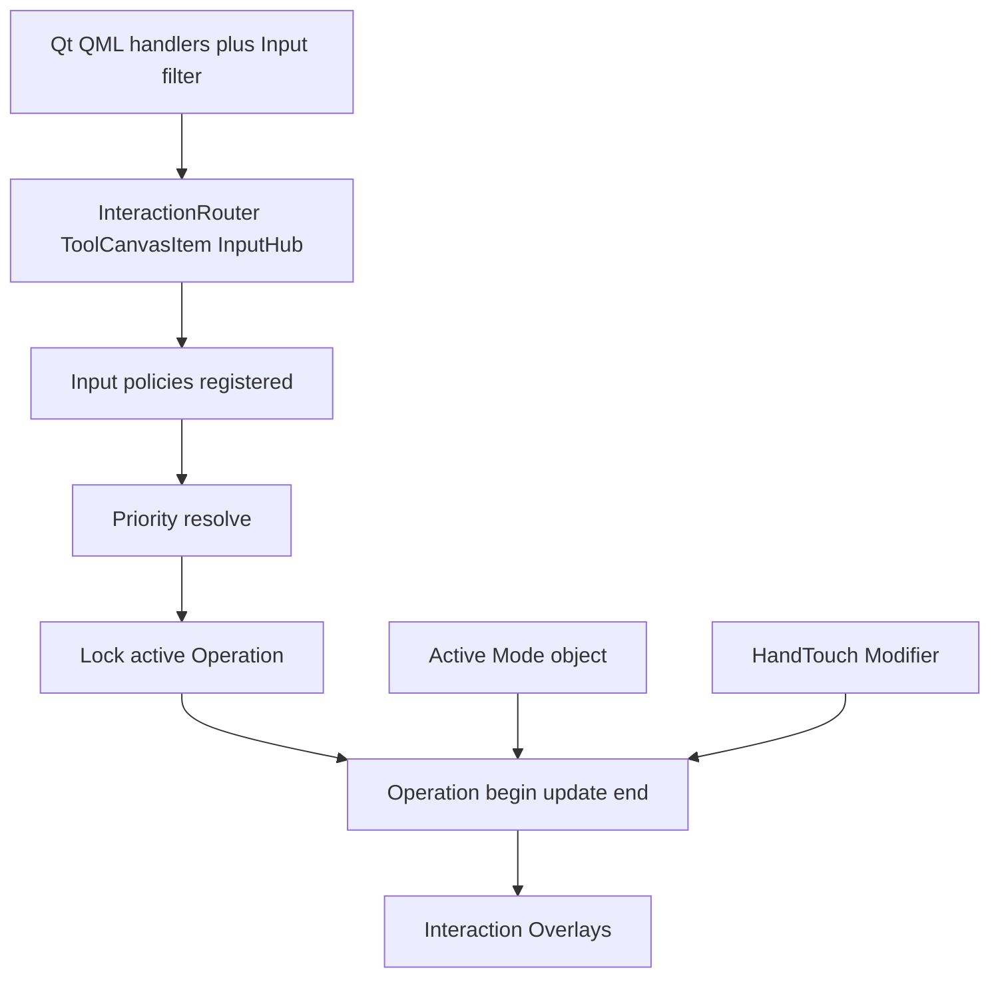
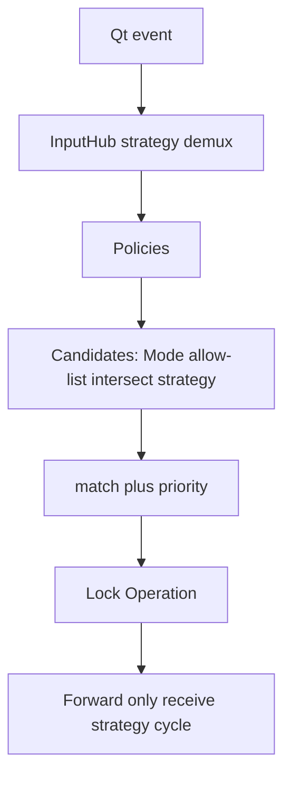
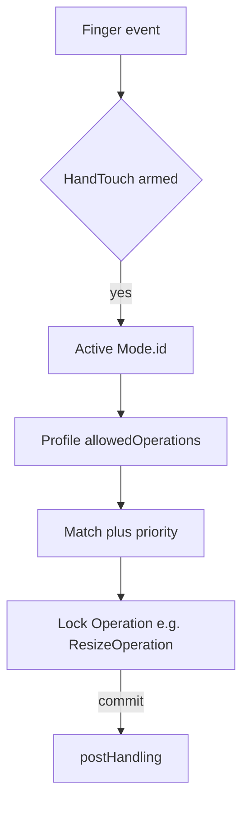

# Epaper tool system refactor (ADR-0033 first)

> **Project memory — draft / active.** Working design for the tool-system refactor.
> Normative locks also recorded in [ADR-0033](../adr/ADR-0033-tool-abstraction.md) Decision.
> Revise here as implementation learns; keep ADR Decision in sync for locks.
>
> **Not a complete extraction plan.** This file is the taxonomy (Router / Mode / Operation).
> Bodies moved in [plan_dissolve_host_bags.md](./plan_dissolve_host_bags.md). Leftovers in
> [plan_toolaction_context_ui.md](./plan_toolaction_context_ui.md). How that gap happened:
> [refactoring-skills/](./refactoring-skills/SKILL.md).

## Goal

Eliminate mixed tool logic in [`toolcanvasitem.cpp`](../../epaper/drawing/toolcanvasitem.cpp) by implementing [ADR-0033](../adr/ADR-0033-tool-abstraction.md) with ml-mindmap-style register/activate — tools under [`epaper/drawing/tools/`](../../epaper/drawing/tools/).

**Payoff:** new tool = new files + registrations (hub strategies, HandTouch profile, overlays). Not another `onPointerStart` branch.

**Done when:** PenMode + SelectionMode as Mode objects; each gesture is its own **Operation** (Lasso, Marquee, Move, Resize, InkStroke, …); SelectionContext holds durable selection; HandTouch dispatches mode→allowed ops→match→**lock Operation**; recognizer modifiers on Pen; ToolCanvasItem is router host; behavior preserved; build-warn clean.

---

## Emphasize: ADR-0033 concepts (architecture spine)

These are not optional labels — they are the decomposition. **Do not** fold them back into one `Tool` god-interface.

### 1. Interaction Router — [`ToolCanvasItem`](../../epaper/drawing/toolcanvasitem.h) (+ `InputHub`)

[`toolcanvasitem.cpp`](../../epaper/drawing/toolcanvasitem.cpp) **receives Qt events** ([`ToolCanvas.qml`](../../epaper/drawing/ToolCanvas.qml) handlers, pen-near / contactCount) and **routes** — it must not own pen ink, lasso, and finger machines as peer private methods forever.

Router responsibilities:

- Normalize pointer/pinch/tap/cancel into strategy cycles.
- Run **Input policies** (registered; see below).
- Apply **priority** among candidate Operations.
- **Lock** the winning **Operation** for move/end until cancel or commit.
- Forward to active Mode / HandTouch / Overlay hit targets — never “everyone if-else.”



### 2. Interaction Mode — object (id + state), keyed by enum

**Not** “enum only.” An Interaction Mode is an **object**:

```text
InteractionMode {
  id          // enum / singleton: PenMode | SelectionMode | EraserMode | …
  state       // mode-specific durable or phase state (see below)
  activate / deactivate
  register HandTouchProfile(id, allowedOperationKinds, postHandling)
  contribute candidate Operations for match (pen path)
}
```

| Mode object | `id` (enum for HandTouch / chip) | Mode-owned state (examples) |
|---|---|---|
| **PenMode** | `Pen` | little durable state; stroke lives in InkStroke **Operation** |
| **SelectionMode** | `Selection` (covers `sel_rect` / `sel_freeform` arms or sub-id) | collaborates with **SelectionContext** (ids, Idle/Selected/…); does **not** store lasso polyline on the Mode |
| **EraserMode** (later) | `Eraser` | TBD |

Toolbar / `ChipModel.exclusive` maps to Mode `id`. HandTouch profiles key off that **enum id** (easy registration) while the live instance is the Mode **object**.

**Transform** is **not** a primary toolbar Mode. When SelectionContext has `selected != none`, Move/Resize/Rotate are **Operations** available under SelectionMode (ADR-0033 §2 hit-test picks which).

### 2b. Operation — locked gesture object with lifecycle (standard name)

**Most important decomposition:** each gesture has its **own Operation implementation**. Prefer the word **Operation** (ADR / industry); internally it may still look like today’s Qt-free “session” structs (`begin`/`update`/`end` → intents).

```text
Operation (base) {
  kind            // enum: Lasso | Marquee | Move | Resize | Rotate | InkStroke | Navigation | …
  begin(down)
  update(move)
  end(up)         // → SelectionContext and/or Document Command
  cancel()
  // ephemeral gesture geometry only — not durable selection ids
}
```

Router / HandTouch **locks exactly one** active Operation for the pointer gesture.

| While locked | After end/commit |
|---|---|
| Op owns ephemeral geometry (lasso pts, marquee corners, live transform) | Op destroyed/reset |
| Overlay may paint from Op (live lasso stroke) | Overlay paints from **SelectionContext** / doc (settled bounds, knobs) |

#### SelectionMode — Operations (extend base)

```text
SelectionMode
  ├── LassoOperation
  ├── MarqueeOperation
  ├── MoveOperation
  ├── ResizeOperation
  ├── RotateOperation      // when product-ready
  └── (Select-tap may be a thin Operation or entry that only updates SelectionContext)
```

Example — **LassoOperation** (maps today’s `SelectionSession` lasso path):

```text
pointer down  → begin: start lasso pts; ToolContext stroke overlay
pointer move  → update: append pts; damage overlay
pointer up    → end: containment on DocContext → set SelectionContext ids/phase=Selected
              → clear Op; overlay shows settled selection rect from SelectionContext
```

Split today’s single `Gesture` enum on [`selection_session.hpp`](../../epaper/drawing/selection_session.hpp) (`Marquee|Lasso|Move|Resize`) into **separate Operation types**; keep Qt-free intent style. [`manip_session.hpp`](../../epaper/drawing/manip_session.hpp) seeds **MoveOperation** / **ResizeOperation**.

#### PenMode — Operations

| Device | Typical Operation |
|---|---|
| Pen | **InkStrokeOperation** → InkSink (+ recognizer modifiers on commit) |
| Finger (HandTouch profile) | **NavigationOperation**, **Select**/entry, **MoveOperation** (per profile) — not ink |

### 2c. Operation receive strategies — event shapes (flexible delivery)

**Operation is the locked primary receiver of events, but it never talks to Qt.** Flexibility = each Operation **declares** which host **Strategy** feeds it; the Router demuxes and calls a narrow sink. Operations do **not** `bind`/`unbind` listeners (ml-mindmap style stays at Mode/HandTouch registration of kinds only).

#### Two phases

| Phase | Who | Operation role |
|---|---|---|
| **Match** (unlocked) | Router asks candidates `match(event)` | Cheap, side-effect-free; often only needs down / hit-test |
| **Locked** | Router forwards **only** to winning Operation | Full lifecycle on that Op’s **receive** strategy cycle |

#### StrategyKind (Router-owned channels)

| Strategy | Cycle delivered | Typical Operations |
|---|---|---|
| `RawPointer` | down / move / up / cancel (+ device, pressure) | InkStroke, Lasso, Marquee, Move, Resize |
| `Drag` | begin / update / end after threshold | Optional; marquee-style |
| `Tap` | single tap | Select / deselect |
| `Pinch` | begin / update / end | Navigation |
| `HitTarget` | down/move/up if hit registered rect | Resize knobs, move slab (often match) |

#### Descriptor + sinks

```text
OperationDescriptor {
  kind: OperationKind
  matchOn: StrategyKind     // which channel can win the match
  receive: StrategyKind     // which channel feeds the Op once locked (may differ from matchOn)
  priority: int
  devices: Pen | Finger | Both
  // optional: needsSelection, …
}

// Operation implements ONE sink for its receive strategy — not onAnyEvent
RawPointerSink: onDown / onMove / onUp / onCancel
PinchSink:      onPinchBegin / onPinchUpdate / onPinchEnd
TapSink:        onTap
HitTargetSink:  onDown / onMove / onUp  // or match-only then switch receive
```

**matchOn ≠ receive (allowed):** e.g. Resize — `matchOn = HitTarget`, `receive = RawPointer` (hub keeps lock and forwards move/up on RawPointer after knob hit).

#### End-to-end demux



1. Classify event → StrategyKind channel.
2. Candidates = Mode / HandTouch **allowed kinds** whose descriptor accepts that channel (`matchOn` or locked `receive`).
3. Match + priority → lock; store descriptor (`receive` strategy).
4. Until unlock: ignore other Ops; feed only locked Op’s sink.
5. end/cancel → unlock; Overlay may switch Op paint → SelectionContext paint.

#### Examples

| Operation | matchOn | receive |
|---|---|---|
| InkStroke | RawPointer (Pen) | RawPointer |
| Lasso / Marquee / Move | RawPointer | RawPointer |
| Resize | HitTarget | RawPointer (or Drag) |
| Navigation | Pinch | Pinch |
| Select | Tap or RawPointer | Tap or RawPointer |

#### HitTarget strategy (detail)

**HitTarget** = Router only offers the event to an Operation if the pointer is inside a **registered geometry** (knob AABB, move slab, later connector endpoint/tie regions)—not the whole canvas.

| | **RawPointer** | **HitTarget** |
|---|---|---|
| Where | Full canvas input layer | Only registered hit regions |
| Typical use | Ink, lasso, marquee, free move | Resize knobs, move slab, connector endpoint/tie knobs |
| Who defines region | N/A | Chrome / Operation registers rects (or paths) with the Hub; refresh when SelectionContext or camera changes |

**Why:** Without HitTarget, every down competes as a full-canvas Operation (Resize fights Lasso). With HitTarget, down-on-knob only considers high-priority Resize-like candidates; after lock, **`receive` often switches to RawPointer** so move/up still work if the pointer leaves the tiny knob (capture at Hub).

**Lifecycle sketch**

```text
SelectionContext has selection → register HitTargets (rects update on camera/layout)
pointer down inside region → strategy HitTarget → match Op → lock
further moves → feed receive strategy (usually RawPointer)
end/cancel → unlock; targets may stay registered until selection clears
```

**Not:** a Mode/Modifier; not document blit; not primary ToolChip (those stay separate QML controls outside the canvas Hub).

#### Chrome hit policy (locked) — QML DragHandler vs HitTarget

For SelectionOverlay knobs (SmartGroup 8-knob **or** future connector start/end/tie knobs):

| Approach | Verdict |
|---|---|
| **QML component + its own DragHandler** | **Reject for canvas chrome.** Steals from canvas handlers; pen-near / 2nd-contact / HandTouch arbitration bypasses Router; every new knob type forks input policy. |
| **Render chrome + HitTarget hit-test** | **Prefer.** Visuals via ToolContext (Mono paint and/or **visual-only** QML like today’s [`ResizeKnob.qml`](../../epaper/drawing/ResizeKnob.qml) — already “Hit-test lives on leftover canvas”). Hit geometry registered with Hub; Operations self-compute/update regions (AABB, fat polyline for connector highlight, endpoint/tie spots). |

**Tomorrow — connector selection chrome** (no bounds rect; fat stroke highlight; start/end/tie knobs): still **HitTarget**. Register multiple regions (or a small hit graph) owned by connector-specific Operations (e.g. `ConnectorEndpointDragOperation`, `ConnectorTieOperation`). Do **not** attach DragHandlers to those knobs. Self-computing hit-test is intentional cost of one event pipeline.

**Exception:** primary ToolChip / dialogs / true buttons that are not SelectionOverlay canvas chrome may keep QML handlers (already outside Hub).

#### Registration

At startup / Mode activate: `Register(kind, descriptor, factory)`. HandTouch profiles list **kinds** only; Hub resolves factory+descriptor on match win.

#### Non-goals

- Operation calling `hub.bind(RawPointer)` itself.
- One mega `onAnyEvent` on every Operation.
- Strategy arbitration inside each Operation (stays on Router).

**One line:** Strategy = how events are shaped/delivered (Router); Operation = what the locked gesture does with that stream; Mode = which Operation kinds may be candidates.

### 3. Modifier / Behavior

Orthogonal to exclusive Mode — **zero or more** active. Never `ChipModel.exclusive`.

| Modifier | Composes with | Role | Binds input strategies? |
|---|---|---|---|
| **HandTouch** | Any Mode | Armed on/off; finger/pinch dispatch via Mode’s HandTouchProfile | Yes (finger/tap/pinch) |
| **InkBoxRecognizer** | **Pen Mode** | On pen-up, if latched armed → ink-box recognition path after InsertInk | No — pen-up **behavior** |
| **ConnectorRecognizer** | **Pen Mode** | On pen-up, if latched armed → connector recognition path after InsertInk | No — pen-up **behavior** |
| View-only (later) | Any | Forces HandTouch nav-only | Policy on HandTouch |

```text
PenMode
  + HandTouchModifier          (optional; finger world)
  + InkBoxRecognizerModifier (optional; pen-up)
  + ConnectorRecognizerModifier (optional; pen-up)
```

Nonsense to avoid (ADR-0033): `ActiveTool = InkBoxRecognizer`. Correct state:

```text
Mode = Pen
Modifiers = { HandTouch?, InkBoxRecognizer?, ConnectorRecognizer? }
```

#### Pen Mode modifiers — Ink-box & Connector recognizers

**Kind:** Behavior modifiers on **Pen Mode only** (ADR-0033 / existing ChipModel). They do not receive pointer events; they alter what happens when a pen stroke **commits**.

| Aspect | InkBoxRecognizer | ConnectorRecognizer |
|---|---|---|
| Primary toolbar | Yes — toggle tiles (not exclusive tools) | Yes |
| State | `chip.recogInkBox` bool | `chip.recogConnector` bool |
| When effective | Exclusive Mode == Pen (dimmed / flip rejected while Selection Mode — today `recogDimmed()`) | same |
| Pen-down latch | Snapshot into `latchedInkBox` / `latchedConnector` for the in-flight stroke ([SRS-EP-04]) | same |
| Pen-up | Participate in recognizer dispatch after ink insert (Tablet ingest / `dispatchTuple`) | same |
| Overlay | None (no ToolContext chrome) | None |
| Registration | At startup: register as Pen Mode behaviors; PenTool (or session) reads armed+latched at commit | same |

**Ownership in refactor:** Keep chip state on [`CanvasSession`](../../epaper/drawing/canvas_session.h) / [`ChipModel`](../../epaper/drawing/primary_toolbar.hpp). Represent as small Modifier types (or session-backed facades) under `tools/` e.g. `ink_box_recognizer_modifier.hpp`, `connector_recognizer_modifier.hpp` — **toggle API + latch hooks**, not InputHub sinks. PenTool’s Document Command path (InsertInk → recog) **queries** these modifiers; Selection Mode does not.

**vs HandTouch:** HandTouch changes *who gets finger events*. Recognizers change *pen-up document pipeline*. Both are Modifiers; only HandTouch is an input Modifier.

HandTouch is **never** `ChipModel.exclusive`. Recognizer toggles are **never** exclusive Modes.

### 4. Interaction Overlay

Transient interaction visuals — not document blit (ADR-0019 / ADR-0033 §6):

- Lasso / marquee / settled bounds → ToolCanvas Mono (`ToolContext`)
- Knobs / enclose / mode-chip → ToolLayer QML (`ToolContext`)
- Live ink preview → Tablet (`InkSink`)
- Origin punch hole → Tablet Surface

Overlays are contributed by the **locked Operation** (live gesture) and/or **SelectionContext** (settled); router/host composites via `ToolContext`.

### 5. DocContext + Document Command

- **DocContext** — capability to read/write `DeviceDocument` (hit-test, preview, commit hooks).
- **Document Command** — explicit ops (`InsertInk`, `SetSmartTransform`, enclose, later Copy/Cut/Paste). **Operations** collect gesture → emit Command — they do not become a second document owner.

Pen: InkStrokeOperation → InkSink preview → pen-up → InsertInk command (+ recognizer modifiers). ResizeOperation: drag → preview → commit transform command.

### 6. Selection state machine → SelectionMode + SelectionContext

ADR-0033 §3: Idle → Selecting → Selected → Transforming.

**Host:** SelectionMode object + **SelectionContext** (durable ids / phase).  
**Selecting / Transforming phases** are realized by locking **Lasso/Marquee** or **Move/Resize** Operations — not by stuffing geometry into the Mode enum. HandTouch only match→locks an allowed Operation.

### 7. Input policy — register vs execute

| | Who |
|---|---|
| **Register** | Modes / modifiers / Operation factories at **app startup** or **document load** (Mode id enum + Operation kind enums) |
| **Execute / match** | **Interaction Router** (and HandTouch for finger) |

Examples:

- Pen-near cancels finger + active **Operation**.
- Second contact aborts one-finger Move/Resize Operation.
- HandTouch profiles **per Mode id** listing **allowed Operation kinds**.
- Pen-down recognizer latch when Mode id == Pen.
- Priority: Resize handle hit > Move body > Lasso/Marquee canvas > …

### 8. Priority — Interaction Router

```text
ResizeOperation (handle)  >  MoveOperation (body)  >  Lasso/Marquee Operation  >  …
```

Match side-effect-free; winner **locked as active Operation** until end/cancel.

---

## Locked design choices (keep)

| Choice | Decision |
|---|---|
| Binding model | activate/deactivate = bind/unbind strategy sinks; host talks to Qt |
| Event ownership | QML → ToolCanvasItem router → InputHub |
| Forward rule | Policies → priority match → lock → Mode (pen) / HandTouch (finger) / Overlay hits |
| HandTouch | Orthogonal input modifier; profiles key off Mode **id** enum; allow-list of **Operation kinds**; match→lock Operation |
| Mode shape | **Object** with id + state (not enum-only); enum id for registration / chip |
| Operation | Standard name for locked gesture lifecycle object; **declares** matchOn/receive StrategyKind; Router feeds narrow sink — Op never binds Qt |
| Operation strategies | RawPointer, Drag, Tap, Pinch, HitTarget — host channels; matchOn may differ from receive |
| SelectionOverlay hits | **HitTarget** (+ visual-only QML/paint); **not** per-knob DragHandlers — including future connector knobs |
| InkBox / Connector recognizers | Orthogonal **Pen Mode** behavior modifiers; latch on pen-down; dispatch on pen-up; dim under Selection; never exclusive |
| Capabilities | Settled names below |
| Product docs | ADR-0033 Decision emphasizing this spine; SRS-EP-04/12/21/23/24 |

### Capability ports (settled names — keep)

| Port | Role |
|---|---|
| **InkSink** | Stroke pipe to Tablet (pen samples / cancel) |
| **DocContext** | Document model access + command commit helpers |
| **ToolContext** | Tool UI host — today SelectionOverlay (stroke + context QML); later may include primary toolbar (**not this plan**) |
| **SelectionContext** | Selection state machine + ids / gesture phase |

Activate bag: **`HostCaps`** `{ InkSink*, DocContext*, ToolContext*, SelectionContext* }` — not named ToolContext.

---

## HandTouch: parallel arming + Mode id → allowed Operations

Because HandTouch is armed **in parallel** with Modes, each Mode **registers with HandTouch** using its **enum id** and an allow-list of **Operation kinds** (not raw finger binds on every tool).

### Registration

```text
HandTouchProfile {
  modeId              // enum: Pen | Selection | Eraser | …
  allowedOperations[] // enum kinds: Navigation, Select, Lasso, Marquee, Move, Resize, Rotate, …
  postHandling        // std::function(HostCaps&, HandTouchCommitInfo&) — empty = none
                      // Mode/Operation supplies logic (not hardcoded SwitchToSelection enum)
}
```

| Mode object | `modeId` | `allowedOperations` | postHandling |
|---|---|---|---|
| **PenMode** | Pen | `{ Navigation, Select, Move }` | Lambda: switch to Selection **only if** `didMutateSelection && selectionNonEmpty` |
| **SelectionMode** | Selection | `{ Navigation, Select, Lasso, Marquee, Move, Resize, Rotate }` | empty |
| **EraserMode** (later) | Eraser | `{ Navigation }` | empty |

(`sel_rect` vs `sel_freeform` choose Marquee vs Lasso Operation on pen canvas; both sit under SelectionMode id for HandTouch.)

### Dispatch

```text
1. Active Mode.id  →  load HandTouchProfile
2. Classify event → StrategyKind; narrow to allowedOperations ∩ matchOn/receive
3. Match + priority  →  e.g. Resize
4. Instantiate/lock ResizeOperation (feed via descriptor.receive)
5. onDown/onMove/onUp (or Pinch sinks) until end
6. postHandling if any
```



---

## Target layout

```text
epaper/drawing/tools/
  operation.hpp                 # Operation base + OperationDescriptor (kind, matchOn, receive, priority)
  strategy.hpp                  # StrategyKind + RawPointer/Tap/Pinch/HitTarget sink interfaces
  mode.hpp                      # InteractionMode base: id enum + state, activate/deactivate
  host_caps.hpp
  ink_sink.hpp / doc_context.hpp / tool_context.hpp / selection_context.hpp
  input_hub.hpp / .cpp          # strategy demux, policy, match, lock, feed receive cycle
  interventions.hpp
  hand_touch_profile.hpp        # modeId + allowedOperations[] + postHandling
  hand_touch_modifier.hpp / .cpp
  modes/pen_mode.hpp / .cpp
  modes/selection_mode.hpp / .cpp
  operations/ink_stroke_operation.hpp / .cpp
  operations/lasso_operation.hpp / .cpp
  operations/marquee_operation.hpp / .cpp
  operations/move_operation.hpp / .cpp
  operations/resize_operation.hpp / .cpp
  operations/navigation_operation.hpp / .cpp
  ink_box_recognizer_modifier.hpp
  connector_recognizer_modifier.hpp
  # later: eraser_mode.*, rotate_operation.*, view_only_modifier.*
```

Domain seeds: fold/split [`selection_session.hpp`](../../epaper/drawing/selection_session.hpp) into Lasso/Marquee ops + SelectionContext; [`manip_session.hpp`](../../epaper/drawing/manip_session.hpp) into Move/Resize ops.

## Contracts (minimal)

```cpp
struct OperationDescriptor {
  OperationKind kind;
  StrategyKind matchOn;
  StrategyKind receive;   // may differ from matchOn
  int priority;
  // devices, …
};

struct Operation {
  virtual OperationKind kind() const = 0;
  virtual const OperationDescriptor &descriptor() const = 0;
  virtual bool match(/* strategy event */) const = 0;  // side-effect free
  virtual void cancel() = 0;
  // Plus ONE strategy sink, e.g. RawPointerSink or PinchSink — not onAnyEvent
};

struct InteractionMode {
  virtual ModeId id() const = 0;
  virtual void activate(HostCaps&, InputHub&, HandTouchModifier&) = 0;
  virtual void deactivate(InputHub&, HandTouchModifier&) = 0;
};
```

**Router (`InputHub`)**

1. Classify Qt event → StrategyKind; run policies.
2. If Operation locked → feed only its `receive` sink (update/end/cancel).
3. Else candidates = allow-list ∩ ops whose `matchOn` matches channel → `match` + priority → lock.
4. Pen candidates from active Mode; Finger via HandTouch profile kinds.
5. Support matchOn≠receive (e.g. HitTarget match, RawPointer continue).

## Host after refactor

ToolCanvasItem = **Interaction Router host**: QML entry, `HostCaps`, switch Mode objects, paint via ToolContext (active Op + SelectionContext), arm HandTouch, recog toggles. No gesture implementation bodies.

## Phased implementation

### Phase 0 — Docs + skeleton

- ADR-0033 Decision: Mode **object**, **Operation** lifecycle + **receive strategies** (descriptor matchOn/receive), Router demux/lock, Modifiers, Overlay, Command, HandTouch profiles by Mode id.
- Skeleton `Operation` / `OperationDescriptor` / `StrategyKind` sinks + hub shim.

### Phase 1 — PenMode + InkStrokeOperation + recog modifiers

- PenMode object; InkStrokeOperation → InkSink; HandTouch profile `{ Navigation, Select, Move }` + SwitchMode postHandling; InkBox/Connector modifiers.

### Phase 2 — SelectionMode + SelectionContext + Lasso/Marquee Operations

- SelectionMode object; SelectionContext durable state; **LassoOperation** + **MarqueeOperation**; pen `sel_rect`/`sel_freeform` choose which; HandTouch allow-list includes Lasso/Marquee/Move/Resize/….
- **Status (2026-08-26):** done — `SelectionContextHost`, `SelectionMode`, marquee/lasso ops wired through `ToolCanvasItem::feedSelectStroke`; Move/Resize remain `ManipSession` until Phase 4.

### Phase 3 — HandTouchModifier dispatch

- Profile registry; modeId→allowedOperations→match→**lock Operation**; NavigationOperation shared.
- **Status (2026-08-27):** done — `InputHub` match/lock/feed for finger + pinch; `NavigationOperation`, `MoveOperation`, `FingerResizeOperation`, `SelectOperation`; factories registered from `ToolCanvasItem::syncHandTouchFactories`.

### Phase 4 — MoveOperation + ResizeOperation (+ overlays)

- From ManipSession; HitTargets; punch; settled chrome from SelectionContext when no Op locked.
- **Status (2026-08-27):** done — `ManipHost`, pen+finger `MoveOperation`/`ResizeOperation` (HitTarget match → RawPointer drag); `syncSelectionHitTargets()` on chrome refresh; pen path via `tryDispatchSelectionPointer`.

### Phase 5 — Thin router host + CMake + verify

- `SessionDocContext` + `ToolCanvasContext` implement `DocContext` / `ToolContext`; wired into `HostCaps`.
- `SelectionIntentApplier` + `ManipIntentApplier` own intent sinks; `applySelectionIntent` / `applyManipIntent` delegate.
- **Status (2026-08-27):** done — build-warn clean.

### Phase 6 — Extract finger/selection/chrome from host

- `FingerIntentApplier`, `SelectionManipController`, `ToolChrome`; frame/pick/camera on `SessionDocContext`.
- `ToolCanvasContext` owns chrome refresh/paint/damage (not forwarders to host).
- **Status (2026-08-27):** done — then superseded by dissolve-host-bags (Operations own logic).

### Phase 7 — Operations own logic; HostCaps is ports only

- Move/Resize own `TransformGesture` (`ManipSession` + DocContext/ToolContext calls). No `ManipHost` / `ManipIntentApplier`.
- Lasso/Marquee own polyline/rect; containment via `document()`; no `SelectionStrokeHost` / `SelectionIntentApplier`.
- Navigation owns pan/pinch + `Viewport`; Select is tap pick/clear; `HandTouchModifier` is armed + lock-until-lift only.
- `InputHub` unified `dispatchPointerDown/Move/Up`, `dispatchTap`, `dispatchPinch*` via `PinchSink` (no `NavigationOperation` cast). Commit info from `SelectionContext` + `Operation::didMutateSelection()`.
- ToolCanvasItem Q_INVOKABLE one-liners. Deleted `SelectionManipController` and host bags.
- ToolContext holds panel↔world mapping. Ops never downcast `SessionDocContext` (`Viewport*` ctor-injected into Navigation).
- **Status (2026-08-27):** done.

## Verification

- build-warn; pen ink; recog latch; pen+hand select→SwitchMode Selection; Lasso/Marquee commit→SelectionContext settled rect; ResizeOperation lock from knob; pinch Navigation; pen-near cancels Op; undo after transform command.

## Payoff test

New gesture = new **Operation** class + **OperationDescriptor** (matchOn/receive strategy) + allow-list entry on the Mode’s HandTouch profile (and/or Mode pen candidates). Router demux/lock unchanged. New Mode = Mode object + profile registration.
