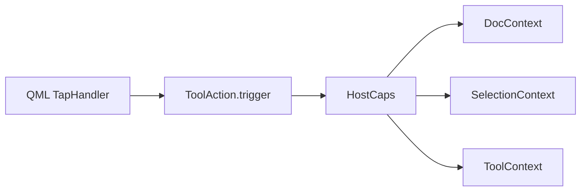
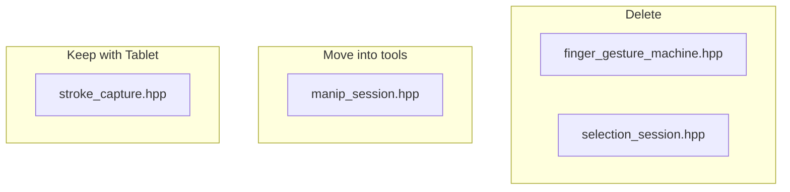

# ToolAction, context UI, leftover session types

## 0. Save dissolve plan into memory

Plans already live as [`plan_dissolve_host_bags.md`](.docs/memory/plan_dissolve_host_bags.md) and [`plan_epaper-tool-system-refactor.md`](.docs/memory/plan_epaper-tool-system-refactor.md). Update [`.docs/memory/README.md`](.docs/memory/README.md) to list them (the README still points at the old `epaper-tool-system-refactor.md` name). Do **not** edit the Cursor plan file.

---

## Host methods — stay vs move

[`toolcanvasitem.cpp`](epaper/drawing/toolcanvasitem.cpp) today:

| Method | Callers | Verdict |
|---|---|---|
| `syncToolHost` / `registerOperations` | **only** `setSurface` / `setSession` | Keep. Per-canvas hub rebuild. Not on pointer events. Early-return already exists when surface/session identity is unchanged. |
| `syncActiveMode` | `setSession` + `exclusiveToolChanged` | Keep. Primary toolbar still lives in [`Main.qml`](epaper/drawing/Main.qml); chip → exclusive tool → Mode object. |
| `onDocumentOrCameraChanged` | Qt `documentMutated` / `cameraChanged` | **Logic moves to ToolContext.** Host keeps the `connect` one-liner. |
| `encloseSelection` / `tapModeChip` + Q_PROPERTY chrome rects | Main.qml CTA/chip | **Leave the host.** Become ToolActions + selection context UI. |

`onDocumentOrCameraChanged` body is a SelectionContext invariant (drop ids whose nodes vanished) plus chrome refresh. That is not router demux. Move to `ToolContext::onDocumentOrCameraChanged()` (prune via `doc->document().find`, `selection->setIds(keep)`, `requestChromeRefresh()`). Host:

```cpp
connect(m_session, &CanvasSession::documentMutated, this,
        [this] { if (m_toolCtx) m_toolCtx->onDocumentOrCameraChanged(); });
```

Also drop unused `m_inkBoxRecog` / `m_connRecog` unique_ptrs (never constructed).

---

## ToolAction (click → document command)

New concept, **not** an Operation. Operations are pointer-locked gestures. Actions fire once on tap and talk to `HostCaps`.

```text
epaper/drawing/tools/actions/action.hpp          // ToolAction
epaper/drawing/tools/actions/enclose_action.hpp
epaper/drawing/tools/actions/ink_scale_action.hpp
epaper/drawing/tools/actions/cut_action.hpp      // visible, enabled=false, trigger no-op
epaper/drawing/tools/actions/copy_action.hpp
epaper/drawing/tools/actions/paste_action.hpp
```

```cpp
class ToolAction {
  virtual QString id() const = 0;
  virtual QString icon() const;   // qrc path; empty → text tile
  virtual QString label() const;
  virtual bool visible(const HostCaps &) const = 0;
  virtual bool enabled(const HostCaps &) const = 0;
  virtual void trigger(HostCaps &) = 0;
};
```

- **Enclose** — `visible` when SelectionMode and **≥2 selected inks** (tighten today’s `ids.size() >= 2`); `trigger` = today’s `encloseSelection()` body (`doc->encloseSelection` + clear + chrome). Icon: existing `icon-epaper-enclose`.
- **InkScale** (InkBoxContentScale) — `visible` when one selected node has `Verb::SetInkScaleMode` and LOD ok (else trigger shows manip-unavailable, same as `tapModeChip`). Label toggles Keep size / Scale ink. No separate chip type.
- **Cut / Copy / Paste** — `visible` when selection non-empty; `enabled` always false; no clipboard. Text tiles (no PNG assets yet).



---

## Selection context UI (`tools/ui`)

ADR-0033 already splits **context toolbar** from Mode/Operation. First concrete package:

```text
epaper/drawing/tools/ui/action_list_model.hpp/.cpp      // QAbstractListModel over ToolAction*
epaper/drawing/tools/ui/selection_context_bar.hpp       // owns action instances, refresh(HostCaps)
epaper/drawing/tools/ui/SelectionContextToolbar.qml     // strip + handle Repeater
```

CMake `QML_FILES` includes that path; set `QT_RESOURCE_ALIAS` so QML can `import` it next to ToolCanvas.

**Not ToolActions:** resize knobs are Overlay + HitTarget ([ADR-0033](.docs/adr/ADR-0033-tool-abstraction.md)). Visuals move out of Main.qml into the same QML file. [`ResizeKnob.qml`](epaper/drawing/ResizeKnob.qml) stays visual-only.

Instantiate from [`ToolCanvas.qml`](epaper/drawing/ToolCanvas.qml) (not Main). Strip [`Main.qml`](epaper/drawing/Main.qml) of `encloseCta`, `inkScaleChip`, `selectHandles`, refuse-reason Text tied to enclose.

### Overlay hit-test (generic) vs knob layout (selection-only)

`ToolChrome::handleIndexAtPanel` is the wrong name **and** the wrong layer: it is selection-knob math pretending to be a ToolContext port, while [`InputHub`](epaper/drawing/tools/input_hub.hpp) already stores `HitRegion`s that **match never consults**. Resize today re-hit-tests via ToolContext.

**Generic (any Mode’s overlay chrome) — InputHub**

HitTarget is a Router strategy ([plan § HitTarget](.docs/memory/plan_epaper-tool-system-refactor.md)). The hub owns registered overlay rects and answers “is this panel point on overlay chrome?”

```cpp
const HitRegion *InputHub::overlayHitAt(const QPointF &panel) const; // first hit, highest priority
```

`dispatchPointerDown` already tries `StrategyKind::HitTarget` first; **match must use `overlayHitAt`**, not a chrome-specific knob index. `ownerToken` identifies which overlay control (knob 0–7, later connector endpoint, …). Drop `ToolContext::handleIndexAtPanel`.

**Selection-only — publish geometry, do not query it**

Computing 8 knob AABBs from `selectionBoundsRect` stays on selection overlay ([`ToolChrome`](epaper/drawing/tools/tool_chrome.hpp) or `tools/ui`). Rename `syncHitTargets` → `publishOverlayHits(InputHub &)` (or `registerOverlayHits`). Resize `onDown` reads `overlayHitAt(panel)->ownerToken` → `handleFromIndex`. Connector chrome later publishes more regions; the hub API does not change.

Do **not** keep a generic hit-test method on ToolChrome: that class is SelectionOverlay state (bounds, knobs, refuse), not all Modes’ chrome.

Toolbar layout: horizontal 64px tiles under the selection AABB (today’s `encloseCtaRect` / `modeChipRect` collapse into one strip). Handles stay on the AABB. Refuse / manip-unavailable can stay as small ToolContext chrome or a label in the same QML.

Remove from ToolCanvasItem: `encloseSelection`, `tapModeChip`, and the Q_PROPERTY getters that exist only to drive those Main.qml rectangles (`encloseCtaRect`, `encloseVisible`, `modeChip*`). Keep `selectionBoundsRect` / `handleCount` / `handleSize` (or expose them on the bar model) for the knob Repeater. Q_INVOKABLE `triggerSelectionAction(id)` **or** the model’s `trigger(row)` — one path, no host gesture code.

Primary toolbar stays in Main.qml this round (`tools/ui` is the future home).

---

## Header merges (mechanical)

- [`mode_id.hpp`](epaper/drawing/tools/mode_id.hpp) into [`mode.hpp`](epaper/drawing/tools/mode.hpp); fix includes.
- [`session_doc_context.cpp`](epaper/drawing/tools/session_doc_context.cpp) into [`session_doc_context.hpp`](epaper/drawing/tools/session_doc_context.hpp); drop the `.cpp` from CMake.
- [`selection_context_host.hpp`](epaper/drawing/tools/selection_context_host.hpp) into [`selection_context.hpp`](epaper/drawing/tools/selection_context.hpp). After deleting `SelectionSession`, the host **is** the store (`ids` / `pickableId` / `phase` members). Drop `m_selection` on ToolCanvasItem.

---

## Interventions (keep — register, do not delete)

[`plan_epaper-tool-system-refactor.md`](.docs/memory/plan_epaper-tool-system-refactor.md) §7: policies **register** at startup/load; the Router **executes**. Today [`interventions.hpp`](epaper/drawing/tools/interventions.hpp) is an unused enum, and pen-near / second-contact are hardwired Q_INVOKABLEs. Keep the concept; make it a tiny registered table.

**Not** run on every pointer move. Gate first (filters almost everything), then an optional matcher, then apply. Expectation: **a handful of rows**, only those whose gate matches the event.

```cpp
enum class InterventionGate {
  PenProximity,   // stylus enter near
  PenDown,        // stylus contact (if needed)
  SecondContact,  // capacitive contactCount >= 2
};

struct Intervention {
  InterventionGate gate;
  std::function<bool()> match;   // empty = true; must be cheap (locked? armed?)
  std::function<void()> apply;   // cheap: hub.cancelAll(), setLockedUntilLift
};
```

Hub: `registerIntervention`, `dispatchIntervention(gate)` — iterate **only** rows with that gate, skip if `match` is false.

Register once in canvas setup (`syncToolHost`), not per event. First set:

| Gate | Match | Apply |
|---|---|---|
| PenProximity | empty (or armed \|\| locked) | `cancelAll()` |
| SecondContact | locked Op | `cancelAll()` + `lockedUntilLift` |

Host/QML stay one-liners: `Input.penNear` → `m_hub.dispatchIntervention(PenProximity)`; `contactCount >= 2` → `SecondContact`. No product if-else in ToolCanvasItem.

Pen-down gate exists for later (e.g. latch) but need not have rows yet. Do not fold HandTouch allow-list into this table — that is match/lock, not a side-path cancel.

---

## Leftover “session” headers — fold or keep



**Delete [`finger_gesture_machine.hpp`](epaper/drawing/finger_gesture_machine.hpp)** — Navigation already owns pan/pinch; HandTouch owns armed/lock. [`finger_gesture_machine_test.cpp`](epaper/tests/finger_gesture_machine_test.cpp) overlaps [`hand_touch_test.cpp`](epaper/tests/hand_touch_test.cpp); drop the machine test (or keep only classifiers that are not already there).

**Delete [`selection_session.hpp`](epaper/drawing/selection_session.hpp)** — Lasso/Marquee own geometry; SelectionContext owns ids. Gesture enum / SelectionIntent / `beginMarqueeOrLasso` are dead. [`selection_session_test.cpp`](epaper/tests/selection_session_test.cpp) either dies or the containment cases already live under surround_create tests.

**Move [`manip_session.hpp`](epaper/drawing/manip_session.hpp) → [`tools/manip_session.hpp`](epaper/drawing/tools/manip_session.hpp)** (used by [`transform_gesture.hpp`](epaper/drawing/tools/transform_gesture.hpp) + [`manip_session_test.cpp`](epaper/tests/manip_session_test.cpp)). Do **not** inline the geometry into Move/Resize: the Qt-free begin/apply/commit math is the shared private helper the dissolve plan asked for. Drop unused `ManipIntent` bits if nothing reads them after appliers died (TransformGesture already ignores the bitmask and calls ports).

**Keep [`stroke_capture.hpp`](epaper/drawing/stroke_capture.hpp) next to Tablet** — not a Tool session. It is the live sample path ([SRS-EP-13](.docs/modules/epaper/features/device-document/srs-quality.md) latency), owned by [`TabletCanvasItem`](epaper/drawing/tabletcanvasitem.h) (`m_stroke` + `applyStrokeIntent`). [`InkStrokeOperation`](epaper/drawing/tools/operations/ink_stroke_operation.hpp) already stops at `InkSink`. Folding it into `tools/` would mix Tablet ingest with ADR-0033. Optional later: `drawing/tablet/stroke_capture.hpp`, not this chase.

---

## Verify

- `build-warn` clean.
- Host tests: stroke_capture, manip_session, hand_touch; no selection_session / finger_gesture_machine binaries in `run_device_document_test.sh`.
- Smoke: pen ink; marquee/lasso; enclose tile (≥2 inks); ink-scale tile; Cut/Copy/Paste visible+disabled; knobs still HitTarget-resize (hub `overlayHitAt`); pen-near / second-contact via registered Interventions; Main.qml no longer hosts enclose/chip/handles.
