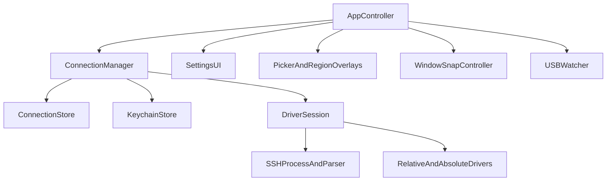

# Swift Porting Notes

This document records the port of Reawa from the original Python/PyObjC menu bar
app to the current native Swift macOS implementation. It is meant to answer four
questions:

1. What moved from Python to Swift?
2. What behavior was intentionally preserved?
3. What changed in the repository and runtime model?
4. Which problems encountered during the port were code issues versus system or
   environment issues?

For product behavior, see [PRD](../modules/reawa/prd.md). For architecture, see [architecture.md](../modules/reawa/architecture.md). For the deepest historical notes on macOS window lifecycle handling, see [macos-window-lifecycle-investigation.md](./macos-window-lifecycle-investigation.md).

---

## Goals

- Make the repository native-first, with Swift as the primary implementation.
- Preserve the existing menu bar workflow and device behavior.
- Keep compatibility with the previous saved connection and SSH key layout where
  feasible.
- Archive the Python implementation for reference rather than deleting it.

---

## Repository Migration

The repository was reshaped from a Python package into a Swift package with the
old code moved aside.

### Before

- Python entrypoint at `app.py`
- Python package modules under `driver/`, `models/`, `services/`, and `ui/`
- `py2app` packaging flow under `packaging/`
- top-level `requirements.txt` and Python development scripts

### After

- Swift package manifest at `Package.swift`
- Native implementation under `Sources/ReawaApp/`
- Native tests under `Tests/ReawaTests/`
- Native bundle metadata under `Config/`
- Archived Python implementation under `legacy/python/`

### Preserved Files

These files intentionally stayed in place during the migration:

- `.docs/`
- `LICENSE`
- `NOTICE`
- `THIRD_PARTY_LICENSES.md`

`README.md` was rewritten to describe the native app and the archived Python
implementation.

---

## Module Mapping

The port did not copy the Python layout one-to-one, but most major concepts were
preserved and renamed into native Swift modules.

| Python area | Swift area | Notes |
| --- | --- | --- |
| `app.py` | `AppController.swift`, `main.swift` | Native app bootstrap, menu bar lifecycle, mode orchestration |
| `services/connection_manager.py` | `ConnectionManager.swift` | Active session, status, connection CRUD, live config |
| `driver/rm2.py` | `SSHSession.swift` | SSH key setup, stream startup, pen-event parsing |
| `driver/session.py` | `SSHSession.swift` | Live session loop and mode-driven driver switching |
| `driver/relative.py` + `driver/absolute.py` + `driver/mouse.py` | `InputDrivers.swift` | Relative/absolute mapping and Quartz event emission |
| `driver/window_snap.py` | `WindowSnap.swift` | AX and `CGWindowList` window management |
| `ui/snap_picker.py` + `ui/region_overlay.py` | `Overlays.swift` | Picker overlay and resizeable snapped region |
| `ui/connections_window.py` + `ui/log_panel.py` | `SettingsUI.swift` | SwiftUI settings and logs surfaces |
| `models/connection.py` | `Models.swift` | Codable Swift models preserving the previous data shape |
| `models/store.py` + `services/keychain.py` | `Storage.swift` | App Support migration and Keychain compatibility |
| `services/network_discovery.py` + `services/usb_watcher.py` | `Discovery.swift` | Discovery, polling, reachability, notifications |
| `services/app_log.py` | `Logging.swift` | In-memory app log surfaced in the UI |

---

## High-Level Native Architecture



### UI split

- AppKit is still used for system-heavy pieces:
  - menu bar application shell
  - picker overlay windows
  - snapped region overlay and resize handles
  - Accessibility and window lifecycle integration
- SwiftUI is used for the configuration-heavy pieces:
  - settings screen
  - saved connection editing
  - log view

This hybrid approach keeps the overlay and AX behavior close to the native APIs
while reducing maintenance cost for the settings UI.

---

## Data and Compatibility

The native app preserves the earlier JSON and Keychain model where possible.

### Previous Python locations

```text
~/Library/Application Support/remarkable-rm2/
  connections.json
  keys/<connection-id>/id_rsa
  keys/<connection-id>/id_rsa.pub
```

### New native locations

```text
~/Library/Application Support/Reawa/
  connections.json
  keys/<connection-id>/id_rsa
  keys/<connection-id>/id_rsa.pub
```

### Compatibility rules implemented

- existing connection data is read from the old `remarkable-rm2` location if the
  new `Reawa` store does not yet exist
- legacy per-connection SSH keys are copied forward
- Keychain passwords are read from both:
  - `Reawa`
  - `remarkable-rm2`
- Swift model decoding preserves the Python snake_case JSON shape

### Compatibility intentionally not guaranteed

- byte-for-byte reproduction of the old `py2app` bundle layout
- exact runtime behavior when the app is launched from SwiftPM instead of a real
  `.app` bundle

---

## Native Runtime Decisions

Several implementation choices changed as part of the port.

### SSH transport

The Python app used Paramiko. The Swift port currently uses the system `ssh`
client through `Process`, along with `ssh-keygen` for key creation.

Reasons:

- faster path to a native implementation without pulling in a third-party Swift
  SSH library
- reuses the macOS OpenSSH stack already present on the machine
- easier to debug interactively from the shell during the port

Trade-off:

- launch and error handling are more shell/process oriented than the original
  Paramiko implementation

### Concurrency model

The Python app mixed threads, timers, and AppKit callbacks. The Swift port uses:

- `@MainActor` for app state and AppKit integration
- detached tasks for discovery work
- native timers for periodic polling

This was not just stylistic; it was required to avoid queue/assertion crashes
that surfaced under Swift 6 and modern AppKit.

---

## Porting Bugs and Fixes

These issues came up during the migration and are worth keeping as future
maintenance notes.

### 1. `UNUserNotificationCenter` crash in `swift run`

Symptom:

- app crashed immediately on startup when launched via `swift run reawa`
- exception referenced `bundleProxyForCurrentProcess is nil`

Cause:

- `UNUserNotificationCenter.current()` expects a real app bundle context
- SwiftPM launches from `.build/...`, not from a packaged `.app`

Fix:

- `NotificationService` now checks whether `Bundle.main.bundleURL` is an actual
  `.app`
- notifications are suppressed during non-bundled launches instead of crashing

Status:

- fixed in `Discovery.swift`
- covered by a regression test

### 2. USB watcher dispatch assertion crash

Symptom:

- startup crash with `_dispatch_assert_queue_fail`
- failing thread was the custom `reawa.usb-watcher` queue

Cause:

- the first watcher implementation used a `DispatchSourceTimer` on a custom
  queue while also hopping into main-actor state
- runtime queue assertions were triggered in that mixed model

Fix:

- replaced the custom dispatch-source timer with a main-runloop `Timer`
- moved expensive discovery work into detached background tasks
- applied poll results back on the main actor only

Status:

- fixed in `Discovery.swift`

### 3. Link-local discovery on wide subnets

Symptom:

- device discovery failed on USB links that exposed a `169.254.x.x` address
- scanning only the first few hosts in a wide subnet missed the peer entirely

Cause:

- the initial Swift discovery logic enumerated from the start of the subnet
- on `/16` link-local ranges, this meant probing near `169.254.0.x` instead of
  near the active interface address

Fix:

- candidate generation now prioritizes the local `/24` neighborhood around the
  current interface address when the subnet is wider than `/24`
- candidate ordering prefers nearest neighbors first

Status:

- fixed in `Discovery.swift`
- covered by a regression test

---

## Current Environment Findings

During live debugging on the development machine, one important distinction
emerged: some failures were not caused by the app itself.

### Observed USB state

- macOS recognized a USB device from `reMarkable`
- the active USB-side interface was `en7`
- that interface had a self-assigned link-local address in `169.254.x.x`

### Observed routing mismatch

When checking the route to `10.11.99.1`, the OS routed it through Wi-Fi instead
of the USB interface. That means the app cannot reach `10.11.99.1:22` even if
the tablet would normally be available there.

This matters because it explains a class of failures where:

- the tablet is physically connected
- the app is running correctly
- discovery and connection still fail because macOS never put the USB interface
  on the expected `10.11.99.x` network

### Important conclusion

The original Python app did not contain a hidden route or interface-binding
workaround. It used standard TCP and standard SSH. So if Python reaches the
tablet while Swift does not, the likely difference is the machine’s networking
state at that moment, not a special transport trick in the Python code.

---

## Testing Performed During the Port

The following categories were exercised during migration:

- Swift build and package validation via `swift test`
- model compatibility decoding tests
- pen-frame parsing tests
- startup smoke tests for `swift run reawa`
- debugger-based startup crash investigation with LLDB
- live network inspection:
  - `ifconfig`
  - `route -n get`
  - `networksetup`
  - `arp`
  - `ioreg`

The repository currently includes focused unit coverage for:

- Python JSON compatibility
- aspect-ratio preservation in `AbsoluteConfig`
- pen frame parsing
- non-bundled notification behavior
- link-local candidate IP prioritization

---

## Known Gaps

The Swift port is native-first and functional in structure, but there are still
areas that need more hardening.

### Packaging

- `Package.swift` is the active project entrypoint
- `Config/Info.plist` and `Config/Reawa.entitlements` exist, but the repo does
  not yet include a full Xcode `.app` target or release packaging flow

### SSH implementation maturity

- the current Swift implementation uses the system `ssh` process rather than an
  in-process SSH client
- this is practical, but less integrated than the original Paramiko approach

### Network diagnosis UX

- the app does not yet expose a dedicated diagnostics panel for:
  - active interfaces
  - candidate discovery IPs
  - route selection
  - last SSH failure

### Runtime environment dependence

- reaching `10.11.99.1` still depends on macOS presenting the USB link in a
  usable network configuration
- no app-side code can compensate if the OS has no route to the tablet

---

## Recommended Next Steps

1. Add an in-app diagnostics section to the settings/logs UI that shows:
   - active interfaces
   - USB-like interface selection
   - generated candidate IPs
   - route/reachability results for the saved device IP
   - latest SSH connection error

2. Add an integration test strategy for bundled versus non-bundled launch modes.

3. Decide whether to keep the process-based SSH approach or replace it with a
   Swift-native SSH client.

4. Add a dedicated Xcode app target and release flow when the runtime behavior
   is stable enough for distribution.

5. Keep `legacy/python/` untouched except for reference and parity checks until
   the native implementation is considered fully production-ready.

---

## File Index

The main files added or created during the Swift port are:

- `Package.swift`
- `Config/Info.plist`
- `Config/Reawa.entitlements`
- `Sources/ReawaApp/main.swift`
- `Sources/ReawaApp/AppController.swift`
- `Sources/ReawaApp/Models.swift`
- `Sources/ReawaApp/Storage.swift`
- `Sources/ReawaApp/SSHSession.swift`
- `Sources/ReawaApp/InputDrivers.swift`
- `Sources/ReawaApp/WindowSnap.swift`
- `Sources/ReawaApp/Overlays.swift`
- `Sources/ReawaApp/Discovery.swift`
- `Sources/ReawaApp/SettingsUI.swift`
- `Sources/ReawaApp/Logging.swift`
- `Tests/ReawaTests/`

The Python implementation was archived under:

- `legacy/python/reawa/`
- `legacy/python/packaging/`

---

## Summary

The Swift port succeeded in moving Reawa from a Python/PyObjC utility to a
native-first Swift macOS app while preserving the core product shape:

- menu bar workflow
- Relative and Absolute pen modes
- live SSH-driven pen input
- AX and `CGWindowList` window snapping
- saved-device compatibility

The most important lessons from the port were:

- not every failure during the migration was an app bug; several were launch or
  OS-network-state issues
- Swift/AppKit actor boundaries matter for stability
- USB discovery needs to be robust to multiple subnet styles, not just the
  historical `10.11.99.x` path

This document should be updated whenever the native app’s packaging story,
diagnostics story, or SSH transport design changes substantially.
