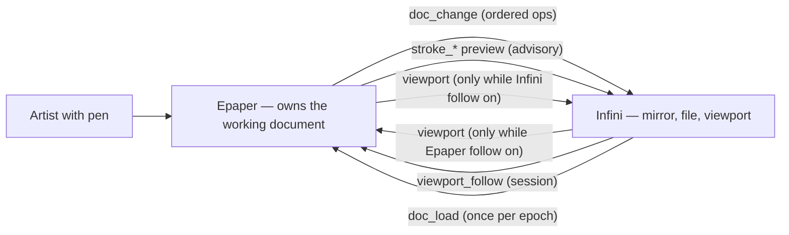
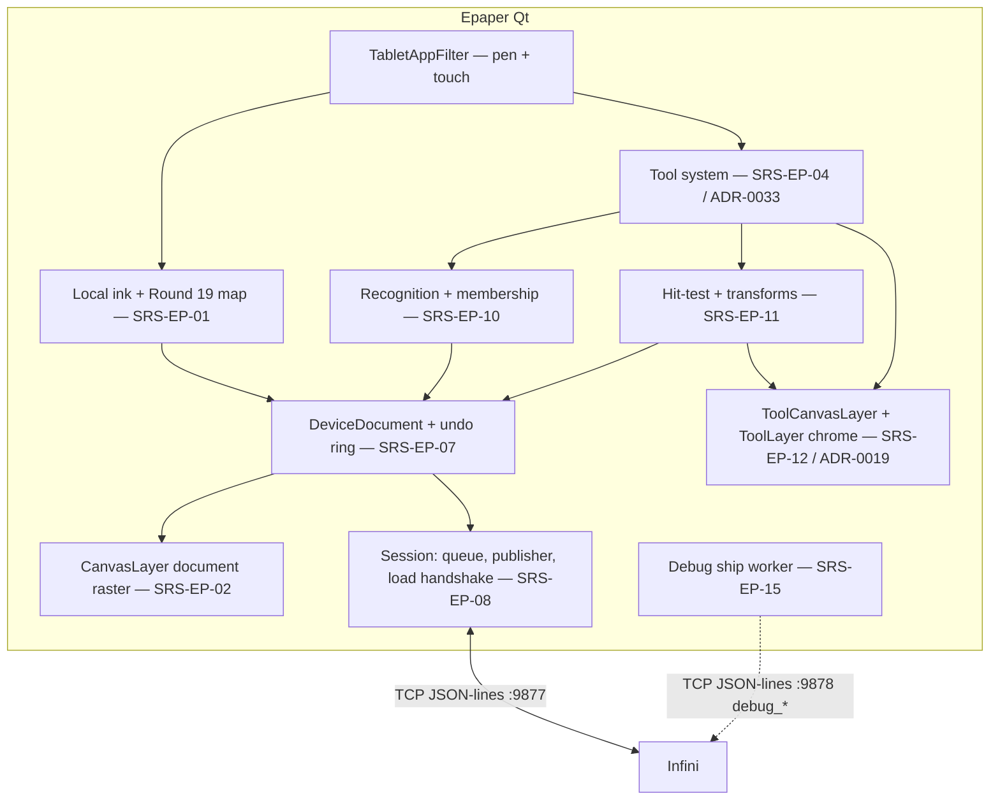

# Architecture — Epaper

A view, not a spec: it references SRS/ADR ids and defines none of its own.
View over [PRD](./prd.md). Sibling: [infini/architecture.md](../infini/architecture.md).

Created 2026-08-13 with [CHL-0008](../../../.plan/iter-003/challenges/CHL-0008-architecture-rework.md).
Until then the device was a thin client — ink in, pixels out — and needed no architecture view. It
now holds the working document ([ADR-0014](../../adr/ADR-0014-document-ownership-inversion.md)),
which is the largest single increase in device scope so far.

## Quality goals (prioritised)

1. **Ink latency** — pen-down → pixel p95 ≤30 ms, unconditionally
   ([SRS-EP-01](./features/local-pen-ink/srs-logic.md)). Everything below is subordinate: if the
   document, the undo ring, or the publisher cannot fit under this ceiling, they change, not the
   ceiling.
2. **Gesture truth** — committed geometry equals released geometry; 0 px jump, 0 snap-back
   ([SRS-EP-14](./features/ink-box/srs-quality.md)). This is the defect the whole rework exists to
   remove.
3. **Local sufficiency** — create, group, move, resize, and undo behave identically with the link
   down ([SRS-EP-13](./features/device-document/srs-quality.md) offline parity).
4. **Refresh discipline** — manipulation feedback ≥5 Hz with 0 full-panel invalidations
   ([SRS-EP-03](./features/region-sync/srs-quality.md)).
5. **Document fidelity** — a document authored here round-trips through desktop save/open unchanged
   (±1 world unit @ 100% zoom).
6. **Hand-on-paper bars (TRACK-005)** — tool switch p95 ≤300 ms; live-direct 0 px / ≥5 Hz; two-finger map apply p95 ≤100 ms; erase p95 ≤50 ms ([SRS-EP-25](./features/ink-box/srs-quality.md), [SRS-EP-26](./features/region-sync/srs-quality.md), [SRS-EP-30](./features/local-pen-ink/srs-quality.md)).

## Constraints

- reMarkable 2: 1872×1404 1-bit panel, partial-refresh floor ≈250 ms (`kRefreshMinIntervalMs`), no
  hover, no keyboard, no cursor. Pen for content, finger for chrome.
- Qt/QML fullscreen, C++; xochitl stopped while the app runs.
- Link is USB-Ethernet TCP and is **occasionally down** — treated as a normal state, not an error.
- **In-memory document this iter**: no on-device **document** persistence, no file browser, no multi-document
  ([Non-Goals](./prd.md)). An app restart loses unpublished **document** work, accepted by PM.
  **Exception:** Device Settings persist on this device ([REQ-20](./prd.md#device-settings), [ADR-0031](../../adr/ADR-0031-device-settings-persist-on-epaper.md)).
- **Independent cameras by default.** Follow is optional and exclusive ([ADR-0029](../../adr/ADR-0029-independent-cameras-viewport-follow.md), [SRS-EP-49](./features/region-sync/srs-logic.md#srs-ep-49-viewport-follow)). Inbound Infini `viewport` applies **only while Epaper follow is on** ([SRS-EP-02](./features/region-sync/srs-logic.md)). Two-finger **local** pan is Must; publish **only if Infini follow is on** ([SRS-EP-24](./features/region-sync/srs-logic.md#srs-ep-24-two-finger-viewport)). One-finger empty canvas pans past **20 mm** (**178 du** @ 226 dpi); at/below is palm-rest ([SRS-EP-21](./features/ink-box/srs-logic.md#srs-ep-21-one-finger)). Last-writer ([ADR-0023](../../adr/ADR-0023-viewport-last-writer.md)) is superseded. Follow is **not** a ToolChip exclusive.
- Transform = translate + scale. Rotation is reserved, never set
  ([REQ-08](./prd.md#node-manipulation)).

## Solution strategy

Three layers, ordered by how much the ink budget protects them.

1. **Ink path (untouchable).** Digitizer → Round 19 map → local paint, unchanged from
   [SRS-EP-01](./features/local-pen-ink/srs-logic.md). Nothing added by this rework may sit between
   a sample and its pixel.
2. **Document layer (new).** At pen-up the stroke becomes a node in a `DeviceDocument`
   ([SRS-EP-07](./features/device-document/srs-logic.md)), the tool decides what happens next
   ([SRS-EP-10](./features/ink-box/srs-logic.md)), manipulation transforms real ink
   ([SRS-EP-11](./features/ink-box/srs-logic.md)), and every structural op pushes one undo entry and
   one queue entry. The panel paints from this tree — never from a peer picture.
3. **Sync layer (inverted).** Inbound is `viewport` plus exactly one handshake-gated `doc_load` per
   epoch; outbound is an ordered `doc_change` stream plus advisory stroke previews
   ([SRS-EP-08](./features/device-document/srs-logic.md),
   [ADR-0015](../../adr/ADR-0015-one-way-sync-contract.md)).

The strategy is deliberately boring where it can be: the undo ring is counterpart **inverse-op per
session** (depth 20, `lastOpId` skip) rather than whole-document snapshots
([ADR-0032](../../adr/ADR-0032-inverse-op-undo.md)), with a matching linear redo stack of forward
counterparts ([ADR-0018](../../adr/ADR-0018-undo-redo-chip-actions.md) chrome unchanged), and the
change stream is one op per gesture (`compound` when a gesture has several inverses) rather than a
diff format or a tree dump. Both choices buy correctness-under-later-edits and a small wire unit.

## Domain entities (consumed)

| Entity | Canonical doc | Notes |
|---|---|---|
| Vector document (Ink, Text, Primitive, Group, Frame, Connector, SmartGroup) | [domain/vector-document](../../domain/vector-document.md) | Link only — terminals + attachments included |
| Pen-button map | [domain/pen-button-map](../../domain/pen-button-map.md) | Device Settings; tablet authors and persists on this device; Infini holds 0 copies |
| Viewport follow | [domain/viewport-follow](../../domain/viewport-follow.md) | Session enum; not document |

Device-authored kinds this iter: `Ink`, `SmartGroup`, `Connector` ([REQ-09](./prd.md#device-connectors),
[ADR-0020](../../adr/ADR-0020-connector-ink-geometry.md)). Other kinds arrive via `doc_load` and must
round-trip and paint; unknown kinds are carried opaquely so a device session cannot make the
desktop's file lossy.

Device-local, never shared: exclusive tool, recognizer toggles, selection, undo ring, publish queue, session epoch
([SRS-EP-09](./features/device-document/srs-data.md)).

## Context view

## Container / component view

The single arrow worth staring at is `doc --> paint`. In the pilot that arrow came from the wire.

## Crosscutting concepts

- **Authority:** one writer per session and it is this device
  ([ADR-0014](../../adr/ADR-0014-document-ownership-inversion.md) §1). A peer message may never
  alter the document except an accepted `doc_load`.
- **Consistency:** local-first. Ops commit locally, then publish; the queue preserves order and is
  never coalesced, because the undo unit and the change unit are the same gesture.
- **Degradation:** the link going down removes *publishing*, not *function*. Nothing in the tool
  chip may be gated on the session ([SRS-EP-05](./features/tool-modes/srs-ui.md)).
- **Refresh:** map is never coalesced, paint is. Ghosting **during** a move/resize is a timing
  allowance ([CHL-0018](../../../.plan/iter-003/challenges/CHL-0018-live-node-tool-canvas.md));
  a **settled** frame that disagrees with the document is a defect. Live node pixels in flight
  belong on ToolCanvasLayer, not a growing CanvasLayer punch.
- **Error posture:** retired message types are rejected, logged, and surfaced rather than ignored.
  The pilot's extra snapshots were tolerated silently for weeks, and silence is what made them
  expensive.
- **Observability:** message-type counts at the transport make the "0 inbound document messages"
  invariant checkable; op-commit timestamps drive the publish-latency budget. Instrumentation stays
  out of the paint loop. Console shipping to Infini is env-gated TCP `:9878`
  ([SRS-EP-15](./features/device-document/srs-logic.md#srs-ep-15-debug-log-ship)) — never on `:9877`.

## Decisions

- [ADR-0019](../../adr/ADR-0019-selection-chrome-layers.md) — CanvasLayer / ToolCanvasLayer / ToolLayer (Pen / Mono / UI)
- [ADR-0033](../../adr/ADR-0033-tool-abstraction.md) — Mode / Operation / Modifier / overlay split (overview)
- **Implementation view:** [tool-system/](./tool-system/index.md) — current `epaper/drawing/tools/` catalog, routing, how to add tools
- [ADR-0029](../../adr/ADR-0029-independent-cameras-viewport-follow.md) — independent cameras + exclusive one-way follow (supersedes [ADR-0023](../../adr/ADR-0023-viewport-last-writer.md))
- [ADR-0024](../../adr/ADR-0024-in-document-clipboard.md) — in-document clipboard (one slot)
- [ADR-0025](../../adr/ADR-0025-barrel-vs-eraser-nib.md) — barrel channel ≠ eraser nib
- [ADR-0026](../../adr/ADR-0026-endpoint-ink-membership.md) — endpoint-ink vs spine vs empty
- [ADR-0027](../../adr/ADR-0027-attachment-t-rest-spine.md) — attachment `t` on rest spine
- [ADR-0028](../../adr/ADR-0028-pen-button-map-settings-channel.md) — **superseded** by [ADR-0030](../../adr/ADR-0030-tablet-authors-pen-button-map.md); persist split **superseded** by [ADR-0031](../../adr/ADR-0031-device-settings-persist-on-epaper.md) (persist on Epaper; 0 Infini copies)
- [ADR-0032](../../adr/ADR-0032-inverse-op-undo.md) — inverse-op undo per session (amends ADR-0014 §5)
- [ADR-0014](../../adr/ADR-0014-document-ownership-inversion.md) — the device owns the working document
- [ADR-0015](../../adr/ADR-0015-one-way-sync-contract.md) — one-way sync contract v1
- [ADR-0013](../../adr/ADR-0013-ink-box-tool-modes.md) — §1 device-local tool state and §6 world-unit enclose guard survive; §2–§5 superseded
- [ADR-0011](../../adr/ADR-0011-smart-group.md) — Smart Group semantics (host moved, meaning unchanged)
- [ADR-0010](../../adr/ADR-0010-tree-of-vectors.md) — tree-of-vectors document
- [ADR-0012](../../adr/ADR-0012-world-stroke-viewport-parity.md) — world stroke width + viewport paint parity
- `ADR-0016` (deferred) — node manipulation model, constrained by the capability descriptor in
  [node-manipulation srs-product](./features/node-manipulation/srs-product.md)

## Risks & technical debt

| Risk | Threatens | Likelihood × impact | Mitigation / accepted |
|---|---|---|---|
| Document + hit-test cannot fit under the ≤30 ms ink budget | Quality goal 1 — **invalidates the rework** | M×H | Measure before the first REQ-04 story; a miss is a `CHL-*`, not a design workaround |
| C++/TS geometry divergence | Document fidelity | M×H | Shared fixtures (`ops/`, `enclose/`, `fixed-ink/`, `round-trip/`) + the domain doc |
| Undo ring memory (20 inverse entries, not 20 whole trees) | Ink latency | L×M | Measured in [SRS-EP-13](./features/device-document/srs-quality.md); shrink depth before slowing ink. Bodies of huge removes still sit on the ring |
| Live manipulation exceeds the partial-refresh budget | Gesture feel | M×M | ≥5 Hz / 0 full-panel bar; CHL-0006 established that slow is acceptable |
| Selection chrome painted on CanvasLayer (full `update()`) | Lasso lag / refresh discipline | **H×M** | **Closed [CHL-0017](../../../.plan/iter-003/challenges/CHL-0017-selection-chrome-layers.md) / [ADR-0019](../../adr/ADR-0019-selection-chrome-layers.md)** — ToolCanvasLayer Mono + ToolLayer QML |
| Live SmartGroup painted on CanvasLayer during drag | Duplicate origin + trail wipe | **H×M** | **Closed [CHL-0018](../../../.plan/iter-003/challenges/CHL-0018-live-node-tool-canvas.md)** — live node on ToolCanvasLayer; option 2 deferred |
| Device constants inherited from desktop values (LOD 0.35, 8 px tolerance) | Manipulation usability | **H×M** | **Closed.** Device locks: handle 28/56 du, LOD min on-panel axis 96 du ([SRS-EP-12](./features/ink-box/srs-ui.md)). Miss-rate on hardware files a `CHL-*` in du, never 8 CSS px / 0.35 |
| No undo affordance on a three-tool chip | Recoverability | H×M | **Deferred this campaign ([CHL-0010](../../../.plan/iter-003/challenges/CHL-0010-undo-vs-selection-create-chrome.md)).** Undo logic ships regardless ([SRS-EP-07](./features/device-document/srs-logic.md) / EP-015) |
| Unpublished work lost on app restart | Data loss | L×M (accepted) | Publish per committed op + visible pending state |
| RM2 touch unreachable from Qt | Tool arming | M×H | Spike shipped; fallback is pen-on-chip |
| `regionsync/` library still unwired from the Qt binary | Dual path confusion | H×M | Wire it as the document layer lands, or retire it |
