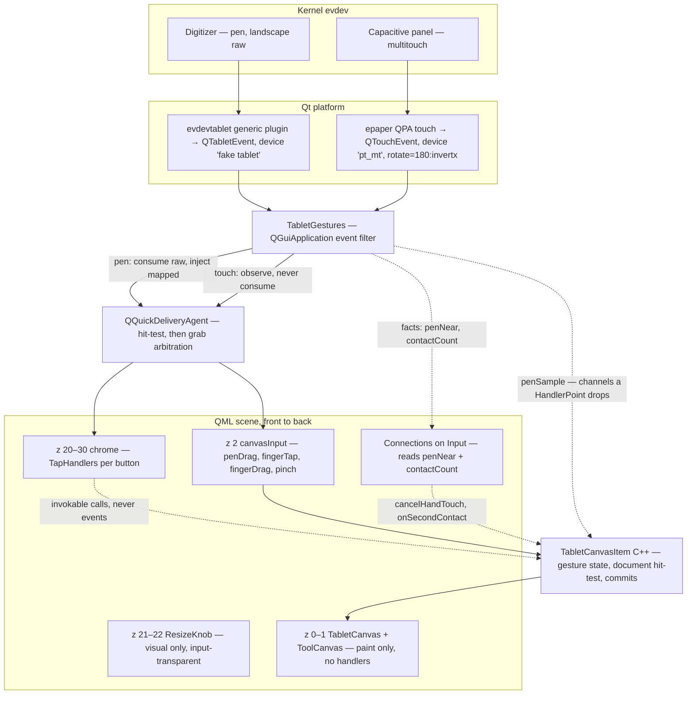
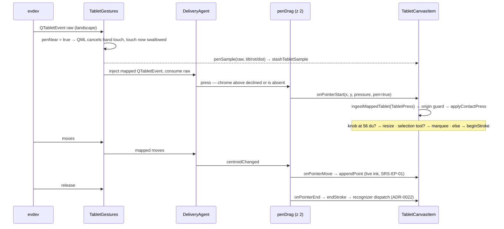
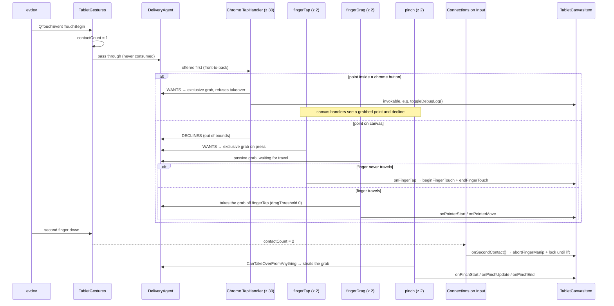
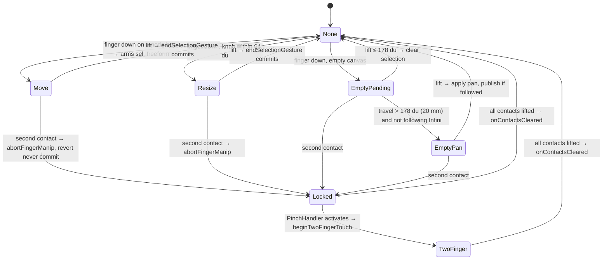

# Event flow — pen, finger, and chrome on one panel

A view, not a spec: it references SRS/ADR ids and defines none of its own. It describes how a physical
contact becomes a document gesture, which component decides what, and **why each tuning knob is set
the way it is** — the knobs are the whole subject, because every one of them was bought with a bug.

Ground rule, and the reason this document exists: **Qt routes events; we do not hit-test Qt
components.** The only hit-tests we own are against *document* geometry (node boxes, resize knobs).
Anything that looks like `if (rect.contains(p))` for a button is a defect, not a design.

Sources: `epaper/main.cpp`, `epaper/gesture/tabletgestures.{h,cpp}`, `epaper/Main.qml`,
`epaper/tabletcanvasitem.cpp`, `epaper/document/hand_touch.hpp`.

## The stack an event falls through

Two independent input devices reach one window. Neither knows about the other; the arbitration is all
in the middle.

The two bottom layers are worth staring at: `TabletCanvas` (z 0) and `ToolCanvas` (z 1) are
`QQuickPaintedItem`s that **paint and nothing else**. They install no pointer handlers, never call
`setAcceptTouchEvents`, and accept no mouse buttons, so Qt's hit-test does not consider them targets
at all ([ADR-0019](../../../../adr/ADR-0019-selection-chrome-layers.md) keeps the rasters separate
from the input surface). All canvas input arrives through one empty `Item` at z 2.

### Who is invisible to input, and who is not

This is the trap the stack sets, and it cost us the DBG button (gotcha 7 below).

| QML type | In Qt's hit-test? | Why |
|---|---|---|
| `Item`, `Rectangle`, `Image` | No | No handlers, `acceptedMouseButtons == NoButton`, touch not accepted |
| `Text` | **Yes** | `QQuickTextPrivate::init()` calls `setAcceptedMouseButtons(Qt::LeftButton)` for link activation — every label is a potential grabber |
| `Flickable` | Yes | Accepts LeftButton and filters child mouse events |
| Any item with a pointer handler | Yes | The handler is the target |

So a decorative `Rectangle` over the canvas is free, and a decorative `Text` over the canvas is a
bug waiting for a finger.

## Component roles

| Component | Owns | Explicitly does not own |
|---|---|---|
| `TabletGestures` (app-wide `eventFilter`) | Pen coordinate mapping and injection; publishing pen channels, `penNear`, `contactCount`; swallowing touch while the pen is near | Any hit-test, any gesture decision, any chrome knowledge — and **no reference to the canvas** |
| `QQuickDeliveryAgent` | Front-to-back hit-test, exclusive/passive grabs, takeover arbitration | Nothing we may second-guess |
| Chrome `TapHandler`s (z 20–30) | One button's tap, inviolably | Canvas semantics; they only call invokables |
| `canvasInput` handlers (z 2) | Turning grabs into `onPointer*` / `onPinch*` / `onFingerTap` calls | What the gesture *means* |
| `Connections { target: Input }` | What a second contact or a nearby pen *means* | Observing input; it only reads published facts |
| `TabletCanvasItem` | Gesture state machine, **document-space** hit-test, ink, recognizer dispatch, selection, manipulation, viewport | Deciding whether a point was chrome — Qt already answered |

`TabletGestures` is the one place that reads raw events, and it exists for three jobs Qt handlers
cannot do:

1. **Pen mapping.** The digitizer reports landscape coordinates for a portrait framebuffer, so every
   pen event is remapped (`epaper::input::mapPanel`, verified Round 19) — the raw event is consumed
   and a mapped `QTabletEvent` is injected in its place, guarded by `m_injectingMapped` against
   re-entry.
2. **Channel rescue.** A QML `HandlerPoint` carries position and pressure, but not tilt, rotation,
   tangential pressure, or distance. The filter emits those as `penSample(raw, channels)`, wired in
   `main.cpp` to `stashTabletSample`, and the canvas picks them back up when Qt delivers the handler
   callback. `epaper::input::PenSample` is a neutral struct precisely so neither side includes the
   other's header.
3. **Contact count.** `MultiPointHandler` publishes only the `minimumPointCount` /
   `maximumPointCount` it *requires*, never the live count, and a passive handler is not told which
   contact it holds — so no QML handler can answer "how many fingers are on the glass". Qt exposes
   the number only as `QPointerEvent::pointCount()`, on the C++ event. The filter counts non-released
   points and publishes `contactCount`.

### The filter publishes facts; it never issues commands

The load-bearing rule of this layer. `penNear` and `contactCount` are `Q_PROPERTY`s on an `Input`
singleton, and the policy that reads them — "a second contact outranks a one-finger manip", "a nearby
pen cancels hand touch" — lives in a `Connections` block in `Main.qml`, beside the handlers it
arbitrates with. The filter used to call `onSecondContact()` and `cancelHandTouch()` directly, which
put a product decision two layers below where that decision belongs and coupled the lowest component
in the stack to the highest.

Palm rejection is the one thing the filter still *does* rather than reports, and it has to be: while
the pen is near or down, touch events are swallowed outright (`return true`)
([SRS-EP-21](../ink-box/srs-logic.md#srs-ep-21-one-finger) pen wins over hand touch). The canvas
could not do this if it wanted to — it is not an event target, so it never sees the touch event it
would have to reject. The *consequence* of the pen arriving (cancel whatever the hand was doing) is
still QML's call, via `penNear`. Touch is otherwise **observed and passed through** — the filter
never consumes a finger.

## Pen: down, move, up

Pen events reach the canvas through the same QML arbitration as fingers. That is a deliberate
reversal of an earlier design (gotcha 1): routing pen through QML is *not* what cost latency.

## Finger: the arbitration that actually decides everything

The single most important property: **a `TapHandler` refuses a press whose point already has an
exclusive grabber** (`QQuickSinglePointHandler::wantsPointerEvent`, the `!event->exclusiveGrabber(p)`
test). Every finger bug in the history below is a variation on "the wrong object grabbed first".

## Tuning knobs, and what each one bought

These are the ad-hoc adjustments. None is cosmetic; each is load-bearing.

| Where | Setting | Bought |
|---|---|---|
| `main.cpp` | `AA_SynthesizeMouseForUnhandledTouchEvents = false`, `…TabletEvents = false` | No phantom grabs. Synthesis handed the grab to whatever plain item sat under the finger — a `Text` label — and starved the chrome handler above it |
| `TabletGestures` | Touch observed, `return false` | Handlers still see real touch; the filter is a listener, not a gate |
| `TabletGestures` | Touch swallowed while pen near/down | Palm rejection at the source, before arbitration can start a hand gesture |
| `TabletGestures` | `contactCount` counted from `QTouchEvent::points()`, published as a property | A truthful contact count that no QML handler can provide, without the filter deciding what it means |
| `Main.qml` | `Connections { target: Input }` | The second-contact and pen-near rules sit beside the handlers they arbitrate with, instead of inside the event filter |
| Chrome `TapHandler` | `gesturePolicy: ReleaseWithinBounds` + `grabPermissions: CanTakeOverFromItems \| ApprovesCancellation` | Exclusive grab on press that **nothing may take** except a cancel. This refusal — not crippled permissions on the canvas side — is what protects buttons |
| `penDrag` | `grabPermissions: ApprovesTakeOverByAnything` only | Cannot steal a grab a chrome handler already took; pen taps on chrome work |
| `canvasInput` | `fingerTap` **and** `fingerDrag`, not one handler | A `DragHandler` reports nothing until the point travels, so a stationary finger never reached the canvas — tap-to-select needs its own handler |
| `fingerDrag` | `dragThreshold: 0` + `CanTakeOverFromHandlersOfDifferentType \| CanTakeOverFromItems \| ApprovesTakeOverByAnything` | Takes the grab off `fingerTap` the instant the finger moves, with no dead zone |
| `fingerDrag` | `maximumPointCount: 2` (not 1) | Exceeding the maximum *deactivates* the handler, and that deactivation raced `pinch`'s takeover; whoever won decided whether a second contact committed a node move |
| `pinch` | `min/maximumPointCount: 2`, `dragThreshold: 0`, `CanTakeOverFromAnything` | Two contacts are already the whole gesture; waiting for Qt's default threshold on top is what made pinch need a huge travel before it engaged |
| `TabletCanvasItem` | `m_fingerLockedUntilLift` + `abortFingerManip()`, and `cancelHandTouch()` clears the latch | A second contact reverts an in-flight one-finger manip and nothing commits until the glass clears — the fix for "one finger on a node, one on empty space, node moves". The cancel path resets the latch itself so no caller needs to know it exists |
| `TabletCanvasItem` | `onPointerEnd` returns early while `TwoFinger` | The one-finger handler cycling mid-pinch must not end the pinch or re-arm |
| `TabletCanvasItem` | `classifyHit(chip = false, …)` | The chip argument is hardwired off: Qt owns chrome now, so the C++ classifier only ranks knob > box > empty |
| `ResizeKnob.qml` | Visual only, no handlers | Knobs are document affordances, hit-tested in C++ at a 64 du finger floor vs 56 du for pen; as QML items they are input-transparent |
| `DebugLogShip` | `linesChanged` coalesced to 250 ms | The panel relays out a 256-line wrapped `Text` per emission; per-line signalling froze the UI thread, which *is* the event loop |

## Where the flow ends: the document gestures

`TabletCanvasItem` is the only place a gesture becomes a document change. Finger gestures run a small
state machine (`FingerGesture`), and pen gestures run the ink/selection path.

`Locked` is not a separate enum value: it is `None` plus `m_fingerLockedUntilLift`, the window in
which a one-finger gesture has been reverted and no new one may arm. `onContactsCleared()` from the
event filter is the **only** thing that reopens it — a drag handler cycling mid-pinch must not.

| Gesture | Route | C++ entry | Document effect |
|---|---|---|---|
| **Ink** | `penDrag` | `onPointerStart/Move/End` → `ingestMappedTablet` | `beginStroke` / `appendPoint` / `endStroke`; live ink is the untouchable path ([SRS-EP-01](../local-pen-ink/srs-logic.md)) |
| **Recognizer** | pen-up | `endStroke` → dispatch | enclose / membership / connector / ordinary ink ([SRS-EP-10](../ink-box/srs-logic.md#srs-ep-10-device-recognition), [ADR-0022](../../../../adr/ADR-0022-recognizer-dispatch.md)) |
| **Select (pen)** | `penDrag` | `applyContactPress` → `beginSelectionGesture` | Marquee or lasso while a selection tool is armed ([SRS-EP-04](../tool-modes/srs-logic.md)) |
| **Resize (pen)** | `penDrag` | `tryBeginHandleAtPanel(56 du)` | `ManipDrag` live-direct transform ([SRS-EP-11](../ink-box/srs-logic.md#srs-ep-11-device-manipulation)) |
| **Select / deselect (finger)** | `fingerTap` | `onFingerTap` → `beginFingerTouch` + `endFingerTouch` with zero travel | Box hit selects; empty tap ≤ 178 du clears selection |
| **Move (finger)** | `fingerDrag` | `fingerHitsBox` → `hitLocalSmartGroup`, LOD-gated → `Move`, arms `sel_freeform` | Live-direct node move ([SRS-EP-23](../tool-modes/srs-logic.md#srs-ep-23-finger-tool-switch)) |
| **Resize (finger)** | `fingerDrag` | knob wins over box-move at 64 du | Same `ManipDrag` commit as pen |
| **Pan (one finger)** | `fingerDrag` | `EmptyPending` → `EmptyPan` past 20 mm | `panKeepWorldUnderFinger`; blocked while following Infini; publishes only if Infini follows ([SRS-EP-21](../ink-box/srs-logic.md#srs-ep-21-one-finger), [ADR-0029](../../../../adr/ADR-0029-independent-cameras-viewport-follow.md)) |
| **Pan + zoom (two finger)** | `pinch` | `onPinchStart/Update/End` → `beginTwoFingerTouch` | Local viewport map; refused outright while following Infini, and while the hand-touch toggle is off; publishes only if Infini follows ([SRS-EP-24](../region-sync/srs-logic.md#srs-ep-24-two-finger-viewport)) |
| **Chrome tap** | chrome `TapHandler` | invokable (`toggleDebugLog`, `toggleHandTouch`, `tapFollowToggle`, …) | Tool/toggle state only ([SRS-EP-22](../ink-box/srs-ui.md#srs-ep-22-hand-touch-ui)) |

Two guards sit across all of it: the hand-touch toggle (`m_handTouchArmed`, a kill switch that makes
`beginFingerTouch` a no-op) and the pen-proximity suppression in the filter. Both are checked before
any gesture state is entered, never after.

## History of gotchas and fixes

Ordered as they were found. Each entry is a mechanism, because the symptom rarely pointed at it.

**1. "Pen through QML is laggy" — it was a freeze, and it was the recognizer.**
Pen input was pulled out of QML on the theory that event routing cost latency. The real symptom was a
multi-second freeze *after* some strokes, not a steady lag: `endStroke` ran connector recognition
whose `polylineIntersect` was super-linear in stroke count and length. Fixed with an AABB reject plus
polyline decimation ahead of the exact test (`sampleBoundsMayTouch`, `coarsenForJoin` in
`recognize_connector.hpp`), preserving output exactly. Pen then went back through QML and stayed
smooth. *Lesson: measure the freeze, don't redesign the path it happened on.*

**2. Manual chrome hit-testing (`isScreenChromeAt`) — deleted.**
The pen-out-of-QML detour needed C++ to know where the buttons were. That function had to grow with
every new control, so it was removed along with the detour; the `chip` argument of `classifyHit` is
now hardwired `false`.

**3. Contact counting via QML `PointHandler`s broke one-finger input.**
A passive `PointHandler` pair was used to count contacts. A single finger could activate the *second*
handler, which fired `onSecondContact()` and locked out every one-finger gesture. Counting moved into
the event filter, which sees every point.

**4. A `DragHandler` alone cannot see a tap.**
With only `fingerDrag` on the canvas, a stationary finger produced nothing — no select, no deselect.
Split into `fingerTap` (stationary) plus `fingerDrag` (travel), with permissions that let the drag
take the grab the moment the finger moves.

**5. Pinch needed a huge travel before engaging.**
`PinchHandler` inherited Qt's default drag threshold on top of already requiring two contacts. Set
`dragThreshold: 0` and `CanTakeOverFromAnything` so it outranks the handler holding the first contact.

**6. One finger on a node plus one on empty space moved the node.**
The one-finger handler owns the first contact and may already have grabbed a node before
`PinchHandler` activates. Fixed with `onSecondContact()` → `abortFingerManip()` (revert, never
commit — mirroring the no-move branch of `commitLiveManip`) plus `m_fingerLockedUntilLift`, and
`maximumPointCount: 2` on `fingerDrag` so its deactivation stops racing the takeover.

**7. Finger on DBG did nothing; pen on DBG worked.**
The hardest one, and the reason for the *invisible to input* table above. `QQuickText` always accepts
`LeftButton`, so Qt synthesized a mouse press from the touch and offered it to the `Text { "DBG" }`
label filling the button. Our filter swallowed synthesized mouse events by returning `true` — but a
swallowed `QEvent` stays **accepted**, so Qt concluded the label had handled it and gave the label the
exclusive grab (`grab QObject(0x0) -> QQuickText`). `dbgTap` was polled next, saw a grabbed point, and
declined the press; it only ever saw the release, which emits no tap. Tablet events skip that
synthesis path, so the pen was unaffected, and every other button is labelled with an `Image`, which
accepts no buttons — DBG was the only casualty. Fixed by disabling both synthesis attributes in
`main.cpp` and deleting the swallow. *Lesson: swallowing an event is not the same as rejecting it.*

**8. Opening the debug panel froze the whole app.**
`appendUiLine` emitted `linesChanged` per line; the panel relaid out a 256-line wrapped `Text` and
repainted e-paper for each one. Under a log burst the UI thread never returned to the event loop.
Coalesced to one emission per 250 ms.

**9. A frozen UI thread cannot be killed by the deploy script.**
`SIGTERM` sets a flag that a `QTimer` polls on the UI thread, so a wedged UI ignores it; `killall`
appears to succeed, the process survives, and `scp` then fails with a busy binary. Currently handled
by `killall -9`. A signal path that does not depend on the UI thread would remove the manual step.

**10. Verbose `QT_LOGGING_RULES` destroys live ink.**
`qt.quick.handler.dispatch` logs several lines per pen move, each through the message handler and out
to a file, which is enough to stop ink appearing until pen-up. Diagnosing pointer routing changes the
thing being diagnosed; the deploy script now says so where the variable is documented.

**11. The filter was commanding the canvas.**
Not a runtime bug — a design one, found while writing this document. `TabletGestures` held a
`TabletCanvasItem*` and called `cancelHandTouch()`, `onSecondContact()` and `onContactsCleared()` on
it, so the lowest component in the stack decided a product rule ("two contacts outrank a manip") and
included the highest component's header in order to say it. Fixed by demoting the filter to a
publisher: pen channels leave as a `penSample` signal wired in `main.cpp`, `penNear` and
`contactCount` became properties on an `Input` singleton, and the rules moved to a `Connections`
block in `Main.qml`. `epaper::input::PenSample` in `gesture/pen_sample.hpp` is the neutral type that
lets the include go away, and `mapPanel` moved there too, so the filter and the canvas share one
remap instead of the filter calling the canvas to borrow it. Behaviour is unchanged by construction:
the same three facts reach the same three methods, one hop later. *Lesson: the test for a layering
violation is not "does it call down", it's "does it decide".*

## Debugging this system

Named handlers make Qt's own tracing readable — `objectName` is set on `penDrag`, `fingerTap`,
`fingerDrag`, `pinch`, `dbgTap`, `handTap`, so dispatch lines say who declined instead of `""`.

| Want | Set |
|---|---|
| Who wanted/declined each point | `QT_LOGGING_RULES="qt.quick.handler.dispatch=true"` |
| Who grabbed, and when it moved | `QT_LOGGING_RULES="qt.pointer.grab=true"` (qtbase category, low volume) |
| Every touch point the filter sees | `EPAPER_TOUCH_TRACE=1` |
| UI-thread stall reports | `EPAPER_UI_STALL_MS=<ms>` |

All three variables are forwarded by `epaper/scripts/deploy-rm2.sh`. Read grab lines first: they name the
grabber, which is the answer to almost every routing question in this document.
