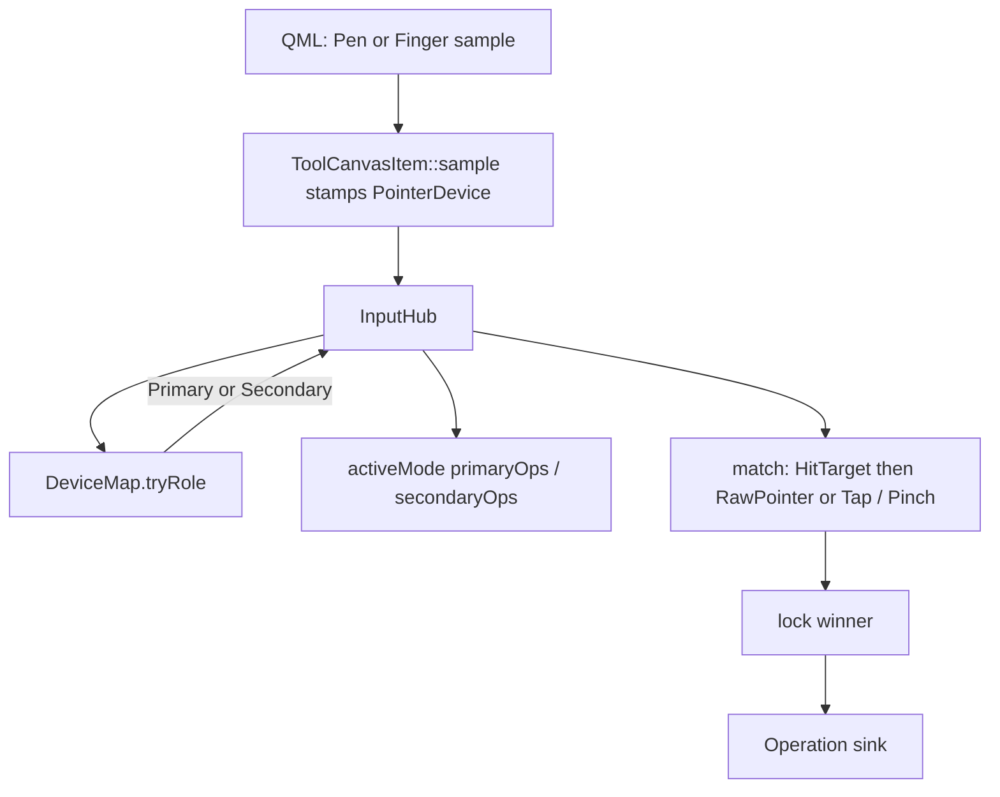

# Tool system — routing

How a contact becomes a locked Operation. Qt/QML delivery is
[event-flow.md](../features/event-system/event-flow.md). After `ToolCanvas.qml` `canvasInput`,
everything below is [`InputHub`](../../../epaper/drawing/tools/input_hub.cpp).

## Pipeline



1. QML `DragHandler` / `TapHandler` / `PinchHandler` call `onPointerStart(..., pen)`.
2. Host builds `PointerSample` (`device` only). Mouse is in the enum; no handler stamps it yet.
3. Hub copies the sample and stamps `role` from `DeviceMap`. Unknown device → ignore.
4. If role is **Secondary**: require `SecondaryDeviceModifier::armed()` and not `lockedUntilLift`.
5. If already locked: feed the locked Op (no re-match).
6. Else match in hub order, filtered by Mode allow-list + `acceptPrimary`/`acceptSecondary` +
   `Operation::match`. Highest `descriptor.priority` wins.
7. Lock, `onDown` / `onTap` / pinch begin.
8. Move/up feed the same Op. On **Secondary** up/tap (and pinch-end when Finger is Secondary):
   `activeMode()->onSecondaryCommit`.

Down match tries **HitTarget** then **RawPointer** (resize knobs beat body move beat canvas
lasso/ink).

### Tap vs travel (SelectionMode)

[SRS-EP-11](../features/ink-box/srs-logic.md#srs-ep-11-hold-still) / [ADR-0037](../../adr/ADR-0037-device-clipboard-singleton.md): lock may occur on down, but Move / Lasso / Marquee / Resize **must not mutate** until panel travel **> 1 mm**. Lift with travel ≤ 1 mm: tap-select (Primary and Secondary) and record paste origin. **No** 500 ms hold menu. 1 mm ≈ 8.9 du @ 226 dpi.

## Match order (hub)

Fixed scan in `input_hub.cpp` (priority still decides among those that match):

`Resize → Move → Lasso → Marquee → Navigation → Select → InkStroke → Rotate`

Rotate is in the enum; no Operation is registered yet.

## DeviceMap

```cpp
DeviceMap { primary = Pen, secondary = Finger }
hub.setDeviceMap({ Finger, Pen }); // later: invert without rewriting Ops
```

QML does not know roles. Assigning Primary = Mouse does nothing until a handler stamps
`PointerDevice::Mouse`.

## Pinch (hardware exception)

Two-finger is always physical **Finger**. `dispatchPinchBegin` locks **Navigation** if that Op
exists and `match(Pinch)` succeeds — **not** via the Finger role’s allow-list (`kindAllowed` is not
consulted). After a DeviceMap swap (Finger = Primary / ink), pinch can still pan.
`SecondaryDeviceModifier::armed()` still gates pinch. `lockedUntilLift` is set on pinch end (ignore
one-finger until contacts clear).

Pinch-end runs `onSecondaryCommit` only when Finger maps to **Secondary**.

## Interventions

Not pointer-move. Registered on the hub; Qt/QML facts fire them.

| Gate | Registered today? | Effect |
|---|---|---|
| `PenProximity` | Yes | `cancelAll()` |
| `SecondContact` | Yes, if an Op is locked | `cancelAll()` + `lockedUntilLift` |
| `PenDown` | Enum only | unused |

`PenProximity` is still a **physical stylus** event, not `PointerRole::Primary`. After a DeviceMap
swap, pen-near cancelling finger-ink is a known leftover.

## Overlay presence and live manip

Active **Mode** `syncOverlay` / `paintOverlay` (not `InputHub::overlayOperation`).

- **SelectionMode:** overlay attached while the mode is active (lasso must not pay Mono-attach).
  Waveform Pen while Selecting, or Idle `sel_freeform`. Selected / Transforming are Mono.
- **EraserMode:** overlay on; Pen while an `erase_*` chip is armed.
- **InkMode:** overlay hidden while an ink stroke is active (Tablet Pen). Else visible while
  Transforming or NodeEmphasis (Mono). Transforming still forces overlay so tablet suppress
  does not leave a hole.
- Gesture start/end may also `ToolContext::setStrokeWaveform`; Mode restores idle policy on refresh.

Hover is an unlocked `StylusHoverSink` cycle (`dispatchHoverMove` / `dispatchHoverLeave`). Brush
erase implements it. Pointer-down and cancel end hover.

`TransformGesture::apply`: document live geometry every sample; `caps.overlay->redrawLiveManip`
every sample; Infini `DocContext::publishManipPreview` throttled to 200 ms.

Begin of move/resize **suppresses** the node on Tablet. If the overlay is not shown, the node
vanishes. That is why Transforming forces overlay even in InkMode.

During Transforming, chrome `handleCount = 0` — QML knobs stay off the live path. Settled knobs
return after commit refresh.

## Host wiring

`ToolCanvasItem` is the Qt host only: chip-string → `ModeId` in `syncActiveMode`; owns impl,
overlay, bar, modes, hub; `syncToolHost` fills `HostCaps`. Gesture bodies do not live on the host.
The item does not implement `redrawLiveManip` / `publishOverlayHits` / `showManipUnavailable`.

## Ink path (do not remap)

Stylus: `QtInputFilter::remapPen` (`mapPanel`) → QML panel coords + stash raw/channels →
`InkStrokeOperation` → `InkSink::ingestPen` → `ingestMappedTablet` (already panel).

Non-Pen ink (if Primary is Finger later): skip tablet stash; `raw = panel`; never `mapPanel`.
There is no `ingestPoint` / `mapInputToCanvas` on Tablet.
