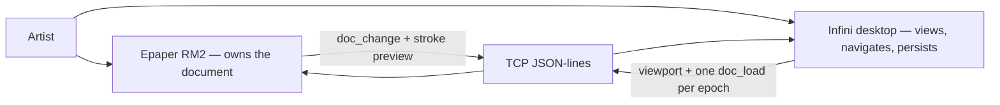
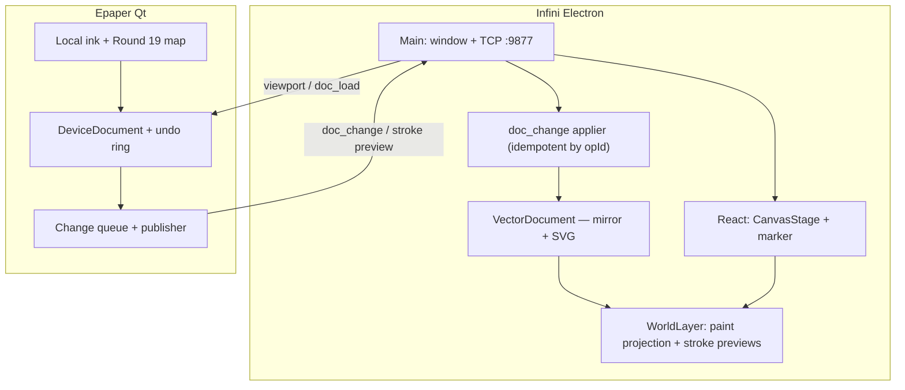

# Architecture — Infini

View over [PRD](./prd.md). Specs live in feature `srs-*`; decisions in ADRs.

> **Revised 2026-08-13 — CHL-0008.** Infini is a **viewer, navigator, and persistence home**. The
> device owns the working document and is its only writer
> ([ADR-0014](../../adr/ADR-0014-document-ownership-inversion.md)); the desktop applies the change
> stream, paints it, and saves it ([ADR-0015](../../adr/ADR-0015-one-way-sync-contract.md)).
> Device architecture: [epaper/architecture.md](../epaper/architecture.md).

## Quality goals (prioritised)

1. **Gesture smoothness** — continuous pan/pinch without visible stutter on a 60 Hz display ([REQ-01](./prd.md#infinity-canvas)).
2. **Mapping latency** — Epaper input map tracks Infini viewport before full panel refresh ([REQ-03](./prd.md#tablet-sync), [ADR-0009](../../adr/ADR-0009-shared-document-viewport.md)).
3. **Mirror convergence** — every published device change applied, in order, idempotently, ≤300 ms p95; a gapped mirror is visible and never saved silently ([ADR-0015](../../adr/ADR-0015-one-way-sync-contract.md)).
4. **Stroke/region paint parity** — world-unit stroke width × viewport/panel scale on both peers ([ADR-0012](../../adr/ADR-0012-world-stroke-viewport-parity.md)).
5. **Document fidelity** — SVG/profile round-trip ±1 px @ 100% zoom; tree parenting preserved ([REQ-02](./prd.md#vector-document), [ADR-0010](../../adr/ADR-0010-tree-of-vectors.md)).
6. **Cross-platform velocity** — one Electron+React shell ([ADR-0008](../../adr/ADR-0008-electron-react-infini.md)).

## Constraints

- Sibling to Swift Reawa and Qt Epaper — do not merge codebases.
- RM2 reachable over USB Ethernet; xochitl stopped while Epaper runs.
- Transform = translate + **uniform** scale only (no rotate/skew in v0).
- Target document is a **composite tree** ([ADR-0010](../../adr/ADR-0010-tree-of-vectors.md));
  **live paint today** uses WorldLayer primitives until tree-driven paint lands.

## Solution strategy

Electron main owns window lifecycle + TCP session to Epaper (`:9877`).
React owns infinity canvas UI with `screen = (world + T) * S`.
The TypeScript **tree-of-vectors** library (`VectorDocument`) becomes the desktop's **mirror**:
inbound `doc_change` applies to it idempotently by `opId`, paint is driven from it, and it is what
SVG save serializes. Inbound `stroke_*` is demoted to a **transient preview layer** on WorldLayer.
Outbound is `viewport` plus exactly one `doc_load` per session epoch
([ADR-0015](../../adr/ADR-0015-one-way-sync-contract.md)).

**The main desktop work is the inversion of the paint source**: today `rebuildWithRmInk` turns
strokes into flat WorldLayer primitives and nothing enters `VectorDocument`. Enclose recognition is
no longer the first slice — the applier is.

## Domain entities (consumed)

Shared semantics: [domain/vector-document](../../domain/vector-document.md).

| Entity | Notes |
|---|---|
| Ink | Dense polyline of tablet samples — primary handwriting (mirror tree) |
| WorldLayer path/line/rect/ellipse | Paint projection + **transient stroke previews** |
| Text / Primitive / Group / Frame / Connector | Mirror tree |
| SmartGroup | Authored on the device ([epaper REQ-05](../epaper/prd.md#device-ink-box)); the desktop renders, serializes, and reloads it |
| Tool mode | **Device-local UI state**, never on the wire ([ADR-0013](../../adr/ADR-0013-ink-box-tool-modes.md) §1) |
| Document change | `doc_change { seq, opId, op, baseSeq }` — the only inbound document truth |
| Document load | `doc_load` — one per epoch, handshake-gated, the only outbound document message |
| Viewport | translate, scale, gut orientation, tablet CSS frame → drawingRegion |
| Session | TCP JSON-lines Epaper ↔ Infini |

Retired with [SRS-IN-13](./features/tablet-sync/srs-logic.md#srs-in-13-tool-intent-transport):
`stroke_begin.intent`, `doc_snapshot`, `doc_snapshot.pickables`, `tool_intent`.

## Context view

## Container / component view

## Crosscutting concepts

- **Consistency:** viewport map immediate; the document flows one way (device → mirror) with an
  ordered, idempotent op stream; a detected gap makes the mirror **suspect**, which is a visible
  state, not a silent save.
- **Authority:** one writer per session, and it is the device
  ([ADR-0014](../../adr/ADR-0014-document-ownership-inversion.md) §1). The desktop's recovery lever
  is an explicit resync, never a correction.
- **Parity:** stroke width world units × scale ([ADR-0012](../../adr/ADR-0012-world-stroke-viewport-parity.md)).
- **Orientation:** four gut poses; default `gutToLeft`.
- **Observability:** optional latency traces (`RM_INK_TRACE`); message-type counts make the
  "0 inbound document messages" invariant checkable without judgement.
- **Trust boundary:** local USB network only in v0.

## Decisions

- [ADR-0008](../../adr/ADR-0008-electron-react-infini.md) — Electron + React shell
- [ADR-0009](../../adr/ADR-0009-shared-document-viewport.md) — shared document + viewport (interim wire amended)
- [ADR-0010](../../adr/ADR-0010-tree-of-vectors.md) — tree-of-vectors document
- [ADR-0011](../../adr/ADR-0011-smart-group.md) — Smart Group pilot (library)
- [ADR-0012](../../adr/ADR-0012-world-stroke-viewport-parity.md) — world stroke width + viewport paint parity
- [ADR-0013](../../adr/ADR-0013-ink-box-tool-modes.md) — ink-box tool modes (§1 and §6 survive; §2–§5 superseded)
- [ADR-0014](../../adr/ADR-0014-document-ownership-inversion.md) — the device owns the working document
- [ADR-0015](../../adr/ADR-0015-one-way-sync-contract.md) — one-way sync contract v1
- Sync bind: [tablet-sync SRS-IN-07](./features/tablet-sync/srs-logic.md) shipped wire + change applier
- Device bind: [epaper SRS-EP-08](../epaper/features/device-document/srs-logic.md) the other end of the contract

## Risks & technical debt

| Risk | Threatens | Likelihood × impact | Mitigation / accepted |
|---|---|---|---|
| Chromium trackpad pinch jank | Gesture smoothness | M×H | Spike done; revisit only if regresses |
| Dual SoT (WorldLayer vs tree) | Consistency / DX | H×H | Resolved in direction: the mirror tree becomes the paint source, WorldLayer the projection |
| **No inbound change applier** (`rebuildWithRmInk` writes flat primitives) | All of REQ-03 | **H×H** | First desktop slice: apply `doc_change` into `VectorDocument`, paint via `syncFromVectorDoc`, demote strokes to preview |
| Preview and real node both visible briefly | Paint correctness | L×M | Key previews by stroke id; replace, do not append |
| Gap detection triggers spurious resyncs | Consistency | M×M | Resync is safe (queue drains first) and visible; tune with trace evidence |
| Suspect mirror saved silently | **Data loss** | L×H | Save is blocked / marked while suspect ([SRS-IN-06](./features/vector-document/srs-quality.md)) |
| `regionsync/` unwired on device | Dual path confusion | H×M | Docs mark library vs Qt; wire or retire |
| Gut orientation hardware edge cases | Map correctness | M×H | Human confirm four poses |
| Desktop ink-box code left behind after deprecation | Dead weight, false traceability | M×M | Retire it in the story that removes it; `@implements` drift stays visible to `adlc audit` |
| Two geometry implementations diverge | Document fidelity | M×H | Shared fixtures + [domain doc](../../domain/vector-document.md); divergence is a `CHL-*` |
