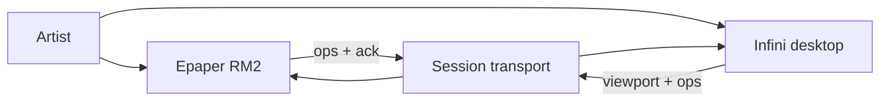
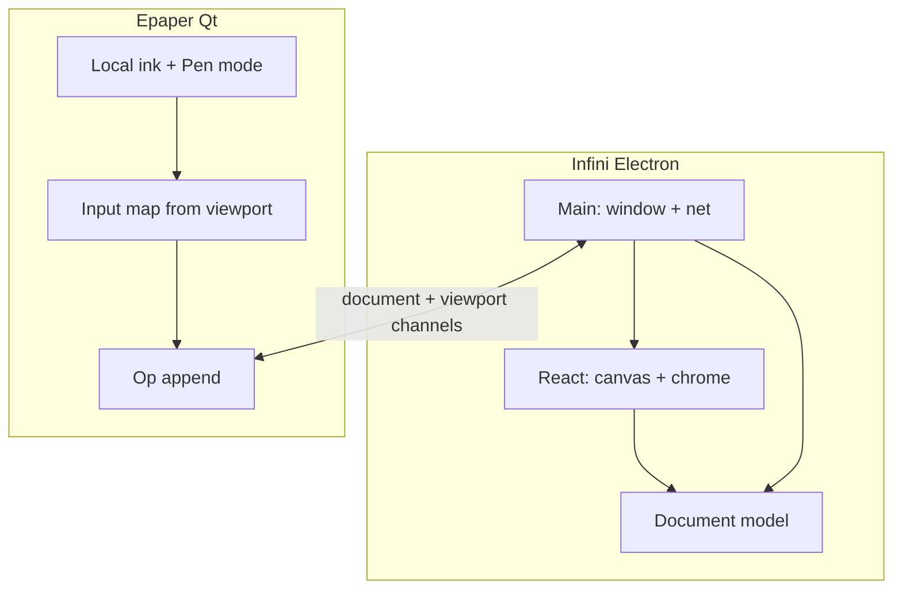

# Architecture — Infini

View over [PRD](./prd.md). Specs live in feature `srs-*`; decisions in ADRs.

## Quality goals (prioritised)

1. **Gesture smoothness** — continuous pan/pinch without visible stutter on a 60 Hz display ([REQ-01](./prd.md#infinity-canvas)).
2. **Mapping latency** — Epaper input map tracks Infini viewport before full panel refresh ([REQ-03](./prd.md#tablet-sync), [ADR-0009](../../adr/ADR-0009-shared-document-viewport.md)).
3. **Document fidelity** — SVG/profile round-trip ±1 px @ 100% zoom ([REQ-02](./prd.md#vector-document)).
4. **Cross-platform velocity** — one Electron+React shell ([ADR-0008](../../adr/ADR-0008-electron-react-infini.md)).

## Constraints

- Sibling to Swift Reawa and Qt Epaper — do not merge codebases.
- RM2 reachable over USB Ethernet; xochitl stopped while Epaper runs.
- Transform = translate + **uniform** scale only (no rotate/skew in v0).

## Solution strategy

Electron main process owns window lifecycle + TCP (or Unix) session to Epaper.
React renderer owns infinity canvas UI and applies `screen = (world + T) * S`.
A shared TypeScript document model serializes to SVG for disk and to a compact op
encoding for the wire. Viewport updates are a separate high-priority message type
([ADR-0009](../../adr/ADR-0009-shared-document-viewport.md)).

## Domain entities (consumed)

| Entity | Notes |
|---|---|
| Stroke / Path | Ordered samples or path segments in world space |
| Document | Op-log + materialised scene |
| Viewport | translate, scale, drawing-region AABB |
| Session | Connection Epaper ↔ Infini |

## Context view

## Container / component view

## Crosscutting concepts

- **Consistency:** op-log + ordered apply; viewport immediately on Epaper map.
- **Observability:** optional latency traces (reuse EXP `RM_INK_TRACE` ideas on both ends).
- **Trust boundary:** local USB network only in v0; no auth productization yet.

## Decisions

- [ADR-0008](../../adr/ADR-0008-electron-react-infini.md) — Electron + React shell
- [ADR-0009](../../adr/ADR-0009-shared-document-viewport.md) — shared document + viewport channels

## Risks & technical debt

| Risk | Threatens | Likelihood × impact | Mitigation / accepted |
|---|---|---|---|
| Chromium trackpad pinch jank | Gesture smoothness | M×H | Early spike; fallback Ctrl+wheel; accept Electron if spike fails → revisit Tauri/Qt |
| Op-log divergence bugs | Consistency | M×H | Snapshot hash of drawing region on refresh; assert in debug builds |
| Dual stack (TS + Qt) model drift | Maintainability | H×M | Single schema doc + golden fixtures both sides consume |
