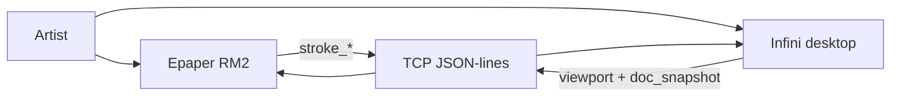
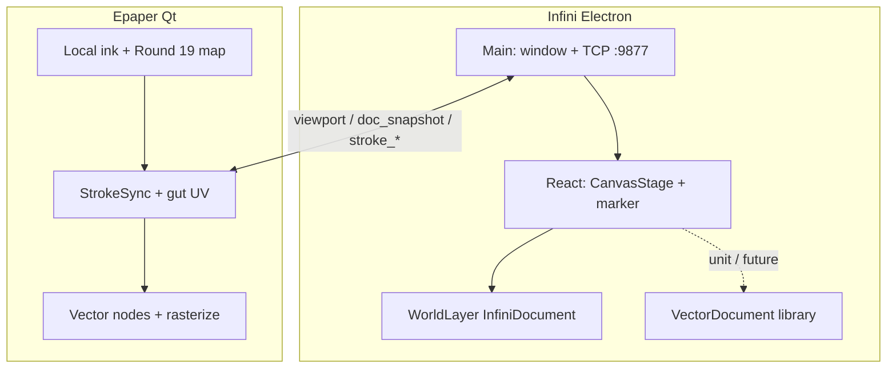

# Architecture — Infini

View over [PRD](./prd.md). Specs live in feature `srs-*`; decisions in ADRs.

## Quality goals (prioritised)

1. **Gesture smoothness** — continuous pan/pinch without visible stutter on a 60 Hz display ([REQ-01](./prd.md#infinity-canvas)).
2. **Mapping latency** — Epaper input map tracks Infini viewport before full panel refresh ([REQ-03](./prd.md#tablet-sync), [ADR-0009](../../adr/ADR-0009-shared-document-viewport.md)).
3. **Stroke/region paint parity** — world-unit stroke width × viewport/panel scale on both peers ([ADR-0012](../../adr/ADR-0012-world-stroke-viewport-parity.md)).
4. **Document fidelity** — SVG/profile round-trip ±1 px @ 100% zoom; tree parenting preserved ([REQ-02](./prd.md#vector-document), [ADR-0010](../../adr/ADR-0010-tree-of-vectors.md)).
5. **Cross-platform velocity** — one Electron+React shell ([ADR-0008](../../adr/ADR-0008-electron-react-infini.md)).

## Constraints

- Sibling to Swift Reawa and Qt Epaper — do not merge codebases.
- RM2 reachable over USB Ethernet; xochitl stopped while Epaper runs.
- Transform = translate + **uniform** scale only (no rotate/skew in v0).
- Target document is a **composite tree** ([ADR-0010](../../adr/ADR-0010-tree-of-vectors.md));
  **live paint today** uses WorldLayer primitives until tree-driven paint lands.

## Solution strategy

Electron main owns window lifecycle + TCP session to Epaper (`:9877`).
React owns infinity canvas UI with `screen = (world + T) * S`.
**Live paint** uses WorldLayer (`InfiniDocument`). The TypeScript **tree-of-vectors**
library (`VectorDocument`) is the target SoT for structure/persistence; SVG profile +
ops are unit-tested. **Shipped sync wire:** `viewport` + `doc_snapshot` + `stroke_*`
([ADR-0009](../../adr/ADR-0009-shared-document-viewport.md) amendment). Target remains
a shared op-log when migration lands.

## Domain entities (consumed)

| Entity | Notes |
|---|---|
| Ink | Dense polyline of tablet samples — primary handwriting (tree library) |
| WorldLayer path/line/rect/ellipse | Live paint + `doc_snapshot` nodes |
| Text / Primitive / Group / Frame / Connector | Tree library |
| SmartGroup | Ink-box pilot — library ops; no live UI yet ([ADR-0011](../../adr/ADR-0011-smart-group.md)) |
| Viewport | translate, scale, gut orientation, tablet CSS frame → drawingRegion |
| Session | TCP JSON-lines Epaper ↔ Infini |

## Context view

## Container / component view

## Crosscutting concepts

- **Consistency:** viewport map immediate; picture via `doc_snapshot` + local re-rasterize; paint coalesced (e-ink). Target: op-log.
- **Parity:** stroke width world units × scale ([ADR-0012](../../adr/ADR-0012-world-stroke-viewport-parity.md)).
- **Orientation:** four gut poses; default `gutToLeft`.
- **Observability:** optional latency traces (`RM_INK_TRACE`).
- **Trust boundary:** local USB network only in v0.

## Decisions

- [ADR-0008](../../adr/ADR-0008-electron-react-infini.md) — Electron + React shell
- [ADR-0009](../../adr/ADR-0009-shared-document-viewport.md) — shared document + viewport (interim wire amended)
- [ADR-0010](../../adr/ADR-0010-tree-of-vectors.md) — tree-of-vectors document
- [ADR-0011](../../adr/ADR-0011-smart-group.md) — Smart Group pilot (library)
- [ADR-0012](../../adr/ADR-0012-world-stroke-viewport-parity.md) — world stroke width + viewport paint parity
- Sync bind: [tablet-sync SRS-IN-07](./features/tablet-sync/srs-logic.md) shipped wire

## Risks & technical debt

| Risk | Threatens | Likelihood × impact | Mitigation / accepted |
|---|---|---|---|
| Chromium trackpad pinch jank | Gesture smoothness | M×H | Spike done; revisit only if regresses |
| Dual SoT (WorldLayer vs tree) | Consistency / DX | H×H | Accepted interim; migrate live paint to tree |
| `stroke_*` vs `append_ink` drift | Schema fidelity | H×M | ADR-0009 amendment; migrate wire |
| `regionsync/` unwired on device | Dual path confusion | H×M | Docs mark library vs Qt; wire or retire |
| Reconnect without hello protocol | Consistency | M×M | Resend `doc_snapshot` on TCP connect today |
| Gut orientation hardware edge cases | Map correctness | M×H | Human confirm four poses |
