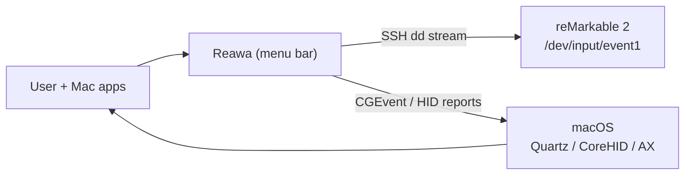
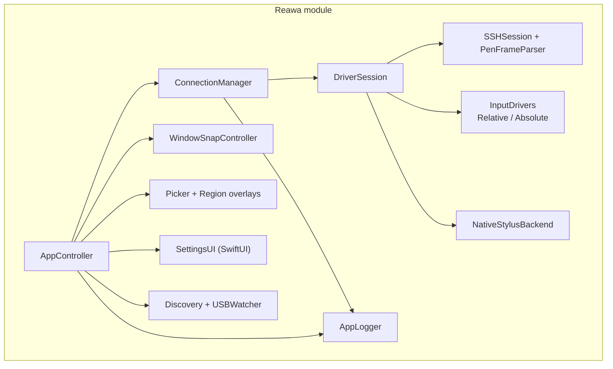
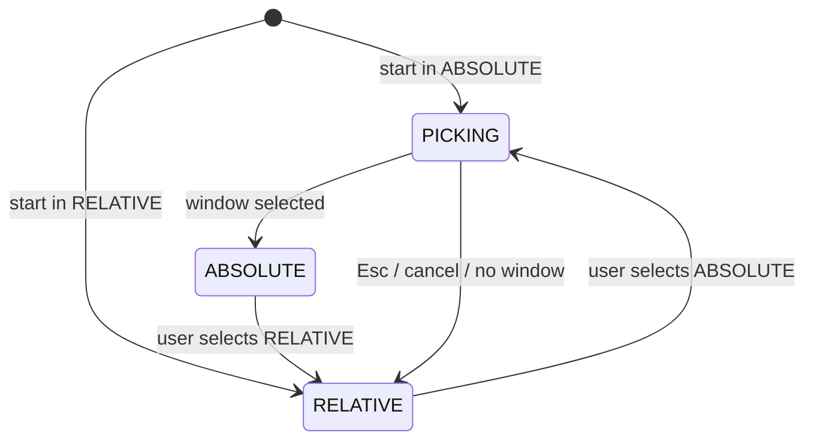

# Architecture — Reawa

Native Swift macOS menu bar app streaming reMarkable 2 pen events over SSH and translating them into Quartz mouse events or (planned) virtual HID stylus reports.

## Quality goals (prioritised)

1. **Responsiveness** — Pen frame → cursor event latency p95 ≤ 16 ms under normal load — [SRS-RW-34](features/pen-input-relative/srs-quality.md#responsiveness)
2. **Reliability** — SSH session survives mode/backend switches without reconnect — [ADR-0001](../../adr/ADR-0001-live-backend-swap.md)
3. **Correctness (Absolute lifecycle)** — Window minimize/maximize/close/restore detected on all displays including Stage Manager — [SRS-RW-23](features/pen-input-absolute/srs-logic.md#stage-manager-detection), [ADR-0004](../../adr/ADR-0004-stage-manager-lifecycle.md)
4. **Compatibility** — Legacy `remarkable-rm2` App Support and Keychain data migrates on first launch — [SRS-RW-08](features/connection-management/srs-logic.md#storage)

## Constraints

- macOS 13+; Native Stylus requires macOS 15+ and signed `.app` with Virtual HID entitlement.
- No Python runtime in active app; archived under `legacy/python/`.
- System `/usr/bin/ssh` and `/usr/bin/ssh-keygen` for transport — [ADR-0006](../../adr/ADR-0006-system-openssh.md).
- Accessibility + (for Native Stylus) post-event HID permission required.

## Solution strategy

```
AppController (menu bar, overlays, timers)
  → ConnectionManager (single active session, live config)
    → DriverSession (background Thread: SSH read → PenFrameParser → backend)
      → RelativePenDriver | AbsolutePenDriver | NativeStylusBackend
  → USBWatcher + NetworkDiscovery (poll, probe, notify)
  → WindowSnapController + Picker/Region overlays (Absolute mode)
  → SettingsUI (SwiftUI in NSWindow)
```

Pen frames are parsed once; backends swap in-process without SSH reconnect. Absolute mode stores geometry in **Quartz** global coordinates; AppKit UI converts at draw time only. Window enumeration uses `CGWindowListCopyWindowInfo`; lifecycle close detection uses AX element validity, not window-list membership.

## Context view



## Container / component view



### App-level Absolute mode state machine



Flags: `picking`, `snappedConnectionID`, `snappedWindowState` (`normal` | `minimized`). `updateOverlay()` orchestrates picker, region overlay, and follow timer.

## Project layout (implementation map)

| Path | Responsibility |
|---|---|
| `Sources/ReawaApp/main.swift` | NSApplication bootstrap |
| `Sources/ReawaApp/AppController.swift` | Menu bar, snap flow, overlay lifecycle, menu UI |
| `Sources/ReawaApp/Models.swift` | Connection, DeviceConfig, PenFrame, enums |
| `Sources/ReawaApp/Storage.swift` | JSON persistence, SSH keys, legacy migration |
| `Sources/ReawaApp/ConnectionManager.swift` | Active session, statuses, live config |
| `Sources/ReawaApp/SSHSession.swift` | SSH, key install, pen parsing |
| `Sources/ReawaApp/InputDrivers.swift` | Relative/Absolute Quartz backends |
| `Sources/ReawaApp/NativeStylusBackend.swift` | Virtual HID stylus (experimental) |
| `Sources/ReawaApp/WindowSnap.swift` | CGWindowList, AX move/resize, lifecycle |
| `Sources/ReawaApp/Overlays.swift` | Picker and region overlay windows |
| `Sources/ReawaApp/SettingsUI.swift` | SwiftUI settings and logs |
| `Sources/ReawaApp/Logging.swift` | Behavior + pen event logs |
| `Sources/ReawaApp/Discovery.swift` | Network scan, USB watcher, notifications |
| `Sources/ReawaApp/Utilities.swift` | Process runner, coordinate conversion |
| `Tests/ReawaTests/` | Parser, models, drivers, logging tests |

## Pen event pipeline

```
RM2 /dev/input/event1
  → ssh "dd bs=16 if=..."
  → PenFrameParser → PenFrame
  → DriverSession [paused? skip]
  → RelativePenDriver | AbsolutePenDriver | NativeStylusBackend
  → CGEventPost (mouse) OR HIDVirtualDevice (stylus)
```

### RM2 device constants

| Constant | Value | Meaning |
|---|---|---|
| `PEN_X_MAX` | 20967 | Digitizer X range |
| `PEN_Y_MAX` | 15725 | Digitizer Y range |
| `RM2_ASPECT` | 20967/15725 | Portrait aspect |
| `RM2_DPI` | 2531 | Auto scale calculation |
| `RM2_USER` | `root` | SSH user |
| `RM2_PEN_FILE` | `/dev/input/event1` | Pen device |
| `SSH_KEY_BITS` | 3072 | RSA key size |
| `EVENT_SIZE` | 16 | Linux input_event bytes |

## Coordinate systems

| Space | Origin | Used by |
|---|---|---|
| Quartz global | Top-left primary, Y down | CGEvent, CGWindowList, AX, stored AbsoluteConfig |
| Cocoa global | Bottom-left primary, Y up | NSScreen, NSWindow, NSView drawing |

Rule: persist region and window geometry in Quartz; convert for AppKit via `Utilities.swift` helpers only.

## Threading model

| Context | Work |
|---|---|
| Main (@MainActor) | Menu bar, settings, overlays, picker, timers |
| DriverSession thread | SSH read, parser, backend translation |
| USBWatcher timer + detached tasks | Discovery polls, reachability |
| Async Native Stylus tasks | HID report submission |

Config changes flow through `ConnectionManager.updateConnection` → live session snapshot (no per-frame disk I/O). Do not reconnect SSH to change output mode.

## Storage

```text
~/Library/Application Support/Reawa/
  connections.json
  keys/<connection-id>/id_rsa
  keys/<connection-id>/id_rsa.pub
```

Legacy migration from `~/Library/Application Support/remarkable-rm2/` on first run. Keychain service `Reawa` with fallback read from `remarkable-rm2`.

## Dependencies

| Package / Tool | Role |
|---|---|
| Foundation, AppKit, SwiftUI, Combine | App shell and UI |
| ApplicationServices, CoreGraphics | CGEvent, CGWindowList, AX |
| Network | TCP reachability |
| Security | Keychain, entitlements |
| UserNotifications | Bundled-run notifications |
| CoreHID (optional) | Native Stylus virtual device |
| `/usr/bin/ssh`, `/usr/bin/ssh-keygen`, `/sbin/ifconfig` | Transport and discovery |

## Crosscutting concepts

- **Error handling:** Connect failures set connection status `error`; Native Stylus startup failure falls back to last mouse mode with logged reason.
- **Observability:** Dual-channel AppLogger (behavior always-on; pen debounced off-main-thread).
- **Validation boundary:** SSH to known device IP; Keychain for passwords; Accessibility for event posting.
- **Consistency:** Single active connection; live config cache synchronized on edit.

## Decisions

- [ADR-0001](../../adr/ADR-0001-live-backend-swap.md) — Live backend swap without SSH reconnect
- [ADR-0002](../../adr/ADR-0002-absolute-window-bound.md) — Absolute mode always window-bound
- [ADR-0003](../../adr/ADR-0003-cgwindowlist-enumeration.md) — CGWindowList for window enumeration
- [ADR-0004](../../adr/ADR-0004-stage-manager-lifecycle.md) — Stage Manager lifecycle via CG/AX area ratio
- [ADR-0005](../../adr/ADR-0005-native-stylus-virtual-hid.md) — Native Stylus virtual HID path
- [ADR-0006](../../adr/ADR-0006-system-openssh.md) — System OpenSSH for pen streaming
- [ADR-0007](../../adr/ADR-0007-hybrid-appkit-swiftui.md) — Hybrid AppKit + SwiftUI UI split

## Risks & technical debt

| Risk | Threatens | Likelihood × impact | Mitigation |
|---|---|---|---|
| Apple Virtual HID entitlement delay | Native Stylus shipping | H × H | Mouse emulation fallback; packaging prep in repo |
| macOS USB routing to Wi-Fi instead of USB iface | Discovery/connect | M × M | Document env dependency; future diagnostics UI |
| AX frame proximity ambiguity | Wrong window picked | L × M | Frame proximity match; known limitation |
| Stage Manager policy changes | Lifecycle detection | M × M | Re-run investigation procedure in memory doc |
| `swift run` vs bundled behavior | Notification/HID testing | M × L | Bundle checks in NotificationService; documented |

## Engineering reference (preserved history)

- [Swift porting notes](../../memory/swift-porting.md)
- [macOS window lifecycle investigation](../../memory/macos-window-lifecycle-investigation.md)
- [Native Stylus packaging notes](../../memory/native-stylus-packaging.md)
- [Bug fix history (Absolute mode)](features/pen-input-absolute/srs-logic.md#bug-fix-history)
- [evdev format learning notebook](../../memory/learn.ipynb)

## Entry points

```bash
swift run reawa
swift test
open Package.swift
sh scripts/build-macos-app.sh --configuration debug
sh scripts/check-native-stylus-setup.sh
```

## Known limitations

- Window picker lists layer-0 windows only (no menu bar, dock, overlays).
- AX resolution by frame proximity may pick wrong element for duplicate frames.
- Single active connection.
- `borderStyle` in data model not yet exposed in UI.
- Native Stylus requires signed `.app` + entitlement; `swift run` cannot activate it.
