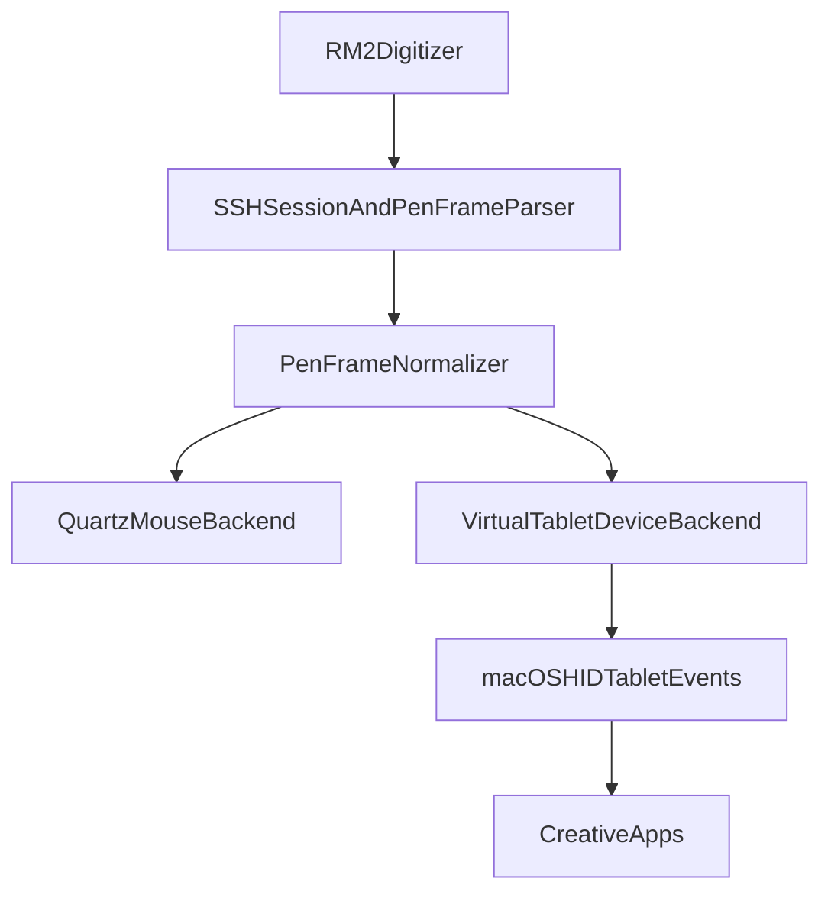

# SRS — Native Stylus (Logic)

## [SRS-RW-51] Backend selection and fallback

`DriverSession` selects backend from `DeviceConfig.outputMode`:

- `.relative` → `RelativePenDriver`
- `.absolute` → `AbsolutePenDriver`
- `.nativeStylus` → `NativeStylusBackend`

On `NativeStylusBackend` startup failure: emit fallback event, switch to last working mouse-emulation mode (`ConnectionManager` tracks last mouse mode).

Live backend swap without SSH reconnect: [ADR-0001](../../../../adr/ADR-0001-live-backend-swap.md).

## [SRS-RW-52] NativeStylusBackend requirements

- macOS 15+
- Signed `.app` bundle with Apple-approved `com.apple.developer.hid.virtual.device`
- `IOHIDRequestAccess(kIOHIDRequestTypePostEvent)` granted
- Uses `CoreHID.HIDVirtualDevice` when available

Converts `PenFrame` to generic HID stylus report:

- tip contact, barrel button (`stylusButton`), in-range (`inProximity`)
- X/Y, pressure, tilt (`tiltX`, `tiltY`), distance when present
- Does **not** spoof Wacom device identity

Publishes capability/failure via `DriverSessionEvent.nativeStylusStatus` → `ConnectionManager.nativeStylusStatuses`.

## [SRS-RW-53] Pen metadata preservation

Tablet backend must preserve and forward from SSH parser ([SRS-RW-29](../pen-input-relative/srs-logic.md)):

- `x`, `y`, `pressure`, `touching`, `inProximity`, `stylusButton`, `distance`, `tiltX`, `tiltY`, `rawEvents`

Do not collapse stream to mouse-only semantics before HID dispatch.

## [SRS-RW-54] Planned high-level flow

## [SRS-RW-55] DriverKit fallback gate

Branch to DriverKit system extension if after entitlement QA:

- `HIDVirtualDevice` not visible as pen device in Krita Tablet Tester
- Pressure/tilt/proximity dropped in macOS input stack
- Apple approves only DriverKit route
- App-only packaging too fragile for support

App retains SSH/controller; extension publishes HID. Entitlements: `com.apple.developer.driverkit`, `com.apple.developer.driverkit.family.hid.virtual.device`.

Full gate criteria: [native-stylus-packaging.md](../../../../memory/native-stylus-packaging.md).

## [SRS-RW-56] Local development limitation

`swift run reawa` launches unsigned SwiftPM executable — **cannot** create supported Virtual HID device. Mouse-emulation development valid; Native Stylus QA requires signed bundle per [ADR-0005](../../../../adr/ADR-0005-native-stylus-virtual-hid.md).

## [SRS-RW-57] Repository packaging artifacts

| Path | Purpose |
|---|---|
| `Config/Reawa.entitlements` | Development entitlement file |
| `scripts/build-macos-app.sh` | Build `.app` from SwiftPM executable |
| `scripts/check-native-stylus-setup.sh` | Local signing readiness checklist |
| `Sources/ReawaApp/NativeStylusBackend.swift` | Backend spike |

---

## Superseded

_None yet._
