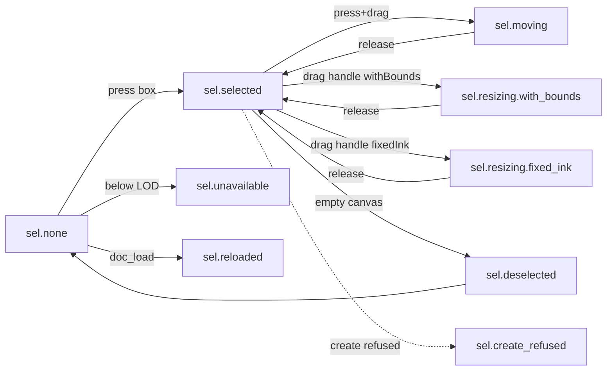

# [UI-EP-02] — Device selection overlay and manipulation chrome

Iter-local UI design for [SRS-EP-12](../../../../.docs/modules/epaper/features/ink-box/srs-ui.md).
**Not a port** of [ink-box-ui](../ink-box-ui/) (mouse + ghost) or of
[epaper-tool-strip](../epaper-tool-strip/) `selection-dragging` ghost scenes.
ToolChip is **composed** from [UI-EP-03](../selection-enclose-chrome/ui-spec.md) (four tools, [ADR-0017](../../../../.docs/adr/ADR-0017-four-tool-chip.md)). Overlay geometry stays UI-EP-02.

## Source

- REQ: [REQ-05](../../../../.docs/modules/epaper/prd.md#device-ink-box), [REQ-06](../../../../.docs/modules/epaper/prd.md#device-manipulation)
- SRS-UI: [SRS-EP-12](../../../../.docs/modules/epaper/features/ink-box/srs-ui.md)
- Experience: [srs-experience](../../../../.docs/modules/epaper/features/ink-box/srs-experience.md) — READY (in-scene state sequences; scene graph N/A)
- Logic (behavior, not chrome): [SRS-EP-10 / SRS-EP-11](../../../../.docs/modules/epaper/features/ink-box/srs-logic.md)
- Story AC: [STORY-EP-012](../../stories/STORY-EP-012.md)
- Compose: [UI-EP-03 ToolChip](../selection-enclose-chrome/) — four tools; do not revert to UI-EP-01 three-chip
- Reference image: none

## Platform profile

| Field | Value |
|---|---|
| Profile | **epaper-device** (reMarkable 2, Qt/QML fullscreen) |
| `data-platform` | `epaper` (CHL-0002 — mechanical gate allowlist pending ADLC patch) |
| Target frames | Landscape tablet **1872×1404** (native panel 1404×1872 rotated). Not phone chrome |
| Responsive strategy | per-target — one panel size; no reflow |
| Breakpoints / resize | N/A — fixed panel |
| Safe areas / fixed regions | ToolChip floats at orientation-top (UI-EP-01 / CHL-0003); overlay is content-space |
| Input model | **Pen** for content and handles; **finger** for the chip only. No keyboard |
| Nav paradigm | In-scene states on one surface — no push / sheet / modal |
| Target minimum | Handle **hit 56 device units** (architect-locked); chip tiles **64×64** (UI-EP-01 v0.4) |
| Density | compact 1-bit |
| Hover | **N/A** — no hover, no focus, no cursor, no motion |
| Preview | Navigator `data-preview-scale="tablet"` @ 100% · 1872×1404 |

**Platform kit (epaper):** press/active invert only. `:hover` and `:focus-visible` are **not designed**
(SRS-EP-12 control states). Status never by color — hatch + label text.

## Screens / flow

Single surface. Journeys are in-scene state sequences (srs-experience). Keep list = SRS states matrix.

Nav kind: **in-scene state** (not push / present-modal). Relative hops in scene HTML for validation.

## Layout regions

| Region | Contents / hierarchy | Component | States |
|---|---|---|---|
| DeviceScreen | Landscape panel frame | — | default |
| InkSurface | Full-bleed document paint; handwriting + boundary ink | InkFigure | document / live-moving / live-scaling / tiny / replaced |
| SelectionOverlay | Bounds, 8 resize handles (no rotation), mode toggle, mode indicator | SelectionOverlay | hidden / selected / moving / resizing / unavailable |
| ToolStrip | Floating four-tool chip | ToolChip (composed UI-EP-03) | `sel_rect` or `sel_freeform` armed |
| StatusLine | Tool + state caption (design preview only) | — | default |

**Chrome relationships:** SelectionOverlay **above** InkSurface, **below** ToolChip. Overlay is
**content-space** — it tracks the box through drag (and would track pan/zoom). Not pinned chrome.
Chrome does not swallow pen input outside its own controls (handles, mode toggle).

**Containment:** DeviceScreen > InkSurface (full-bleed) + ToolStrip (float) + StatusLine.
SelectionOverlay is a child of InkSurface in z-order (painted over ink).

## Component inventory

| Component | Source | Pattern id / CSS class | Variant / props | Used in regions |
|---|---|---|---|---|
| ToolChip | **reuse** UI-EP-03 | `.c-tool-chip` | 4 tools, 64×64, radius 0 | ToolStrip |
| ToolButton | **reuse** UI-EP-01 | `.c-tool-btn` | default, active, pressed, unavailable | ToolStrip |
| SelectionOverlay | **build** | `.c-bounds` + handles | selected, moving, resizing, hidden | SelectionOverlay |
| InkScaleModeToggle | **build** | `.c-mode-toggle` | withBounds, fixedInk, pressed, hidden | SelectionOverlay |
| CreateRefusedIndicator | **build** | `.c-indicator` | hidden, visible | near selection |
| ManipulationUnavailableIndicator | **build** | `.c-indicator` | hidden, visible | SelectionOverlay |

No properties panel. No rotation handle. No marquee. No ghost.

## Tokens used

Closed 1-bit set — [`tokens.json`](./tokens.json) / [`tokens.css`](./tokens.css).
Paper `#ffffff` / ink `#000000` only. Hatch via repeating-linear-gradient. **No tint, no shadow.**

Infini project tokens (slate/teal) are **not applied** on this panel — flagged as platform subset
in `.docs/DESIGN.md`. Chip tokens composed from UI-EP-01 v0.4 (`--chip-btn: 64px`).

## Design system readiness

| Check | Evidence |
|---|---|
| DESIGN.md reconciled | `.docs/DESIGN.md` — epaper-device profile added |
| Project tokens valid | Infini tokens unchanged; this package is a 1-bit subset |
| tokens.css generated | `./tokens.css` |
| Component catalog complete | `components.md` + self-contained `.html` |
| Pattern-only reuse | ToolChip copy-pasted from UI-EP-03; overlay is UI-EP-02 |

## States (required)

| State | Trigger | UI behaviour | AC / SRS |
|---|---|---|---|
| `sel.none` | Idle, Selection armed | Document; overlay hidden | SRS-EP-12 matrix |
| `sel.selected` | Press box, no drag | Double-rail bounds + 8 handles + mode toggle | BR-B11 |
| `sel.moving` | Press+drag inside bounds | **Real ink** follows the pen; bounds track ink | BR-B10, BR-B15 |
| `sel.resizing.with_bounds` | Drag handle, mode withBounds | Content **scales with** the box; active handle invert | BR-B12; CHL-0005 |
| `sel.resizing.fixed_ink` | Drag handle, mode fixedInk | Content **keeps sample size**, centroid tracks UV; box grows | BR-B13; CHL-0004 |
| `sel.deselected` | Empty-canvas press | Overlay gone; **0** residual chrome | BR-B16; CHL-0007 |
| `sel.create_refused` | Selection-create with no surround | Selection unchanged; `ind.create_refused_no_surround` | BR-B06 |
| `sel.unavailable` | Press below LOD cutoff | No grab; `ind.manipulation_unavailable` | BR-B14 |
| `sel.reloaded` | `doc_load` | Replaced document; selection cleared; overlay hidden | SRS-EP-11 |

## Control states & reactivity (required)

Epaper: **hover N/A, focus N/A, cursor N/A, motion none.** Press = invert fill. Proof:
[`device-selection-chrome-states.html`](./device-selection-chrome-states.html).

| Control | hover | focus-visible | active/press | disabled | loading | selected | error | Showcase file |
|---|---|---|---|---|---|---|---|---|
| `ovl.selection_bounds` | N/A | N/A | — | hidden below LOD | — | drawn | — | states.html |
| `ovl.resize_handles` | N/A | N/A | invert (paper well ↔ black) | hidden below LOD | — | drawn | — | states.html |
| `tgl.ink_scale_mode` | N/A | N/A | brief invert | hidden if none selected | — | reflects mode | — | states.html |
| `ind.mode_current` | N/A | N/A | — | — | — | label text | — | states.html |
| `ind.create_refused_no_surround` | N/A | N/A | — | — | — | — | visible copy | states.html |
| `ind.manipulation_unavailable` | N/A | N/A | — | — | — | — | visible copy | states.html |
| ToolButton (composed) | N/A | N/A | invert | hatch fill | — | `aria-pressed` | — | states.html |

No-op still acknowledges press (`:active` / `.is-pressed`).

## Interaction & a11y

- Focus order: N/A (no keyboard on panel)
- Focus variants: **not designed** (SRS)
- Accessible names: handle `aria-label="Resize {corner}"`; toggle names current mode; indicators have text
- Contrast: black/white **21:1**
- Targets: handle hit **56 du** (architect-locked); chip 64×64; ≥8px separation between handle visuals
- Color independence: hatch + label; refuse/unavailable never color-only
- Long content: indicator copy wraps inside hatch chip (`max-width: 16rem`)
- 200% zoom: N/A — physical panel; preview is 1:1 device units

## Copy

| Element | Copy / placeholder | Glossary |
|---|---|---|
| Mode withBounds | `Scale ink` | inkScaleMode |
| Mode fixedInk | `Keep size` | inkScaleMode |
| Refuse | `No surrounding stroke` | selection-create |
| Unavailable | `Too far out to move` | LOD cutoff |
| Tool labels | Selection / Pen / Ink box | SRS-EP-05 |

## Spike answers {#spike}

| Question | Answer | Status |
|---|---|---|
| Handle size + hit in **device units** | Visual **28 du** (≈3.1 mm @ 226 dpi). Hit **56 du** (≈6.3 mm), 14 du pad beyond visual. 1 preview CSS px = 1 device unit. **Not** 8 CSS px. | **Accepted 2026-08-13 (architect).** Implement lock for EP-019. |
| LOD cutoff on a **fixed panel** | Unavailable when the selected box's **smaller on-panel axis < 96 device px** (≈10.8 mm; ~6.8% of the 1404 px short edge). Below that, 28 du handles collide. **Not** `TILE_LOD_SCALE = 0.35`. | **Accepted 2026-08-13 (architect).** Implement lock for EP-019. |
| Undo on the four-tool chip | **Adopted CHL-0016 / ADR-0018:** not a fifth exclusive tool. After a 32 du gap: Undo \| Redo. | Human 2026-08-14 |
| Selection-create invocation | `cta.create_smart_group` stays **out of v1 chrome**. Refuse scene ships; invocation control does not. Enclose-with-Ink-box is the create path. | **CHL-0010 deferred** (PM 2026-08-13) |
| Chrome vs dense 1-bit handwriting | **Designer closed:** double-rail bounds (3px black / 2px paper / 1px black) vs single-path ink; **filled** handles with paper well vs open strokes; **45° hatch** on mode toggle and indicators (ink never uses hatch fill). No tint, no shadow, no dashed ghost. | Closed in this Spec |

## Chrome vs dense handwriting (binding)

Ink is **stroke-only** open paths. Overlay chrome uses **fill + hatch + double-rail** so a glance
cannot mistake a handle for a stroke:

1. Bounds = double-rail, never a dashed marquee or single 2px stroke.
2. Handles = filled black squares with a paper well; pressed inverts. Edge + corner, **no rotation**.
3. Mode toggle sits on the **box** (bottom-center, content-space), hatch-filled, with a paper label
   (`ind.mode_current`). Not parked on ToolChip.
4. Indicators = hatch chip + paper text. Transient, near the selection.

## Interaction map (from SRS)

| Control | Action | Result | Feedback |
|---|---|---|---|
| Box bounds | Pen press, no drag | Select | Bounds + handles ≤100 ms |
| Box bounds | Pen press + drag | Move | **The ink moves.** Bounds track ≥5 Hz |
| `ovl.resize_handles` | Pen drag | Resize | Real ink resizes per mode; bounds follow handle |
| `tgl.ink_scale_mode` | Pen tap | Swap mode | `ind.mode_current` updates; next resize shows effect |
| Empty canvas | Pen press in selection | Deselect | Overlay gone; 0 residual pixels |
| Another box | Pen press | Move selection | Previous overlay cleared first |
| Any | Press below LOD | Nothing | `ind.manipulation_unavailable` |

Release is the commit. No confirm step. Overlay annotates ink that is **already moving**.

## Trace matrix

| Region / state | SRS | Story AC | Notes |
|---|---|---|---|
| SelectionOverlay / sel.selected | [SRS-EP-12] | Overlay specified 1872×1404 1-bit pen | primary `hifi` |
| sel.moving | [SRS-EP-12] / [SRS-EP-11] | 0 ghost; ink follows pen | live translate |
| sel.resizing.with_bounds | [SRS-EP-12] | content scales | separate from fixedInk (CHL-0005) |
| sel.resizing.fixed_ink | [SRS-EP-12] | UV + sample size | CHL-0004 |
| sel.deselected | [SRS-EP-12] | 0 residual | CHL-0007 |
| sel.create_refused | [SRS-EP-12] | refuse visible | invocation = CHL-0010 |
| sel.unavailable | [SRS-EP-12] | LOD in panel terms | 96 du locked |
| sel.reloaded | [SRS-EP-12] | selection cleared | |
| sel.none | [SRS-EP-12] | overlay hidden | boundary ink only |
| ToolChip | [SRS-EP-05] | composed, not redesigned | UI-EP-03 four-tool |
| Handle / LOD constants | [SRS-EP-12] | 28/56 du · 96 du min-axis | architect-locked 2026-08-13 |
| Undo / create CTA | [SRS-EP-12] Open | scarce chrome | CHL-0010 |

## SRS delta table (mandatory after HTML)

| SRS item | Design | Result |
|---|---|---|
| Composition: InkSurface / SelectionOverlay / ToolChip | Layers + z-index 0 / 2 / 5 | match |
| Overlay content-space | Bounds classes track cluster position | match |
| `ovl.selection_bounds` | `.c-bounds` double-rail | match |
| `ovl.resize_handles` 8 handles, **no rotation** | `.c-handle` nw…w; 0 rotate | match |
| `tgl.ink_scale_mode` | `.c-mode-toggle` on the box | match |
| `ind.mode_current` | `.c-mode-current` label | match |
| `ind.manipulation_unavailable` | hatch indicator | match |
| `ind.create_refused_no_surround` | hatch indicator | match |
| `cta.create_smart_group` | omitted | omit — SRS out of v1; CHL-0010 |
| No properties panel / context menu / handle labels / z-order / guides | absent | match |
| No ghost / marquee / stand-in | moving + both resize scenes transform **real ink** | match |
| 1-bit fill+hatch; no hover/focus/cursor/motion | tokens + states showcase | match |
| Box unselected = creator's boundary ink, no synthetic rect | `sel.none` / `sel.deselected` | match |
| Enclose guard fail = no banner | not a scene (no chrome) | match (N/A scene) |
| Platform 1872×1404 `data-platform=epaper` | all scenes | match |
| ToolChip not duplicated / redesigned | composed UI-EP-03 four-tool markup | match |
| Preview tablet not phone | `data-preview-scale="tablet"` | match |
| Rotation handle | absent | match |

## Scenes (N scenarios → N self-contained HTML files)

| Scenario | File | Complex folder? | Notes |
|---|---|---|---|
| `sel.none` | `device-selection-chrome-sel-none.html` | no | overlay hidden |
| `sel.selected` | `device-selection-chrome-sel-selected.html` | no | **primary → hifi** |
| `sel.moving` | `device-selection-chrome-sel-moving.html` | no | real ink translated |
| `sel.resizing.with_bounds` | `device-selection-chrome-sel-resizing-with-bounds.html` | no | ink scaled with box |
| `sel.resizing.fixed_ink` | `device-selection-chrome-sel-resizing-fixed-ink.html` | no | ink size fixed, UV track |
| `sel.deselected` | `device-selection-chrome-sel-deselected.html` | no | 0 residual chrome |
| `sel.create_refused` | `device-selection-chrome-sel-create-refused.html` | no | refuse copy; no marquee |
| `sel.unavailable` | `device-selection-chrome-sel-unavailable.html` | no | tiny box < 96 du |
| `sel.reloaded` | `device-selection-chrome-sel-reloaded.html` | no | different document |

**States showcase:** `device-selection-chrome-states.html`

**Withdrawn (do not port):** `epaper-tool-strip-selection-dragging.html` ghost; any ink-box-ui marquee.

## Icons / assets

| Icon | Kind | File | Used in |
|---|---|---|---|
| Selection rect | system (UI-EP-03) | `../system/assets/icon-epaper-sel-rect.svg` | ToolChip `tool.sel_rect` |
| Selection freeform | system (UI-EP-03) | `../system/assets/icon-epaper-sel-freeform.svg` | ToolChip `tool.sel_freeform` |
| Pen | system (UI-EP-01) | `../system/assets/icon-epaper-pen.svg` | ToolChip |
| Ink-box | system (UI-EP-01) | `../system/assets/icon-epaper-ink-box.svg` | ToolChip |
| Mode withBounds | system | `../system/assets/icon-epaper-mode-with-bounds.svg` | toggle |
| Mode fixedInk | system | `../system/assets/icon-epaper-mode-fixed-ink.svg` | toggle |
| Create refused | system | `../system/assets/icon-epaper-refused.svg` | refuse indicator |
| Manipulation unavailable | system | `../system/assets/icon-epaper-unavailable.svg` | LOD indicator |

Handles are geometric chrome (filled squares), not icons.

## Self-contained HTML components

| Name | Kind | File path | Variants demoed |
|---|---|---|---|
| ToolChip | screen (composed) | `./components/tool-chip.html` | default, sel_rect active, sel_freeform active |
| SelectionOverlay | screen | `./components/selection-overlay.html` | selected, pressed handle, hidden |
| InkScaleModeToggle | screen | `./components/ink-scale-mode-toggle.html` | withBounds, fixedInk, pressed |
| CreateRefusedIndicator | screen | `./components/create-refused-indicator.html` | visible |
| ManipulationUnavailableIndicator | screen | `./components/manipulation-unavailable-indicator.html` | visible |

## Quality evidence

| Check | Evidence / result |
|---|---|
| Existing system discovered | UI-EP-03 four-tool chip + UI-EP-02 overlay; ink-box-ui withdrawn |
| Required platform frames covered | 1872×1404 landscape tablet |
| Component/state coverage | overlay + toggle + indicators + composed chip |
| Structural audit | `data-region` = DeviceScreen, InkSurface, SelectionOverlay, ToolStrip, StatusLine |
| Accessibility audit | 21:1; hatch+text; pen targets in du; focus N/A per SRS |
| Responsive/content resilience | fixed panel; indicator wrap |
| Ghost/marquee scan | 0 dashed stand-in scenes |
| Mechanical gate | `data-platform=epaper` may FAIL Design platform until CHL-0002 engine patch; Spec authoritative |

## Open questions

- Handle 28/56 du — **locked** (architect 2026-08-13).
- LOD 96 du min-axis — **locked** (architect 2026-08-13).
- Undo affordance + selection-create invocation — [CHL-0010](../../challenges/CHL-0010-undo-vs-selection-create-chrome.md) **deferred** (PM 2026-08-13).

## Gate checklist

See `ui-spec-gate.md`. Package: Spec + tokens + components + 9 scenes + states + iframe index.
