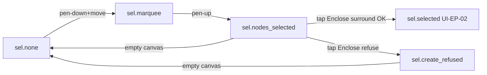

# [UI-EP-03] — Selection rubber-band and Enclose CTA

Creation B chrome for [SRS-EP-12](../../../../.docs/modules/epaper/features/ink-box/srs-ui.md)
after [CHL-0013](../../challenges/CHL-0013-selection-create-feedback-enclose-cta.md) /
[ADR-0016](../../../../.docs/adr/ADR-0016-selection-create-enclose-cta.md).

**Composes** [UI-EP-02](../device-selection-chrome/) (manipulation overlay) and
[UI-EP-01](../epaper-tool-strip/) ToolChip. This package owns marquee + nodes_selected + Enclose.
Does **not** redesign SmartGroup 8-handle chrome.

## Source

- REQ: [REQ-05](../../../../.docs/modules/epaper/prd.md#device-ink-box) Creation B
- SRS-UI: [SRS-EP-12](../../../../.docs/modules/epaper/features/ink-box/srs-ui.md)
- Experience: [srs-experience](../../../../.docs/modules/epaper/features/ink-box/srs-experience.md) `journey.device_select_create` READY
- Logic: [SRS-EP-10 / SRS-EP-11](../../../../.docs/modules/epaper/features/ink-box/srs-logic.md)
- Story: [STORY-EP-022](../../stories/STORY-EP-022.md)
- Scene graph: N/A — in-scene states on one surface (same as UI-EP-02)

## Platform profile

| Field | Value |
|---|---|
| Profile | **epaper-device** (reMarkable 2) |
| `data-platform` | `epaper` |
| Target frames | Landscape **1872×1404** |
| Responsive | per-target — fixed panel |
| Input | **Pen** for marquee + Enclose; **finger** for chip and Enclose (ADR-0016) |
| Hover / focus | **N/A** — press invert only |
| Preview | Navigator `data-preview-scale="tablet"` @ 100% |

## Screens / flow

Nav kind: **in-scene state**. Relative hops in scene HTML.

## Layout regions

| Region | Contents | Component | States |
|---|---|---|---|
| DeviceScreen | Landscape panel | — | default |
| InkSurface | Free ink / document nodes | InkFigure | document |
| SelectionOverlay | marquee / nodes_bounds + 6 anchors + cta.enclose / refuse | Marquee, NodesBounds, EncloseCta, CreateRefusedIndicator | hidden / marquee / nodes / refused |
| ToolStrip | Three-tool chip | ToolChip | Selection armed |
| StatusLine | Preview caption | — | default |

**Chrome:** SelectionOverlay above InkSurface, below ToolChip. Overlay is content-space.
`cta.enclose` is **not** on ToolChip.

## Component inventory

| Component | Kind | Source | Path | Used in |
|---|---|---|---|---|
| ToolChip | system | reuse UI-EP-01 | `components/tool-chip.html` | ToolStrip |
| Marquee | screen | build | `components/marquee.html` | SelectionOverlay `sel.marquee` |
| NodesBounds | screen | build | `components/nodes-bounds.html` | `sel.nodes_selected` |
| EncloseCta | screen | build | `components/enclose-cta.html` | `sel.nodes_selected` |
| CreateRefusedIndicator | screen | reuse UI-EP-02 | `components/create-refused-indicator.html` | `sel.create_refused` |

## Icons / assets

| Icon | Path | Used |
|---|---|---|
| Selection | `../system/assets/icon-epaper-selection.svg` | ToolChip |
| Pen | `../system/assets/icon-epaper-pen.svg` | ToolChip |
| Ink-box | `../system/assets/icon-epaper-ink-box.svg` | ToolChip |
| Enclose | `../system/assets/icon-epaper-enclose.svg` | `cta.enclose` |
| Refused | `../system/assets/icon-epaper-refused.svg` | refuse indicator |

## States (required)

| State | Trigger | UI | SRS |
|---|---|---|---|
| `sel.none` | Idle, Selection armed | Overlay hidden; 3-tool chip | SRS-EP-12 |
| `sel.marquee` | Pen-down+move | Thin dotted `ovl.marquee` follows tip | CHL-0013 |
| `sel.nodes_selected` | Pen-up | **Tight** union AABB (0 pad) + **6** anchors + icon-only `cta.enclose` 64 du | CHL-0013 |
| `sel.create_refused` | Enclose with no surround | Selection chrome **kept**; `ind.create_refused_no_surround` | BR-B06 |

6-anchor layout (Designer choice, count locked): **corners + top/bottom mid** — no east/west mids. Visual 16 du; **not pressable** this campaign.

## Interaction map (this package)

| Control | Action | Result | Feedback |
|---|---|---|---|
| Canvas | Pen-down+move | Marquee | Dotted AABB follows tip |
| Canvas | Pen-up | Nodes selected | Union rect + 6 anchors + Enclose |
| `cta.enclose` | Tap | Create or refuse | Invert press; then box or refuse chip |
| Empty canvas | Press no drag | Deselect | Overlay gone |
| ToolChip | Finger | Arm tool | Invert; still 3 tools |

## Trace matrix

| Region / state | SRS | Story AC |
|---|---|---|
| `sel.marquee` | SRS-EP-12 | EP-022 AC1 |
| `sel.nodes_selected` | SRS-EP-12 | EP-022 AC1 |
| `cta.enclose` on overlay | ADR-0016 | EP-022 AC2 |
| `sel.create_refused` | SRS-EP-12 | EP-022 AC4 |
| ToolChip 3 tools | SRS-EP-05 | EP-022 AC2 |

## SRS delta table

| SRS closed item | Spec / HTML | Delta |
|---|---|---|
| `ovl.marquee` | `.c-marquee` | honor |
| `ovl.nodes_bounds` | `.c-nodes-bounds` same box as ink cluster | honor — **tight** 0 pad |
| `ovl.select_anchors` × 6 | `.c-select-anchor` nw n ne sw s se | honor; no e/w |
| `cta.enclose` | `.c-enclose` icon-only 64×64, no toolbar chrome | honor (human 2026-08-14) |
| ToolChip 3 tools | composed | honor |
| `ind.create_refused_no_surround` | reuse UI-EP-02 | honor; chrome kept |
| `ovl.selection_bounds` / 8 handles | **not in this package** | compose UI-EP-02 `sel.selected` |
| Fourth chip | absent | honor |
| Anchor drag events | pointer-events none | honor (later) |
| Nested SG Enclose | refuse copy can mention later | logic EP-018 |
| Composition overlay > ink < chip | common.css z | honor |
| Nav kind in-scene | relative hops | honor |
| Gap policy | no invent | honor |

## Open / compose notes

- SmartGroup `sel.selected` after successful Enclose is UI-EP-02 — hop caption only.
- Chrome legibility (1-bit over ink): dotted 1 px vs solid double-rail of SmartGroup chrome so marquee never reads as boundary ink.
- **Tight bounds (PM 2026-08-14):** `ovl.nodes_bounds` equals selected nodes’ union AABB; 0 extra padding.
- **Context buttons (human 2026-08-14):** icon-only; size = ToolChip primary 64×64; no hatch/context-toolbar chrome.
