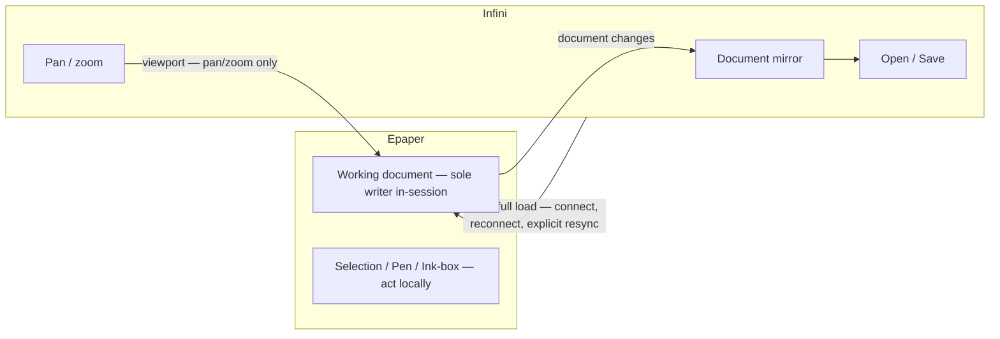

# Hand-off: PM → Architect — Epaper owns the document

## Context

[CHL-0008](../challenges/CHL-0008-architecture-rework.md) is **adopted**. The pilot's fragility was
the ownership model, not a bug stack: every edit travelled Pen → Tablet → Desktop → recognize/apply
→ Tablet, so the creator's own gesture was corrected by a peer round trip. Four fix waves
(CHL-0004…0007) failed human verify with the same class of symptom.

**Document ownership is inverted.** Epaper owns the working document in-session; Infini is viewer,
navigator, and persistence home; sync is one-way per direction.

### What changed in `.docs/`

| File | Change |
|---|---|
| [epaper/prd.md](../../../.docs/modules/epaper/prd.md) | New `[REQ-04]` device document · `[REQ-05]` device ink-box creation · `[REQ-06]` device manipulation · `[REQ-07]` one-way sync · `[REQ-08]` node manipulation (next campaign). `[REQ-02]` narrowed to viewport mapping; `[REQ-03]` tools now act on the local document. Metrics, Non-Goals, Open Questions rewritten. v0.5.0 |
| [infini/prd.md](../../../.docs/modules/infini/prd.md) | `[REQ-03]` amended to the one-way contract; `[REQ-04]` **deprecated** (`superseded-by: [epaper REQ-05], [epaper REQ-06]`); `[REQ-02]` re-scoped to model + mirror + persistence. v0.4.0 |
| [epaper/features/device-document/](../../../.docs/modules/epaper/features/device-document/) | New — `index.md` + `srs-product.md` (BR-D01…BR-D12) |
| [epaper/features/ink-box/](../../../.docs/modules/epaper/features/ink-box/) | New — `index.md` + `srs-product.md` (BR-B01…BR-B18) + `srs-experience.md` (journeys) |
| [epaper/features/node-manipulation/](../../../.docs/modules/epaper/features/node-manipulation/) | New — the `[REQ-08]` thickening: shared verbs, per-kind tools, capability descriptor, cross-cutting rules, REQ-06 conformance contract |

### What changed in `.plan/`

- [CHL-0008](../challenges/CHL-0008-architecture-rework.md) resolved `adopted`; CHL-0004…0007
  dispositioned as **superseded, retained as regression evidence**.
- [lifecycle-map-2026-08-13.md](../lifecycle-map-2026-08-13.md) — **your work order** for SRS
  lifecycle: what retires, what deprecates and re-homes, what amends, what is new.
- [MASTER.md](../../MASTER.md) execution lock re-locked to
  `epaper/{device-document, ink-box, tool-modes}` + `infini/tablet-sync`.
- 12 patch-wave stories (EP-007…011, IN-020…026) set `status: blocked` with a reason — they assumed
  desktop authority. TRACK-003 stays paused.

---

## PM self-review (`review-prd`)

**Verdict: READY-WITH-CONCERNS.** `adlc prd-check`: **0 fail, 0 warn** on epaper and infini.

### Strengths

- Every new REQ states an outcome with a number attached. The bars that matter are the ones the
  pilot failed: committed geometry equals last previewed geometry (0 px jump, 0 snap-backs / 20
  gestures), 0 inbound document messages after the initial load, 100% offline parity.
- CHL-0004…0007 are encoded as **named regression criteria** inside REQ-05/REQ-06 acceptance, so the
  four failure modes cannot quietly return.
- `[REQ-06]` carries a binding seven-row conformance contract against `[REQ-08]`, so the ink-box does
  not have to be rebuilt when generic manipulation lands.

### Concerns (accepted, tracked)

- **C1 — device capacity is unproven.** The device must hold a tree, hit-test it, and mutate ink live
  without regressing the ≤30 ms ink budget. Recorded in epaper Assumptions as *architect to confirm
  before the first `[REQ-04]` story*. This is the top technical risk of the rework.
- **C2 — undo affordance is unspecified.** `[REQ-04]` sets a floor of 20 structural ops, but the
  device has three tools and no keyboard. Open Question, owner pm + designer.
- **C3 — e-ink live manipulation is asserted, not proven.** `[REQ-06]` requires ≥5 Hz partial-refresh
  feedback with 0 full-panel invalidations. CHL-0006 says the human accepts slow; nobody has measured
  what slow costs during a continuous drag.
- **C4 — design stories do not exist yet.** `adlc gate` FAILs *Needs-design REQs have a design story*
  for `epaper/REQ-05`, `REQ-06`, `REQ-08`. **Intentional** — SM slices them after your decomposition.
  The [epaper-tool-strip](../design/epaper-tool-strip/) package needs revision (selection affordances
  are now real, not ghosts); [ink-box-ui](../design/ink-box-ui/) deprecates with `[SRS-IN-14]`.

### Gaps closed during review

- Infini `[REQ-02]` originally had no criterion for the mirror. Added: applying a change stream in
  order yields 0 divergent nodes and replay is idempotent by `opId`.
- Live desktop ink liveness would have regressed from ≤50 ms to a pen-up-only update. Added the
  **preview stream** clause plus its acceptance in both PRDs.
- Load safety was undefined. Added BR-D10 / BR-D11: a load replaces the document, so it is accepted
  only after the change queue drains, and pending changes are visible to the creator.

### Pre-existing gate FAILs (not caused by this change, not mine to fix here)

`reawa/*` design coverage and BDD coverage; 20 orphan active SRS (code was restored to HEAD, so
`@implements` traces are gone). All five **execution-lock** checks now PASS.

---

## Asks

1. **ADR-0014 — document ownership inversion.** The device is the sole in-session writer; the desktop
   is the persistence home. Amends [ADR-0009](../../../.docs/adr/ADR-0009-shared-document-viewport.md)
   (the document channel is no longer a log both peers write) and supersedes
   [ADR-0013](../../../.docs/adr/ADR-0013-ink-box-tool-modes.md) §3 (Infini sole tree writer) and §4
   (device pick → `tool_intent`). Please state explicitly what happens to
   [ADR-0011](../../../.docs/adr/ADR-0011-smart-group.md) — my reading is that its semantics survive
   intact and only its *placement* of recognition is wrong.
2. **ADR-0015 — one-way sync contract v1.** Message set for each direction, reconnect/resync rule,
   change ordering and idempotency, and the queue-drains-before-load rule. Answer the open question
   on **change granularity** (op log vs coalesced change set) — it drives the ≤300 ms mirror target.
3. **Shared domain doc.** Both peers now hold the tree, so its anatomy should stop being an
   Infini-only SRS detail. Please lift it into `.docs/domain/vector-document.md` (+ `domain/index.md`)
   and have `[SRS-IN-04]` link rather than own it.
4. **SRS decomposition per the [lifecycle map](../lifecycle-map-2026-08-13.md)** — new `[SRS-EP-07]`+
   for device-document and ink-box; amend `[SRS-IN-07]`, `[SRS-IN-08]`, `[SRS-IN-09]`, `[SRS-EP-02]`
   … `[SRS-EP-06]`; retire `[SRS-IN-13]`; deprecate `[SRS-IN-10]`, `[SRS-IN-11]`, `[SRS-IN-12]`,
   `[SRS-IN-14]`, `[SRS-IN-15]`, `[SRS-IN-16]` with `superseded-by`. Move and re-tag the BDD.
5. **Confirm or challenge C1** (device capacity) before SM slices the first `[REQ-04]`
   story. If the device cannot hold and hit-test the document within the ink budget, the whole
   rework needs a different shape and I would rather know now — file a `CHL-*` rather than design
   around it quietly.
6. **Answer the two architect-owned open questions** in the epaper PRD: minimum fitted-rect size for
   enclose, and the LOD cutoff for on-device manipulation (the desktop pilot's 0.35 may not transfer).
7. **Review [node-manipulation/srs-product.md](../../../.docs/modules/epaper/features/node-manipulation/srs-product.md)
   for feasibility only** — do **not** design it yet. I need to know whether the capability-descriptor
   contract is buildable before the human approves the model.

## Constraints

- **No peer round trip inside any editing gesture.** This is the whole point; a design that
  reintroduces one is a rejected design.
- **Ink latency is the floor.** `[SRS-EP-01]` ≤30 ms pen-down → pixel must not regress for any
  feature. When something has to give, ink wins.
- **`[REQ-06]` must conform to `[REQ-08]`** — the seven-row contract in the PRD is binding, not
  aspirational. Declared capabilities, shared gizmo geometry, reserved rotation field.
- **Smart Group semantics are settled** — boundary/content roles, `inkScaleMode`, per-ink UV,
  guards, membership. Re-open them only via `CHL-*`.
- **Undo lives where editing lives.** Do not leave undo on the desktop.
- **Never reuse an ID.** Deprecated infini ids keep their text; new device behaviour gets new ids.
- **Human approval gate:** the human reviews `[REQ-04]`…`[REQ-08]` and your ADR-0014/0015 before SM
  slices anything.

## Out of scope

- Multi-directional sync, modern document-synchronization algorithm, CRDT — explicitly deferred by
  the human. Design the one-way contract so it does not *prevent* them, but do not build toward them.
- On-device persistence, offline across restarts, sync-at-any-moment — deferred.
- Desktop-side ink-box authoring — deprecated until multi-directional sync.
- Rotation, connectors on a Smart Group, multi-select, marquee, enter/exit group — `[REQ-08]`.
- `ADR-0016` node manipulation model — write it in the `[REQ-08]` iteration, not now.
- Story slicing — SM, after your handoff.

## Next

`/architect` → ADR-0014 + ADR-0015 + domain doc + SRS decomposition → `/sm` re-slice TRACK-003.
