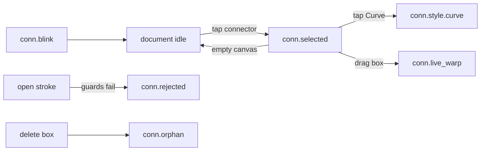

# [UI-EP-05] — Connector chrome

## Source

- REQ: [REQ-09](../../../.docs/modules/epaper/prd.md#device-connectors)
- SRS: [SRS-EP-19](../../../.docs/modules/epaper/features/connector-ink/srs-ui.md)
- Experience: [srs-experience](../../../.docs/modules/epaper/features/connector-ink/srs-experience.md)
- Story: [STORY-EP-027](../../stories/STORY-EP-027.md)
- ToolChip compose: [UI-EP-04](../toolchip-recognizers/ui-spec.md)

## Platform profile

Same as UI-EP-04: **epaper-device**, `data-platform="epaper"`, 1872×1404 @ 100%, no hover/focus/motion, 1-bit.

## Screens / flow

One DeviceScreen. No modal. Blink is a **one-shot mid-pulse frame** (duration: one Mono refresh, ~250 ms) — not a CSS animation.

## Layout regions

| Region | `data-region` | Contents |
|---|---|---|
| DeviceScreen | DeviceScreen | panel |
| ToolChip | ToolChip | composed UI-EP-04 (Pen + both toggles armed) |
| InkSurface | InkSurface | boxes + connector body |
| ConnBlink | overlay | `ovl.conn_blink` — invert connector + both nodes |
| ConnSelect | overlay | `tgl.conn_style`, `tgl.conn_end_kind` |
| StatusLine | StatusLine | debug |

## Closed inventory

| id | Design |
|---|---|
| `ovl.conn_blink` | Invert fill on both SmartGroups + thicken connector stroke. **No copy, no Ink/Curve label, no badge.** Partial region only. |
| `tgl.conn_style` | 48×48 two-tile cluster **Ink \| Curve** near connector midpoint. Hidden during blink and unless selected. |
| `tgl.conn_end_kind` | 48×48 **Edge \| Centre** at each bound end. |
| `recog.connector` | Owned by UI-EP-04 |

## Scene list

| State id | File |
|---|---|
| `conn.blink` | `connector-chrome-blink.html` (hifi) |
| `conn.selected` | `connector-chrome-selected.html` (Ink selected; hop to Curve) |
| `conn.rejected` | `connector-chrome-rejected.html` |
| `conn.live_warp` | `connector-chrome-live-warp.html` |
| `conn.orphan` | `connector-chrome-orphan.html` |
| showcase | `connector-chrome-states.html` |

## Icons

| Name | Path |
|---|---|
| Style Ink | `../system/assets/icon-epaper-style-ink.svg` |
| Style Curve | `../system/assets/icon-epaper-style-curve.svg` |
| End Edge | `../system/assets/icon-epaper-end-edge.svg` |
| End Centre | `../system/assets/icon-epaper-end-centre.svg` |
| ToolChip icons | same as UI-EP-04 |

## Interaction / states

| Control | default | selected | pressed | hover/focus |
|---|---|---|---|---|
| `tgl.conn_style` | outline other | invert current | invert | N/A |
| `tgl.conn_end_kind` | outline other | invert current | invert | N/A |
| Empty canvas | — | deselect, 0 residual | — | N/A |
| `ovl.conn_blink` | hidden | one pulse then off | none | N/A |

Blink duration (designer): **one Mono refresh (~250 ms)**, then settle. HTML shows the pulse frame only.

## SRS delta

| SRS | Spec | Delta |
|---|---|---|
| blink connector + both nodes, no name | invert fill + thick stroke, no label | match |
| Ink/Curve on selected | 48 px cluster | match |
| Edge/Centre per end | 48 px at each end | match |
| rejected = no banner | ink only | match |
| no fifth tool | ToolChip compose only | match |
| live warp | box offset, connector redrawn, style hidden | match |
| orphan still drawn | hatch mark at missing node, connector remains | match |

## Anti-patterns

No toast, no full-panel flash, no draw-time routing picker, no arrowheads.
