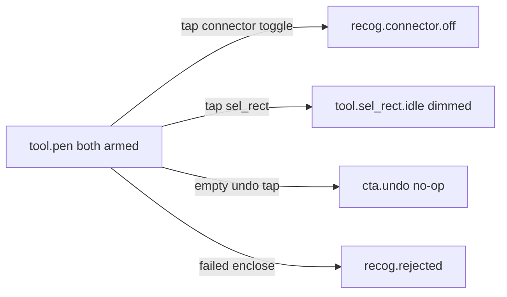

# [UI-EP-04] — ToolChip recognizers

Rebase of [UI-EP-01](.plan/iter-003/design/epaper-tool-strip/) for [ADR-0021](../../../.docs/adr/ADR-0021-connector-toolchip.md).
Supersedes four exclusive tools. Enclose stays off this row ([ADR-0016](../../../.docs/adr/ADR-0016-selection-create-enclose-cta.md)).

## Source

- REQ: [REQ-03](../../../.docs/modules/epaper/prd.md#tool-modes)
- SRS: [SRS-EP-05](../../../.docs/modules/epaper/features/tool-modes/srs-ui.md)
- Story: [STORY-EP-026](../../stories/STORY-EP-026.md)
- Challenge: [CHL-0019](../../challenges/CHL-0019-toolchip-tile-size.md) — tiles **64×64** (shipped), not SRS 32 px

## Platform profile

| Field | Value |
|---|---|
| Profile | **epaper-device** (reMarkable 2) |
| `data-platform` | `epaper` |
| Target frames | Landscape preview **1872×1404** (native 1404×1872 rotated) |
| Responsive strategy | per-target — fixed panel, no reflow |
| Input model | Pen for content; finger for chip (pen-on-chip fallback) |
| Nav paradigm | floating ToolChip (not bottom-bar / not phone chrome) |
| Target minimum | **64×64** tiles (CHL-0003 relaxed; CHL-0019) |
| Density | compact |
| Hover | **N/A** — do not design |
| Focus | **N/A** — do not design |
| Motion | **None** |
| Color | 1-bit paper/ink; fill + hatch only |
| Preview scale | tablet **100%** (navigator); not phone 80% |

## Screens / flow

One DeviceScreen. Scenes are **states**, not routes. No modal/sheet.

## Layout regions

| Region | Parent | Contents | HTML `data-region` |
|---|---|---|---|
| DeviceScreen | panel | Full panel | `DeviceScreen` |
| ToolChip | DeviceScreen | 3 white clusters + 32 px gaps | `ToolChip` |
| InkSurface | DeviceScreen | Full-bleed ink | `InkSurface` |
| SelectionOverlay | InkSurface | (idle hidden in this package) | `SelectionOverlay` |
| StatusLine | DeviceScreen | Debug/status | `StatusLine` |

## Composition

Three **squared white clusters**, 1 px outline, `border-radius: 0`, 32 px paper/ink gap between clusters (⟨space⟩). Floating orientation-top. InkSurface full-bleed.

| Cluster | Inventory |
|---|---|
| tools | `ind.publish_status` (12 px bar) · `tool.sel_rect` · `tool.sel_freeform` · `tool.pen` |
| recog | `tgl.recog.ink_box` · `tgl.recog.connector` |
| history | `cta.undo` · `cta.redo` |

No `tool.ink_box`. Toggles are independent (`aria-pressed` each). Exclusive tools are radio in the tools cluster.

## Component inventory

| id | kind | path | notes |
|---|---|---|---|
| ToolChip | screen | `components/tool-chip.html` | 3 clusters |
| ToolTile | screen | (in ToolChip) | 64×64 invert when pressed/armed |
| RecogToggle | screen | (in ToolChip) | independent; dimmed hatch under Selection |

## Icons / assets

| Name | Path | Used |
|---|---|---|
| Selection rect | `../system/assets/icon-epaper-sel-rect.svg` | tools |
| Selection freeform | `../system/assets/icon-epaper-sel-freeform.svg` | tools |
| Pen | `../system/assets/icon-epaper-pen.svg` | tools |
| Ink-box recognition | `../system/assets/icon-epaper-recog-ink-box.svg` | toggle |
| Connector recognition | `../system/assets/icon-epaper-recog-connector.svg` | toggle |
| Undo | `../system/assets/icon-epaper-undo.svg` | history |
| Redo | `../system/assets/icon-epaper-redo.svg` | history |

## Scene list

| State id | File | AC |
|---|---|---|
| `tool.pen` + both toggles armed | `toolchip-recognizers-pen-armed.html` | primary / hifi |
| `recog.connector.off` | `toolchip-recognizers-connector-off.html` | a toggle off |
| `tool.sel_rect.idle` | `toolchip-recognizers-sel-rect-dimmed.html` | dimmed, armed kept |
| `tool.pen` + empty undo | `toolchip-recognizers-undo-empty.html` | empty no-op |
| `recog.rejected` | `toolchip-recognizers-recog-rejected.html` | no banner |
| (showcase) | `toolchip-recognizers-states.html` | each control × state |

## Interaction / state matrix

| Control | default | armed | pressed | dimmed / empty | hover | focus |
|---|---|---|---|---|---|---|
| `tool.*` | outline | invert | invert | hatch only below LOD | N/A | N/A |
| `tgl.recog.*` | outline = off | invert = on | invert | hatch over current fill; not tappable | N/A | N/A |
| `cta.undo` / `cta.redo` | outline | never | invert | empty still tappable no-op (not hatch) | N/A | N/A |

## Trace matrix

| Region / state | SRS | Story AC |
|---|---|---|
| 3+2+Undo/Redo inventory | SRS-EP-05 | AC1 |
| dimmed under Selection | SRS-EP-05 | AC2 |
| one scene per required state | SRS-EP-05 states | AC3 |

## SRS delta

| SRS item | Spec / HTML | Delta |
|---|---|---|
| 3 exclusive tools | tools cluster | match |
| 2 recognizer toggles | recog cluster | match |
| Undo/Redo after gap | history cluster, 32 px gap | match |
| `tool.ink_box` | absent | match (retired) |
| Tile 32 px | **64 px** | **CHL-0019** — follow shipped |
| No hover/focus | none in CSS | match |
| `ind.publish_status` | 12 px bar, linked default | match |
| SelectionOverlay chrome | not painted here | N/A — SRS-EP-12 / UI-EP-03 |

## Anti-patterns honored

No full-band strip, no pill radius, no fifth exclusive tool, no Enclose on this row, no color/tint.

## Open

- CHL-0019 tile size for PM to amend SRS-EP-05.
