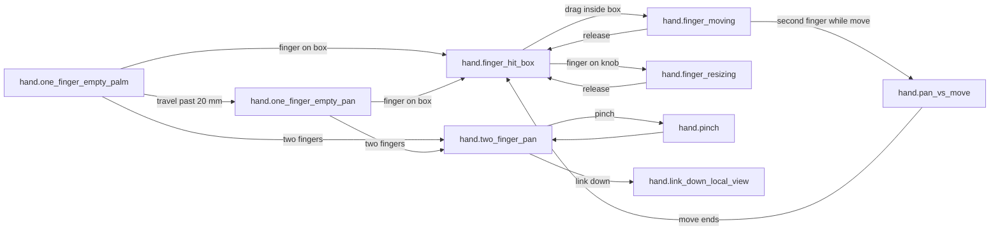

# [UI-EP-06] — Hand-touch: one-finger pick/move and two-finger pan/zoom

Iter-local UI design for [SRS-EP-22](../../../../.docs/modules/epaper/features/ink-box/srs-ui.md#srs-ep-22-hand-touch-ui).
**New grammar** ([CHL-0022](../../challenges/CHL-0022-shipped-no-device-pan.md)): do not revive “finger ignored.”
[STORY-EP-054](../../stories/STORY-EP-054.md) stays `done` — this is an **in-place package revision** (2026-08-20 human-approved field-test chrome), not a new story. Empty-canvas: **palm-rest (≤ 20 mm / 178 du)** vs **local pan (> 20 mm)**. Two-finger does **not** imply Infini match unless Infini follow is on.
Compose ToolChip from [UI-EP-04](../../../iter-004/design/toolchip-recognizers/) and selection overlay from [UI-EP-02](../../../iter-003/design/device-selection-chrome/). `btn.hand_touch` is a **kill-switch** (HT), not a pan-mode / hand-tool tile. No follow-toggle in this package (UI-EP-07).

## Source

- REQ: [REQ-10](../../../../.docs/modules/epaper/prd.md#hand-touch)
- SRS-UI: [SRS-EP-22](../../../../.docs/modules/epaper/features/ink-box/srs-ui.md#srs-ep-22-hand-touch-ui)
- Logic: [SRS-EP-21](../../../../.docs/modules/epaper/features/ink-box/srs-logic.md#srs-ep-21-one-finger) · [SRS-EP-23](../../../../.docs/modules/epaper/features/tool-modes/srs-logic.md#srs-ep-23-finger-tool-switch) · [SRS-EP-24](../../../../.docs/modules/epaper/features/region-sync/srs-logic.md#srs-ep-24-two-finger-viewport)
- Story AC: [STORY-EP-037](../../stories/STORY-EP-037.md) · [STORY-EP-054](../../stories/STORY-EP-054.md) (palm vs empty pan; story stays `done`)
- Challenge: [CHL-0022](../../challenges/CHL-0022-shipped-no-device-pan.md) — paint REQ-10; do not implement shipped “finger ignored”
- Human lock (2026-08-20, **field-test chrome approved**): empty-canvas pan threshold **≤ 20 mm / 178 du** palm-rest; **> 20 mm** local pan. Millimetre↔du bind **178 du @ 226 dpi**. `btn.hand_touch` kill-switch (HT, 64 du, left of Debug).
- Compose: UI-EP-04 ToolChip (3+2+Undo/Redo); overlay = dotted AABB + 6 hollow squares ([CHL-0023](../../challenges/CHL-0023-epaper-physical-scale.md))
- Experience: **thin** — `ink-box/srs-experience.md` has no REQ-10 journeys (campaign override: do not hard-stop; scene list = SRS-EP-22 matrix + REQ-10 journeys)
- Reference image: none

## Platform profile

| Field | Value |
|---|---|
| Profile | **epaper-device** (reMarkable 2, Qt/QML fullscreen) |
| `data-platform` | `epaper` (SRS-EP-22). Mechanical `adlc gate` allowlist is still `ios\|android\|web\|desktop` — owned by existing CHL-0002, not relaxed here |
| Target frames | Landscape **246 mm × 187 mm** (1872×1404). Body 187×246 mm. Not phone chrome |
| Responsive strategy | per-target — one panel size; no reflow |
| Breakpoints / resize | N/A — fixed panel |
| Safe areas / fixed regions | ToolChip floats orientation-top **center**. `btn.hand_touch` floats orientation-top **trailing row**, one 64 du tile **left of Debug** (same family as Debug / Follow / USB). Overlay is content-space; world tracks viewport |
| Input model | **Pen** for content; **finger** for ≥10 mm (tile, box AABB, Enclose, **resize knobs**). Two fingers = viewport. No keyboard |
| Nav paradigm | In-scene states on one surface — no push / sheet / modal |
| Target minimum | Finger-eligible **10 mm × 10 mm (1 cm)**; resize knobs visual **4 mm** hollow square / hit **10 mm** (finger and pen) |
| Density | compact 1-bit |
| Hover | **N/A** — no hover, no focus, no cursor, no motion |
| Preview | Navigator frame **246 mm × 187 mm**, no parent scale ([CHL-0023](../../challenges/CHL-0023-epaper-physical-scale.md)) |

**Platform kit (epaper):** press/active invert only. `:hover` and `:focus-visible` are **not designed**. Status never by color — hatch + label text.

## Screens / flow

Single DeviceScreen. Keep list = SRS-EP-22 states matrix. Journeys are in-scene state sequences.

Nav kind: **in-scene state** (not push / present-modal). Relative hops in scene HTML for validation.

## Layout regions

Region names **must match** HTML `data-region` attributes.

| Region | Contents / hierarchy | Component | States |
|---|---|---|---|
| DeviceScreen | Landscape panel frame | — | default |
| InkSurface | Full-bleed document + world layer (grid + ink). Transform host for pan/pinch | InkFigure / WorldLayer | idle / panned / pinched / moving-ink |
| SelectionOverlay | Dotted AABB + 6 hollow-square knobs (no E/W, no rotation) + mode toggle. Content-space | SelectionOverlay | hidden / selected / moving / resizing |
| GestureAnnotate | Design-preview finger/pen marks + travel tick — **not product chrome** | FingerContact | 1-finger / 2-finger / pinch / ignored-second / pen-tip / down + travel |
| ToolChip | Floating 3-cluster chip (UI-EP-04) | ToolChip | pen armed / sel_freeform armed + toggles dimmed; publish linked \| queued |
| HandTouchToggle | Trailing 64 du **HT** kill-switch — **not** inside ToolChip; **not** a pan-mode tile | HandTouchToggle | on (default, invert) / off (paper) |
| StatusLine | Tool + hit.kind + fingerCount + viewportOwner (design preview) | — | default |

**Chrome relationships:** SelectionOverlay **above** InkSurface, **below** ToolChip. Overlay is **content-space**. ToolChip is **screen-space**. HandTouchToggle is **screen-space**, trailing orientation-top, left of Debug (placement: HT \| DBG \| Follow \| USB). This package paints **HT only** — Debug log panel is field debug (not inventory); Follow stays in UI-EP-07. GestureAnnotate is preview-only, above overlay, does not steal hits. Chip tiles remain finger-hittable during box select ([REQ-10] does not steal chip). Chrome taps still work when HT is off.

**Containment:** DeviceScreen > InkSurface (full-bleed, contains world + overlay + gesture marks) + ToolChip (float) + HandTouchToggle (float, trailing) + StatusLine.

**Gap policy:** 32 px paper between ToolChip clusters (UI-EP-04). Overlay tracks the box with 0 extra padding on SmartGroup AABB.

## Component inventory

Closed list. Detail in [`components.md`](./components.md).

| Component | Source | Pattern id / CSS class | Variant / props | Used in regions |
|---|---|---|---|---|
| ToolChip | **reuse** UI-EP-04 | `.c-tool-chip` | 3 clusters, 10 mm tiles, gap 5 mm | ToolChip |
| ToolButton | **reuse** UI-EP-04 | `.c-tool-btn` | default, armed, pressed, dimmed | ToolChip |
| PublishStrip | **reuse** UI-EP-04 | `.c-publish` | linked, queued | ToolChip |
| HandTouchToggle | **build** | `.c-hand-touch-cluster` + `.c-hand-touch-btn` | 64 du; label **HT**; on (invert, default) / off (paper) | HandTouchToggle |
| SelectionOverlay | **reuse** UI-EP-02 | `.c-bounds` + `.c-handle` | selected, moving, resizing, handle pressed | SelectionOverlay |
| InkScaleModeToggle | **reuse** UI-EP-02 | `.c-mode-toggle` | icon-only; size = primary tile (10 mm); **8 mm** below the box; withBounds / fixedInk | SelectionOverlay |
| FingerContact | **build** | `.c-finger` | filled color circle, no border; one / two / ignored / down; `.c-travel` palm 8 mm / pan 36 mm; tick at **20 mm** | GestureAnnotate |
| PenTipAnnotate | **build** | `.c-pen-tip` | default | GestureAnnotate |

No pan-mode tool. `btn.hand_touch` is a kill-switch, **not** a pan-mode / hand-tool tile. No properties panel. No rotation handle. No ghost / marquee stand-in for move. Resize knobs are finger-eligible ([CHL-0024](../challenges/CHL-0024-finger-resize-knobs.md)). Do **not** add the Debug log panel as product inventory.

## Tokens used

Closed 1-bit set — [`tokens.json`](./tokens.json) / [`tokens.css`](./tokens.css).
Paper `#ffffff` / ink `#000000` only. Hatch via repeating-linear-gradient. **No tint, no shadow, no motion.**

Infini project tokens (slate/teal) are **not applied** on this panel.

## Design system readiness

| Check | Evidence |
|---|---|
| DESIGN.md reconciled | `.docs/DESIGN.md` — epaper-device profile (not edited this story; SM stitches index) |
| Project tokens valid | Infini tokens unchanged; this package is a 1-bit subset |
| tokens.css generated | `./tokens.css` |
| Component catalog complete | `components.md` + self-contained `.html` |
| Pattern-only reuse | ToolChip copy-pasted from UI-EP-04; overlay from UI-EP-02 |

## States (required)

SRS-EP-22 matrix — 9 Keep ids (palm + pan replace former `hand.one_finger_empty`) plus 2 optional ids **reused** on existing empty-canvas paint (no new scene files).

| State id | Trigger | UI behaviour | AC / SRS |
|---|---|---|---|
| `hand.finger_hit_box` | Finger-down on SmartGroup AABB (LOD ok) while Pen | Box selected; exclusive tool → `sel_freeform`; chip invert + toggles dimmed; overlay on; **chip still hittable**; HT on | REQ-10; SRS-EP-21/23 |
| `hand.finger_moving` | Finger drag inside selected box | **Real ink** follows the finger; bounds track ink; **0** viewport pan; HT on | REQ-06 live-direct; SRS-EP-21 |
| `hand.finger_resizing` | Finger drag on a resize knob | **Real ink** scales with bounds; active knob invert; **0** viewport pan; HT on | CHL-0024; SRS-EP-21/11 |
| `hand.one_finger_empty_palm` | One finger on empty canvas; Euclidean travel **≤ 20 mm (178 du)** | Tool unchanged (`pen`); 0 nodes selected; **0** lasso; **0** pan; world **unshifted**; HT on (default) | REQ-10; SRS-EP-21/22; EP-054 revision |
| `hand.one_finger_empty_pan` | One finger on empty canvas; travel **> 20 mm** | Tool unchanged; 0 selection; 0 lasso; **local** world translate; Infini unchanged unless Infini follow is on; HT on | REQ-10; SRS-EP-21/22; EP-054 revision |
| `hand.two_finger_pan` | Two fingers, no box-move in flight | World translates locally; **no extra chrome**; Infini match **not** implied (follow=none default); HT on | SRS-EP-24; ADR-0029 |
| `hand.pinch` | Two-finger pinch | Uniform scale only; world larger about contact; no rotate; Infini unchanged unless follow on; HT on | SRS-EP-24 |
| `hand.pan_vs_move` | Second finger while box-move in flight | Move continues; two-finger **does not run**; world unshifted; HT on | SRS-EP-21/24 |
| `hand.link_down_local_view` | Two-finger pan while link down | Local world still pans; publish strip **queued**; USB-unplugged badge; HT on | SRS-EP-24 link-down |
| `hand.toggle_off` | `btn.hand_touch` off | Canvas fingers ignored; chrome taps still work; HT paper (white fill, black **HT**) | SRS-EP-22; **no new file** — states showcase + caption on palm scene |
| `hand.palm_contacts` | ≥3 capacitive contacts | **0** pan, **0** pinch; world unshifted | SRS-EP-22; **no new file** — reuse palm empty-canvas paint |

## Control states & reactivity (required)

Hover / focus = **N/A** on epaper. Press = invert. Proof: `hand-touch-states.html`.

| Control | hover* | focus-visible | active/press | disabled | loading | selected | error | Showcase file |
|---|---|---|---|---|---|---|---|---|
| ToolButton (64 du) | N/A | N/A | ✓ invert | dimmed (toggles under Selection) | — | armed `aria-pressed` | — | hand-touch-states.html |
| HandTouchToggle (64 du, **HT**) | N/A | N/A | ✓ invert | — | — | on = invert (default); off = paper | — | hand-touch-states.html |
| Resize knob (10 mm hit, finger and pen) | N/A | N/A | ✓ invert | — | — | — | — | hand-touch-states.html |
| Mode toggle (10 mm, icon-only) | N/A | N/A | ✓ invert | — | — | armed `aria-pressed` | — | hand-touch-states.html |
| Box AABB (finger-eligible) | N/A | N/A | press starts select/move | — | — | overlay visible | — | hand-touch-states.html |
| Empty canvas (one finger) | N/A | N/A | palm: travel ≤20 mm, world unshifted; pan: travel >20 mm, world translated | — | — | — | — | hand-touch-states.html |

\* Touch / epaper: hover = N/A; no hover-only affordance. No-op controls still invert on press (chip tiles, hop links).

## Interaction & a11y

- Focus order: **N/A** — no keyboard on panel
- Accessible names: every ToolChip tile, HT kill-switch, and handle has `aria-label`
- Contrast: 1-bit ink on paper; hatch + text (never color alone)
- Targets: chip **10 mm**; knobs visual **4 mm** / hit **10 mm** (finger and pen)
- Color independence: armed = invert fill; dimmed = hatch; queued publish = hatch strip
- Responsive: N/A — fixed 1872×1404
- Long content: status/caption wrap; chip does not grow past `max-width`

## Copy

Placeholders only; glossary terms.

| Element | Copy / placeholder | Glossary |
|---|---|---|
| HT tile | **HT** | kill-switch |
| Status (hit box) | sel_freeform · hit.kind=box · fingers=1 | exclusive tool |
| Status (empty palm) | pen · hit.kind=empty · fingers=1 · travel=8 mm (≤20 mm / 178 du) · 0 pan · HT on | — |
| Status (empty pan) | pen · local pan · follow=none · Infini unchanged · HT on | drawingRegion |
| Status (two-finger) | local pan · fingers=2 · follow=none · Infini unchanged | drawingRegion |
| Status (conflict) | sel.moving · two-finger ignored this gesture | — |
| Link-down badge | Link down · local view | session |
| Mode | Scale ink | withBounds |

## Trace matrix

| Region / state | SRS | Story AC | Notes |
|---|---|---|---|
| ToolChip / finger_hit_box | SRS-EP-23 | chip shows freeform p95 ≤300 ms | Chip still hittable |
| InkSurface / finger_moving | SRS-EP-21 | live-direct; 0 viewport pan | Real ink, 0 ghost |
| Knob / finger_resizing | SRS-EP-21/11 | finger resize live-direct | CHL-0024 |
| Empty / one_finger_empty_palm | SRS-EP-21 | travel ≤20 mm; 0 pan; 0 lasso | EP-054 revision |
| Empty / one_finger_empty_pan | SRS-EP-21 | travel >20 mm; local pan; Infini unchanged unless follow on | EP-054 revision |
| HandTouchToggle / on | SRS-EP-22 `btn.hand_touch` | invert HT; default | all Keep scenes |
| HandTouchToggle / off | SRS-EP-22 `hand.toggle_off` | paper HT; canvas fingers ignored | states showcase (reuse) |
| Empty / palm_contacts | SRS-EP-22 | ≥3 contacts; 0 pan 0 pinch | reuse palm scene |
| World / two_finger_pan | SRS-EP-24 | local pan; **do not** imply Infini match | ADR-0029 |
| World / pinch | SRS-EP-24 | uniform scale only | — |
| Move+2nd finger / pan_vs_move | SRS-EP-24 | 0 pan until move ends | — |
| World / link_down_local_view | SRS-EP-24 | local map still updates | Publish queued |
| GestureAnnotate | N/A | design-preview | Not product inventory |

## SRS delta table (mandatory after HTML)

Re-read [SRS-EP-22](../../../../.docs/modules/epaper/features/ink-box/srs-ui.md#srs-ep-22-hand-touch-ui) after hi-fi.

| SRS item | Design (hi-fi) | Result |
|---|---|---|
| Hit: SmartGroup AABB finger+pen | Box hop in finger_hit_box / finger_moving | match |
| Hit: ToolChip primary 64 du finger-eligible | Chip tiles 64×64; press invert during select scenes | match |
| Closed: `btn.hand_touch` 64 du HT, left of Debug | Trailing HT tile; invert when on (default); paper when off; not a hand-tool | match |
| Hit: Enclose CTA 64 du | Not shown (SmartGroup already exists; Creation B N/A this package) | omit — N/A this journey |
| Hit: resize knobs visual 4 mm / hit 10 mm, finger and pen | Hollow squares; SE hop → finger_resizing | match (CHL-0024) |
| Additive: `ind.two_finger_pan` | **No extra chrome**; world translate; status `follow=none · Infini unchanged` | match |
| No pan-mode tool / no hand-tool tile | Chip inventory = UI-EP-04; HT is kill-switch not pan-mode | match |
| Finger resize on existing knobs | `hand.finger_resizing`; no second handle set | match |
| States matrix 9 Keep ids (palm + pan) | 9 scene files 1:1; retired `hand.one_finger_empty` | match |
| Optional `hand.toggle_off` / `hand.palm_contacts` | No new scene files — documented reuse of palm + states showcase | match — human: prefer amend over explode |
| Anti-pattern: one-finger empty pan without 20 mm threshold | palm scene travel **8 mm** world unshifted; pan scene travel **36 mm** + **20 mm** tick + world translated | match |
| Anti-pattern: follow-toggle in this package | 0 follow buttons | match |
| Anti-pattern: Debug log panel as inventory | 0 debug panel; HT placement mentions left of DBG only | match |
| Anti-pattern: hover/focus/cursor | none designed | match |
| Anti-pattern: phone chrome | 1872×1404 landscape | match |
| Composition layers Canvas / ToolCanvas / ToolChip | InkSurface + overlay + chip; live node = real ink on world (preview of ToolCanvasLayer) | match |
| Gap-policy 32 px chip clusters | `--chip-gap: 32px` | match |
| Nav kind in-scene | relative hops; 0 modal | match |
| CHL-0022 new grammar | two-finger **local** pan painted; empty split palm vs pan | match |
| Human 2026-08-20 20 mm lock vs leftover 10 mm in this package | This revision replaces 10 mm / 89 du empty-canvas threshold with **20 mm / 178 du**. Finger-eligible floor remains 10 mm. STORY-EP-054 AC still says 10 mm — SM stitch, story stays `done` | match — package revision |

## Scenes (N scenarios → N self-contained HTML files)

| Scenario | File | Complex folder? | Notes |
|---|---|---|---|
| `hand.finger_hit_box` | `hand-touch-finger-hit-box.html` | no | **primary** → `hifi_html`; ToolChip hittable |
| `hand.finger_moving` | `hand-touch-finger-moving.html` | no | |
| `hand.finger_resizing` | `hand-touch-finger-resizing.html` | no | CHL-0024 |
| `hand.one_finger_empty_palm` | `hand-touch-one-finger-empty-palm.html` | no | ≤20 mm / 178 du; world unshifted; HT on. Captions `hand.palm_contacts` reuse |
| `hand.one_finger_empty_pan` | `hand-touch-one-finger-empty-pan.html` | no | >20 mm; local pan; Infini unchanged; HT on |
| `hand.two_finger_pan` | `hand-touch-two-finger-pan.html` | no | local; no Infini-match implication |
| `hand.pinch` | `hand-touch-pinch.html` | no | |
| `hand.pan_vs_move` | `hand-touch-pan-vs-move.html` | no | |
| `hand.link_down_local_view` | `hand-touch-link-down-local-view.html` | no | |
| `hand.toggle_off` | *(no new file)* | — | HT paper in `hand-touch-states.html`; caption on palm scene |
| `hand.palm_contacts` | *(no new file)* | — | reuse palm empty-canvas scene |

**Retired this story:** `hand-touch-one-finger-empty.html` (`hand.one_finger_empty` no-op-only) — replaced by palm + pan.

**This revision (2026-08-20):** no new scene files. Empty-canvas threshold copy 10 mm / 89 du → **20 mm / 178 du**. HT kill-switch added to Keep scenes (on) + states showcase (on / off / pressed).

**States showcase (required, not a scenario):** `hand-touch-states.html`.

**Inter-scene navigation (relative hops)**

| From scene | Control | Kind | To |
|---|---|---|---|
| `hand.one_finger_empty_palm` | box AABB | in-scene | `hand.finger_hit_box` |
| `hand.one_finger_empty_palm` | empty travel past 20 mm | in-scene | `hand.one_finger_empty_pan` |
| `hand.one_finger_empty_palm` | two-finger hop | in-scene | `hand.two_finger_pan` |
| `hand.one_finger_empty_pan` | box AABB (hit wins) | in-scene | `hand.finger_hit_box` |
| `hand.one_finger_empty_pan` | two-finger hop | in-scene | `hand.two_finger_pan` |
| `hand.one_finger_empty_pan` | palm-rest caption | in-scene | `hand.one_finger_empty_palm` |
| `hand.finger_hit_box` | box drag | in-scene | `hand.finger_moving` |
| `hand.finger_hit_box` | SE knob (finger) | in-scene | `hand.finger_resizing` |
| `hand.finger_moving` | release / box | in-scene | `hand.finger_hit_box` |
| `hand.finger_moving` | second-finger mark | in-scene | `hand.pan_vs_move` |
| `hand.two_finger_pan` | pinch contacts | in-scene | `hand.pinch` |
| `hand.two_finger_pan` | link-down caption | in-scene | `hand.link_down_local_view` |
| `hand.two_finger_pan` | one-finger hop | in-scene | `hand.one_finger_empty_palm` |
| `hand.pinch` | continue | in-scene | `hand.two_finger_pan` |
| `hand.pan_vs_move` | release move | in-scene | `hand.finger_hit_box` |
| `hand.finger_resizing` | release | in-scene | `hand.finger_hit_box` |
| `hand.link_down_local_view` | session up | in-scene | `hand.two_finger_pan` |

No modal / sheet / popup.

## HTML grey-box (only if fidelity: wireframe)

| Field | Value |
|---|---|
| Requested by | n/a — hi-fi default |
| Entry HTML | — |
| Per-target files | n/a |

## Icons / assets (mandatory for UI icons)

| Icon | Kind (system \| screen) | File | Used in scenes / components |
|---|---|---|---|
| Pen | system | `../system/assets/icon-epaper-pen.svg` | ToolChip |
| Selection rect | system | `../system/assets/icon-epaper-sel-rect.svg` | ToolChip |
| Selection freeform | system | `../system/assets/icon-epaper-sel-freeform.svg` | ToolChip |
| Ink-box recognition | system | `../system/assets/icon-epaper-recog-ink-box.svg` | ToolChip |
| Connector recognition | system | `../system/assets/icon-epaper-recog-connector.svg` | ToolChip |
| Undo | system | `../system/assets/icon-epaper-undo.svg` | ToolChip |
| Redo | system | `../system/assets/icon-epaper-redo.svg` | ToolChip |
| Scale with bounds | system | `../system/assets/icon-epaper-mode-with-bounds.svg` | mode toggle |
| USB unplugged | system | `../system/assets/icon-epaper-usb-unplugged.svg` | link_down badge |
| Finger (annotate) | system | `../system/assets/icon-hand-touch-finger.svg` | GestureAnnotate |
| Two-finger | system | `../system/assets/icon-hand-touch-two-finger.svg` | pan / pinch |
| Pinch | system | `../system/assets/icon-hand-touch-pinch.svg` | pinch |

## Self-contained HTML components

| Name | Kind (system \| screen) | File path | Variants demoed |
|---|---|---|---|
| ToolChip | screen | `./components/tool-chip.html` | pen armed; sel_freeform + dimmed; queued publish; press |
| HandTouchToggle | screen | `./components/hand-touch-toggle.html` | on (default invert); off (paper); press |
| SelectionOverlay | screen | `./components/selection-overlay.html` | selected; moving; knob pressed |
| FingerContact | screen | `./components/finger-contact.html` | one; two; ignored; down; travel |

## Quality evidence

| Check | Evidence / result |
|---|---|
| Existing system discovered | UI-EP-04 chip; UI-EP-02 overlay; 1-bit tokens; promoted epaper SVGs |
| Required platform frames covered | 1872×1404 landscape; navigator 80% |
| Component/state coverage | catalog + states showcase |
| Structural audit | data-region tree matches Layout regions; tokens via `var(--…)` |
| Accessibility audit | 1-bit contrast; 10 mm finger floor; 10 mm knob hit; labels; no color-only |
| Responsive/content resilience | fixed panel; captions wrap |

## Open questions

- **Experience thickness:** `srs-experience.md` for ink-box does not list REQ-10 journeys. Campaign override: painted closed SRS-EP-22 Keep list; optional `hand.toggle_off` / `hand.palm_contacts` documented as reuse. Do not invent popups.
- **`data-platform="epaper"`** vs gate allowlist `ios\|android\|web\|desktop`: CHL-0002. Spec follows SRS-EP-22.
- **STORY-EP-054 AC** still names 10 mm. Human 2026-08-20 approved **20 mm / 178 du**. Package follows the human lock; story stays `done`. SM/PM stitch the story AC — Designer does not edit the story.

## Gate checklist

See `html-ui-quality.md` and `ui-spec-gate.md`. Incomplete without Spec, design system, quality evidence, component `.html` files, and one scene `.html` per required scenario.
