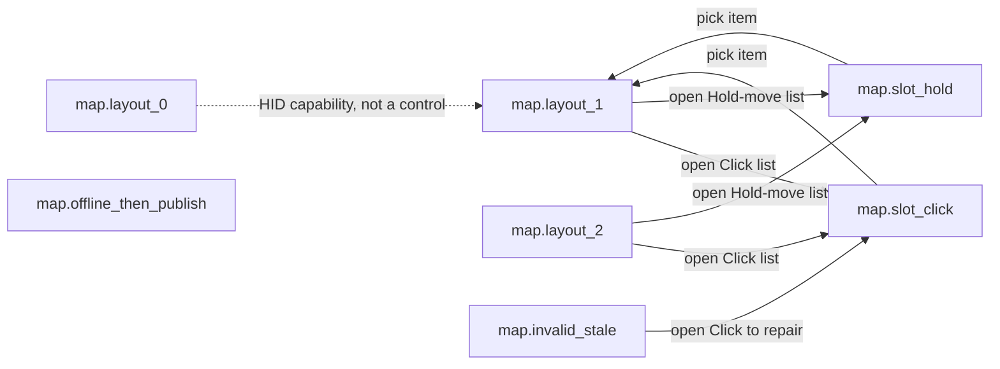

# [UI-IN-03] — Infini pen-button map settings

Iter-local UI design draft for [STORY-IN-034](../../stories/STORY-IN-034.md). **Not** document chrome ([SRS-IN-05](../../../../.docs/modules/infini/features/vector-document/srs-ui.md) is not a parent). HTML is a visual reference, not production code.

**Lock exception:** `.docs/DESIGN.md` and `.docs/design/index.md` are not edited this wave (SM stitches after join). This package **reconciles** the existing Infini contract (slate/ink, desktop hover) without forking tokens.

## Source

- REQ: [REQ-05](../../../../.docs/modules/infini/prd.md#pen-button-map) Pen-button map (desktop settings)
- Peer catalogues: [REQ-18](../../../../.docs/modules/epaper/prd.md#pen-buttons) Click vs Hold-move (Designer must not add items)
- SRS UI: [SRS-IN-24](../../../../.docs/modules/infini/features/tablet-sync/srs-ui.md#srs-in-24-pen-map-ui)
- SRS Logic: [SRS-IN-23](../../../../.docs/modules/infini/features/tablet-sync/srs-logic.md#srs-in-23-pen-map-publish)
- Domain: [pen-button-map](../../../../.docs/domain/pen-button-map.md)
- ADR: [ADR-0028](../../../../.docs/adr/ADR-0028-pen-button-map-settings-channel.md) settings channel; [ADR-0025](../../../../.docs/adr/ADR-0025-barrel-vs-eraser-nib.md) barrel vs eraser nib
- Story AC: [STORY-IN-034](../../stories/STORY-IN-034.md)
- Reference image: none

## Experience bridge (campaign)

`srs-experience.md` was **not** thickened (architect Concern; SM campaign override: do not hard-stop). Scene inventory = [SRS-IN-24](../../../../.docs/modules/infini/features/tablet-sync/srs-ui.md#srs-in-24-pen-map-ui) states only. No third slot type. No tablet 5-way radio. Logged as Concern in the designer→SM handoff — not silently edited into `.docs/modules/**`.

## Platform profile

| Field | Value |
|---|---|
| Profile | **desktop** (Electron; Infini) |
| `data-platform` | `desktop` |
| Target frames | min ~960×640 (DESIGN.md); navigator preview 1280×(vh−4rem) @ **100%** |
| Responsive strategy | Window resize; settings column max 40rem, stacked rows; not a phone layout |
| Breakpoints / resize | Reflow labels; lists stay ≥24 px; no per-target HTML |
| Safe areas / fixed regions | MapEditor fills WindowFrame; Save stays in document flow (not a mobile sticky bar) |
| Input model | pointer + keyboard; **hover required** |
| Nav paradigm | menu-bar / settings surface (this package **is** the settings surface; canvas File chrome is out of scope) |
| Target minimum | ≥24 px (SRS-IN-24 + desktop kit) |
| Density | compact |
| Hover | **required** |
| Preview scale (navigator only) | `data-preview-scale="desktop"` at 100% |

## Screens / flow

| Screen | Purpose | Primary SRS |
|---|---|---|
| Pen-button map settings | Assign each present barrel slot (Click, Hold-move) to one closed-catalogue item and save | [SRS-IN-24](../../../../.docs/modules/infini/features/tablet-sync/srs-ui.md#srs-in-24-pen-map-ui) |

Capability 0/1/2 is a **HID report** (`pen.buttonCount`), not a designer-invented radio. Layout scenes are reached from the validation navigator (and would be driven by `pen_capability` in product).

## Layout regions

Region names **must match** HTML `data-region`. Tree extends SRS-IN-24 contract with justified children (capability + status + repeating row). No third slot type.

| Region | Parent | Contents / hierarchy | Component | States |
|---|---|---|---|---|
| WindowFrame | screen | Existing Electron client; settings fill the client area | — | default |
| MapEditor | WindowFrame | Title, capability, rows, save, settings note | `.c-pen-map-editor` | default, empty-slots (0-button) |
| CapabilityStatus | MapEditor | Read-only `pen.buttonCount` 0\|1\|2 | caption | layout_0 / _1 / _2 |
| ButtonRow | MapEditor | One row per **present** button (index 1, then 2). Absent on 0-button | `.c-pen-map-row` | present / absent |
| SlotClick | ButtonRow | Closed list — Click catalogue only | `.c-pen-map-select` | closed, open, invalid, disabled |
| SlotHoldMove | ButtonRow | Closed list — Hold-move catalogue only | `.c-pen-map-select` | closed, open, disabled |
| Save | MapEditor | Persist + publish (`pen_button_map`, 0 document messages) | `.c-pen-map-btn` | default, hover, focus, active, disabled, loading |
| MapStatus | MapEditor | Invalid/stale or offline/publish copy + icon (not color alone) | `.c-pen-map-status` | hidden, stale, offline, published |

**Containment:** MapEditor is a child of WindowFrame, not of WorldLayer / CanvasStage. It does not pan with the world. It is **settings**, not SVG / VectorDocument chrome.

**Chrome relationship:** standout overlay-as-page on the quiet Infini surface (slate paper behind, non-interactive). Not a card cluster on the canvas (DESIGN.md banned).

## Closed catalogues (Designer must not add items)

Labels are **domain meanings**, not new ids. Eraser **nib** is not a row ([ADR-0025](../../../../.docs/adr/ADR-0025-barrel-vs-eraser-nib.md)).

**Click (discrete only):**

| id | Label shown |
|---|---|
| `toggle_pen_freeform` | Pen ↔ freeform |
| `toggle_pen_eraser` | Pen ↔ eraser |
| `undo` | Undo |
| `off` | Off |

**Hold-move (temporary-tool only):**

| id | Label shown |
|---|---|
| `temp_sel_freeform` | Temporary freeform |
| `temp_sel_rect` | Temporary rectangle |
| `temp_erase` | Temporary erase |
| `drag_node_under_tip` | Drag node under tip |
| `off` | Off |

Defaults ([domain](../../../../.docs/domain/pen-button-map.md#defaults)): 1-button → Click `toggle_pen_freeform`, Hold-move `temp_sel_freeform`. 2-button → Button 1 same; Button 2 Click `toggle_pen_eraser`, Hold-move `temp_erase`. 0-button → no slots (0 fake bindings).

## Component inventory

Closed list. Detail in [`components.md`](./components.md).

| Component | Kind | Source | Pattern id / CSS class | Variant / props | Used in regions |
|---|---|---|---|---|---|
| PenMapButton | system | build | `.c-pen-map-btn` | primary, disabled, loading | Save |
| PenMapSelect | system | build | `.c-pen-map-select` | closed, open, invalid, disabled | SlotClick, SlotHoldMove |
| PenMapOption | system | build (with select) | `.c-pen-map-option` | default, selected | open lists |
| PenMapEditor | screen | build | `.c-pen-map-editor` | default | MapEditor |
| PenMapButtonRow | screen | build | `.c-pen-map-row` | 1-button, 2-button | ButtonRow |
| PenMapStatus | screen | build | `.c-pen-map-status` | stale, offline, published | MapStatus |

## Tokens used

Closed semantic set — [`tokens.json`](./tokens.json) / [`tokens.css`](./tokens.css). Subset of `.docs/design/tokens.json`. No invented danger hex: invalid/stale uses ink + icon + text + `aria-invalid`.

## Design system readiness

| Check | Evidence |
|---|---|
| DESIGN.md reconciled | `.docs/DESIGN.md` v0.1.0 — Infini slate/ink, desktop hover; **not edited** this wave |
| Project tokens valid | `.docs/design/tokens.json` copied 1:1 into package subset |
| tokens.css generated | package `tokens.css` matches project roles |
| Component catalog complete | six rows → self-contained `.html` |
| Pattern-only reuse | scenes copy `.c-pen-map-*` classes |

## States (required)

| State id | Trigger | UI behaviour | AC / SRS |
|---|---|---|---|
| `map.layout_0` | `buttonCount: 0` | Slots **absent**; Save disabled; 0 fake bindings | REQ-05 / SRS-IN-24 |
| `map.layout_1` | `buttonCount: 1` | One ButtonRow; defaults; lists closed | REQ-05 / SRS-IN-24 |
| `map.layout_2` | `buttonCount: 2` | Two ButtonRows; B2 defaults eraser / temp erase | REQ-05 / SRS-IN-24 |
| `map.slot_click` | Click list open | Discrete Click catalogue only (4 ids) | D9 / story AC |
| `map.slot_hold` | Hold-move list open | Temporary-tool catalogue only (5 ids) | D9 / story AC |
| `map.invalid_stale` | Unknown id or unpublished stale map | Banner + invalid slot; unknown applies as Off on device | domain + SRS-IN-23 |
| `map.offline_then_publish` | Edit while disconnected, then handshake | Offline copy → Save locally → published-on-reconnect beat | SRS-IN-23 offline |

## Control states & reactivity (required)

Pointer profile: hover + focus-visible + active required. Proof: `pen-button-map-states.html`.

| Control | hover* | focus-visible | active/press | disabled | loading | selected | error | Showcase file |
|---|---|---|---|---|---|---|---|---|
| `btn.save` | ✓ | ✓ | ✓ | ✓ (0-button / nothing to persist) | ✓ (publish) | — | — | `pen-button-map-states.html` |
| `list.slot_click` (trigger) | ✓ | ✓ | ✓ | ✓ (0-button if shown) | — | open = expanded | ✓ invalid | `pen-button-map-states.html` |
| `list.slot_hold` (trigger) | ✓ | ✓ | ✓ | ✓ | — | open = expanded | — | `pen-button-map-states.html` |
| `.c-pen-map-option` | ✓ | ✓ | ✓ | — | — | `aria-selected` | — | `pen-button-map-states.html` |

\* Desktop: hover required. No-op Save (disabled) still has live CSS; enabled Save acknowledges click even in static HTML.

## Interaction map (draft for PM adopt — not written into srs-ui)

SRS-IN-24 has layout + states but **no** feedback-column interaction map. This table is the Spec contract for HTML. PM should thicken `srs-ui` later.

| Control | Action | Destination | Side-effect | Feedback | Nav kind |
|---|---|---|---|---|---|
| SlotClick trigger (closed) | click / Enter | `map.slot_click` | expand Click list | hover lift · press · focus ring | `expand-list` |
| SlotHoldMove trigger (closed) | click / Enter | `map.slot_hold` | expand Hold-move list | same | `expand-list` |
| Click option | click / Enter | `map.layout_1` (or _2) | bind that Click id | selected check · press | `replace` (in-place) |
| Hold-move option | click / Enter | `map.layout_*` | bind that Hold-move id | selected check · press | `replace` |
| Escape (list open) | key | previous layout | close list, keep prior binding | focus returns to trigger | `dismiss-list` |
| `btn.save` (online) | click / Enter | in-scene | persist app settings; publish `pen_button_map` on `:9877`; **0** doc messages | press · optional busy | `in-scene` |
| `btn.save` (offline) | click / Enter | in-scene (`map.offline_then_publish`) | persist locally; publish after ADR-0015 handshake | press · status copy | `in-scene` |
| `btn.save` (0-button) | — | — | none; disabled | disabled affordance | N/A |
| CapabilityStatus | — | — | read-only HID | none (not a control) | N/A |

Reconnect is a **system** event, not a CTA — shown as a second beat inside `map.offline_then_publish`.

## Interaction & a11y

- Focus order: Capability (skip if not focusable) → Button 1 Click → Button 1 Hold-move → (Button 2 …) → Save
- Keyboard: Tab/Shift+Tab; Enter/Space opens list; ArrowUp/Down in listbox; Escape closes; Save is a `<button>`
- Lists: `role="listbox"` / `role="option"`; one selected; Click list never contains Hold-move ids (except shared `off`)
- Invalid: `aria-invalid="true"` + text “Unknown id — device treats as Off” + warning icon (not color alone)
- Contrast: ink on surface ≥4.5:1; primary on white ≥3:1 for UI; caption ink-muted on surface
- Targets: min 24×24 px, ≥8 px separation; compact desktop
- Heading order: `h1` Pen-button map → `h2` Button n
- Icons: decorative `alt=""` when adjacent text exists; functional Save uses visible text
- Zoom 200%: column wraps; lists remain operable
- `prefers-reduced-motion: reduce` disables transform transitions

## Copy

SRS-IN-24 has **no copy table**. Strings below are glossary/domain terms. Flag for PM adopt.

| Element | Copy / placeholder | Source |
|---|---|---|
| Title | Pen-button map | REQ-05 title |
| Settings note | App settings — not part of the document. | ADR-0028 |
| Capability 0 | Tablet reports 0 barrel buttons. Slots are hidden. | SRS-IN-24 0-button |
| Capability 1 | Tablet reports 1 barrel button. | `pen.buttonCount` |
| Capability 2 | Tablet reports 2 barrel buttons. | `pen.buttonCount` |
| Row | Button 1 / Button 2 | domain `buttons[].index` |
| Slot labels | Click / Hold-move | glossary |
| Save (online) | Save and publish | SRS-IN-24 Save |
| Save (offline) | Save locally | SRS-IN-23 offline |
| Save (busy) | Publishing… | SRS-IN-25 latency |
| Save (0-button) | Nothing to publish | 0 fake bindings |
| Stale banner | Map not yet published to the tablet. Unknown ids apply as Off. | domain `map.stale` |
| Offline banner | Offline. Edit is kept on this computer; publish after reconnect. | SRS-IN-23 |
| Published beat | Published on reconnect. Next tablet gesture uses this map. | SRS-IN-23 / SRS-IN-25 |
| Nib caption | Eraser nib is hardware, not a barrel slot. | ADR-0025 |
| Click group | Click — discrete | D9 |
| Hold group | Hold-move — temporary tool | D9 |

## Trace matrix

| Region / state | SRS | Story AC | Notes |
|---|---|---|---|
| MapEditor / all | SRS-IN-24 | Given 0/1/2 capability… | Settings, not SRS-IN-05 |
| SlotClick catalogue | SRS-IN-24 + REQ-18 D9 | click list is discrete-only | 4 ids only |
| SlotHoldMove catalogue | SRS-IN-24 + REQ-18 D9 | hold-move is temporary-tool-only | 5 ids only |
| 0-button absent slots | SRS-IN-24 / SRS-IN-23 / SRS-IN-25 | 0 fake bindings | layout_0 |
| Save publish | SRS-IN-23 | persist + settings publish | 0 doc messages (annotated) |
| invalid_stale | domain + SRS-IN-23 | invalid/stale map | unknown → Off |
| offline_then_publish | SRS-IN-23 | offline then publish | two beats, one scene |
| Hover / ≥24 px | SRS-IN-24 platform | desktop | data-platform=desktop |

## SRS delta table (mandatory after HTML)

Re-read [SRS-IN-24](../../../../.docs/modules/infini/features/tablet-sync/srs-ui.md#srs-in-24-pen-map-ui) after paint.

| SRS item | Design (hi-fi) | Result |
|---|---|---|
| Purpose: assign Click + Hold-move, save | MapEditor + Save | match |
| Click catalogue 4 ids | `map.slot_click` list | match — no extras |
| Hold-move catalogue 5 ids | `map.slot_hold` list | match — no extras |
| Region MapEditor | `data-region="MapEditor"` | match |
| Region SlotClick | `data-region="SlotClick"` | match |
| Region SlotHoldMove | `data-region="SlotHoldMove"` | match |
| Region Save | `data-region="Save"` | match |
| 0-button slots absent/disabled | layout_0: rows omitted, Save disabled | match |
| Hover required | `:hover` on selects + Save | match |
| Targets ≥24 px | `--target-desktop` min-height | match |
| `data-platform: desktop` | html + WindowFrame | match |
| States layout_0/1/2 | three scene files | match |
| States slot_click / slot_hold | two scene files | match |
| State invalid_stale | scene + banner | match |
| State offline_then_publish | scene two beats | match |
| No third slot type | only Click + Hold-move | match |
| No 5-way radio on tablet | desktop lists only | match |
| Not document open/save | no File dialogs | match |
| Eraser nib not a catalogue item | caption only; not in lists | match |
| Composition layers / chrome vocab | SRS skeleton thin | **omit + Concern** — drafted in this Spec for PM |
| Interaction map + control-states in srs-ui | missing in product docs | **omit + Concern** — drafted here; campaign no hard-stop |
| Copy table in srs-ui | missing | **omit + Concern** |
| srs-experience journeys | missing | **omit + Concern** (campaign override) |
| Entry CTA from canvas / menu | unspecified | **omit + Concern** — package is the settings surface itself, not a modal |
| Scene graph file `srs-ui-multi-scene.md` | missing | **omit + Concern** — Keep list = SRS-IN-24 state ids |

## Scenes (N scenarios → N self-contained HTML files)

| Scenario | File | Complex folder? | Notes |
|---|---|---|---|
| `map.layout_0` | `pen-button-map-layout-0.html` | no | slots absent |
| `map.layout_1` | `pen-button-map-layout-1.html` | no | **hifi primary** |
| `map.layout_2` | `pen-button-map-layout-2.html` | no | two rows |
| `map.slot_click` | `pen-button-map-slot-click.html` | no | Click list open |
| `map.slot_hold` | `pen-button-map-slot-hold.html` | no | Hold-move list open |
| `map.invalid_stale` | `pen-button-map-invalid-stale.html` | no | unknown id |
| `map.offline_then_publish` | `pen-button-map-offline-then-publish.html` | no | two beats |
| states showcase | `pen-button-map-states.html` | no | not a scenario |

**Product hops (relative):** layout_1/2 SlotClick → `pen-button-map-slot-click.html`; SlotHoldMove → `pen-button-map-slot-hold.html`; option / Escape → `pen-button-map-layout-1.html`; invalid SlotClick → slot-click scene.

## Icons / assets

UI icons are SVG under `../system/assets/` (unique `icon-pen-map-*` names — do not overwrite sibling lane files). Infini stroke/`currentColor`, not epaper 1-bit.

| Icon | Kind | File | Used in |
|---|---|---|---|
| Map mark | system | `../system/assets/icon-pen-map.svg` | editor title |
| Button 1 | system | `../system/assets/icon-pen-map-button-1.svg` | ButtonRow |
| Button 2 | system | `../system/assets/icon-pen-map-button-2.svg` | ButtonRow |
| Click slot | system | `../system/assets/icon-pen-map-click.svg` | SlotClick |
| Hold-move slot | system | `../system/assets/icon-pen-map-hold.svg` | SlotHoldMove |
| Save | system | `../system/assets/icon-pen-map-save.svg` | Save |
| Offline | system | `../system/assets/icon-pen-map-offline.svg` | MapStatus offline |
| Stale / invalid | system | `../system/assets/icon-pen-map-stale.svg` | MapStatus stale |
| Off | system | `../system/assets/icon-pen-map-off.svg` | `off` options |
| Undo | system | `../system/assets/icon-pen-map-undo.svg` | `undo` |
| Pen | system | `../system/assets/icon-pen-map-pen.svg` | pen toggles |
| Freeform | system | `../system/assets/icon-pen-map-freeform.svg` | freeform items |
| Rectangle | system | `../system/assets/icon-pen-map-rect.svg` | `temp_sel_rect` |
| Eraser (barrel temp, not nib) | system | `../system/assets/icon-pen-map-eraser.svg` | eraser catalogue items |
| Drag | system | `../system/assets/icon-pen-map-drag.svg` | `drag_node_under_tip` |

## Self-contained HTML components

| Name | Kind | File path | Variants demoed |
|---|---|---|---|
| PenMapButton | system | `../system/components/pen-map-button.html` | default, hover, focus, active, disabled, loading |
| PenMapSelect | system | `../system/components/pen-map-select.html` | closed, open, hover, focus, invalid, disabled |
| PenMapEditor | screen | `./components/pen-map-editor.html` | default + capability |
| PenMapButtonRow | screen | `./components/pen-map-button-row.html` | 1- and 2-button anatomy |
| PenMapStatus | screen | `./components/pen-map-status.html` | stale, offline, published |

## Quality evidence

| Check | Evidence / result |
|---|---|
| Existing system discovered | Infini tokens + infinity-canvas desktop kit; no promoted settings button — build `pen-map-*` |
| Required platform frames covered | desktop 960×640+; navigator 100% |
| Component/state coverage | inventory + states showcase |
| Structural audit | `data-region` tree; `var(--…)` bindings |
| Accessibility audit | labels, focus, targets ≥24, color independence via icon+text |
| Responsive/content resilience | long catalogue labels wrap; 0-button empty guidance |

## Open questions

- Entry control (menu vs command) to open this surface — unspecified in SRS-IN-24. Not invented as a modal.
- Copy table not in srs-ui — domain labels used.
- PM `srs-experience` still thin (campaign Concern).

## Gate checklist

See `html-ui-quality.md` and `ui-spec-gate.md`. Index row in `.docs/design/index.md` deferred to SM (lock). Experience/scene-graph product files: campaign override, Concern in handoff.
