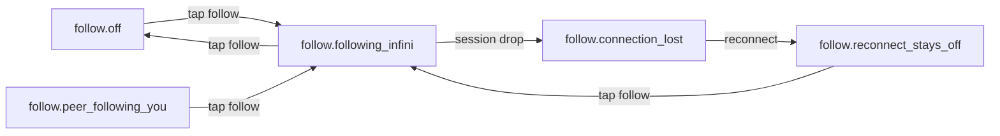

# [UI-EP-07] — Epaper viewport-follow Infini toggle

Iter-local UI design for [SRS-EP-50](../../../../.docs/modules/epaper/features/region-sync/srs-ui.md#srs-ep-50-follow-toggle). One job: opt in to matching Infini’s drawing region, or see that follow is off. **Not** a ToolChip exclusive, recognizer, or hand-tool tile. Last-writer token chrome is withdrawn ([ADR-0029](../../../../.docs/adr/ADR-0029-independent-cameras-viewport-follow.md)).

## Source

- REQ: [REQ-19](../../../../.docs/modules/epaper/prd.md#viewport-follow)
- SRS-UI: [SRS-EP-50](../../../../.docs/modules/epaper/features/region-sync/srs-ui.md#srs-ep-50-follow-toggle)
- Logic: [SRS-EP-49](../../../../.docs/modules/epaper/features/region-sync/srs-logic.md#srs-ep-49-viewport-follow)
- Quality: [SRS-EP-51](../../../../.docs/modules/epaper/features/region-sync/srs-quality.md#srs-ep-51-follow-quality)
- Story AC: [STORY-EP-053](../../stories/STORY-EP-053.md)
- Anatomy: [domain/viewport-follow](../../../../.docs/domain/viewport-follow.md)
- Handoff: [2026-08-20-sm-to-designer-viewport-follow](../../handoffs/2026-08-20-sm-to-designer-viewport-follow.md)
- Compose: ToolChip from [UI-EP-04](../../../iter-004/design/toolchip-recognizers/) (unchanged inventory). Follow is a **sibling** region.
- Experience: **N/A stub** — `region-sync` has no `srs-experience.md`. Campaign override (same as UI-EP-06): scene list = SRS-EP-50 states matrix only; do not invent popups.
- Scene graph: in-scene states on one DeviceScreen (no push / sheet / modal). Catalog = five Keep ids below.
- Reference image: none

## Platform profile

| Field | Value |
|---|---|
| Profile | **epaper-device** (reMarkable 2, Qt/QML fullscreen) |
| `data-platform` | `epaper` (SRS-EP-50). Mechanical `adlc gate` allowlist is still `ios\|android\|web\|desktop` — owned by existing CHL-0002, not relaxed here |
| Target frames | Landscape **246 mm × 187 mm** (1872×1404). Body 187×246 mm. Not phone chrome |
| Responsive strategy | per-target — one panel size; no reflow |
| Breakpoints / resize | N/A — fixed panel |
| Safe areas / fixed regions | ToolChip floats orientation-top **center** (UI-EP-04). FollowToggle floats orientation-top **trailing row**, one 10 mm tile **left of** the USB link tile (same baseline — not stacked). Debug tile is left of Follow. Not inside the chip |
| Input model | **Pen** for content; **finger** for chip + follow tile (≥10 mm). No keyboard |
| Nav paradigm | In-scene states on one surface — no push / sheet / modal |
| Target minimum | Finger-eligible **10 mm × 10 mm (1 cm)** — same as primary ToolChip tile |
| Density | compact 1-bit |
| Hover | **N/A** — no hover, no focus, no cursor, no motion |
| Preview | Navigator `data-preview-scale="mobile"` at **80%** (lock). Scene files stay 246 mm × 187 mm; do not bake scale into scenes |

**Platform kit (epaper):** press/active invert only. `:hover` and `:focus-visible` are **not designed**. Status never by color alone — invert (following) vs paper (off) vs hatch (unavailable).

## Screens / flow

Single DeviceScreen. Keep list = SRS-EP-50 states matrix. Journeys are in-scene state sequences.

Environmental hops (drop / reconnect) have no presenting control — listed in the navigator only.

## Layout regions

| Region | Parent | Contents | HTML `data-region` |
|---|---|---|---|
| DeviceScreen | panel | Full panel | `DeviceScreen` |
| InkSurface | DeviceScreen | Full-bleed ink; world crop shows local vs Infini camera | `InkSurface` |
| ToolChip | DeviceScreen | Unchanged UI-EP-04 three clusters | `ToolChip` |
| FollowToggle | DeviceScreen | Lone 10 mm icon toggle — **not** inside ToolChip | `FollowToggle` |

**Placement (this design story):** FollowToggle is a squared 1-bit cluster at orientation-top in the **trailing row** with the USB link tile: reading left-to-right **Debug | Follow Infini | USB link**. Follow sits **one tile + inset left of** USB (USB owns `right` + `chip-inset`). Same 10 mm tile and 1 px outline language as a chip cluster, separated by paper from the history cluster so it cannot be read as a fourth exclusive tool. **Do not stack Follow under USB.** ToolChip stays the UI-EP-04 centered 3-cluster row. Regions do not overlap; chip hits still win when the finger is on the chip.

## Composition / containment

| Layer | Role |
|---|---|
| InkSurface | Paper; world transform is a **settled snapshot** (no motion). Following Infini = different crop (leader camera applied). Off / peer / reconnect / lost = local crop |
| ToolChip | Exclusive tools + recognizer toggles + undo/redo. Unchanged. Publish strip linked unless session lost |
| FollowToggle | Session follow affordance. Sibling of ToolChip |

**Gap policy:** 5 mm paper between ToolChip clusters (UI-EP-04). FollowToggle uses panel trailing inset (2 mm), not a fourth grid column.

**Chrome relationship:** Follow is session chrome, not a `toolMode`. Enabling it does not arm/disarm Pen / Selection.

## Closed control inventory

| id | Kind | Notes |
|---|---|---|
| `btn.viewport_follow` | icon toggle | Off / following Infini / peer-following-you (pressing on turns Infini follow off) / unavailable when no session |

No extra follow-mode canvas overlay. No last-writer token. No region-marker chrome (camera crop is enough; a marker would fight independent cameras).

## Scene list (⊆ SRS-EP-50 — do not add)

| State id | File | When | Toggle |
|---|---|---|---|
| `follow.off` | `viewport-follow-epaper-off.html` | Default; both off; or after explicit off. Session live | off, tappable → following |
| `follow.following_infini` | `viewport-follow-epaper-following-infini.html` | `direction = infini_to_epaper` | on (invert), tappable → off |
| `follow.peer_following_you` | `viewport-follow-epaper-peer-following-you.html` | `direction = epaper_to_infini` | **off** (not dual-on), tappable → following (peer off) |
| `follow.connection_lost` | `viewport-follow-epaper-connection-lost.html` | Session dropped → forced off | hatch unavailable; 0 follow-on |
| `follow.reconnect_stays_off` | `viewport-follow-epaper-reconnect-stays-off.html` | Link back; still off until opt-in | off, tappable → following |

**States showcase (required, not a scenario):** `viewport-follow-epaper-states.html`.

**Primary / hifi:** `follow.off` (independent cameras by default).

## Interaction map (feedback)

| Control | Action | Effect | Feedback (epaper) |
|---|---|---|---|
| `btn.viewport_follow` (off, session live) | tap | → `follow.following_infini` | press invert; no hover/focus |
| `btn.viewport_follow` (following) | tap | → `follow.off` | press invert; resting invert while on |
| `btn.viewport_follow` (peer following you) | tap | → `follow.following_infini` (peer off) | press invert; resting **off** (paper) |
| `btn.viewport_follow` (no session) | tap or look | stays off/unavailable; 0 follow-on | hatch; not tappable |

AC “off/disabled” when Infini is following this tablet means **cannot stay on** (exactly one direction), not an inert control. SRS tap from peer-following-you still takes over.

## Control-states

| Control | default | pressed | following (on) | peer-off | unavailable | hover | focus |
|---|---|---|---|---|---|---|---|
| `btn.viewport_follow` | paper fill, 1 px ink | invert | invert + `aria-pressed=true` | paper (same as default), tappable | hatch, `aria-disabled` | N/A | N/A |
| ToolButton (composed) | UI-EP-04 | invert | n/a | n/a | dimmed hatch | N/A | N/A |

## Component inventory

| id | kind | reuse/build | file | region |
|---|---|---|---|---|
| FollowToggle | screen | build | `components/follow-toggle.html` | FollowToggle |
| ToolChip | screen | reuse UI-EP-04 | `components/tool-chip.html` | ToolChip |

## Icons / assets

| Icon | Kind (system \| screen) | File | Used in scenes / components |
|---|---|---|---|
| Viewport-follow | system (unique this story) | `../system/assets/icon-epaper-viewport-follow.svg` | FollowToggle — all scenes |
| Pen | system | `../system/assets/icon-epaper-pen.svg` | ToolChip |
| Selection rect | system | `../system/assets/icon-epaper-sel-rect.svg` | ToolChip |
| Selection freeform | system | `../system/assets/icon-epaper-sel-freeform.svg` | ToolChip |
| Ink-box recognition | system | `../system/assets/icon-epaper-recog-ink-box.svg` | ToolChip |
| Connector recognition | system | `../system/assets/icon-epaper-recog-connector.svg` | ToolChip |
| Undo | system | `../system/assets/icon-epaper-undo.svg` | ToolChip |
| Redo | system | `../system/assets/icon-epaper-redo.svg` | ToolChip |

Follow uses **one** glyph in every state. Pressed/on inverts the same file. Do not swap to a last-writer or token mark.

## Trace matrix

| Region / state | SRS | Story AC | Notes |
|---|---|---|---|
| FollowToggle / off | SRS-EP-50 `follow.off` | one scene per journey; icon toggle not ToolChip | primary |
| FollowToggle / following_infini | SRS-EP-50 `follow.following_infini` | — | invert + Infini crop |
| FollowToggle / peer_following_you | SRS-EP-50 `follow.peer_following_you` | toggle off/disabled (exclusion) | off + tappable takeover |
| FollowToggle / connection_lost | SRS-EP-50 `follow.connection_lost` | — | hatch; publish queued |
| FollowToggle / reconnect_stays_off | SRS-EP-50 `follow.reconnect_stays_off` | — | off; no restore |
| ToolChip | SRS-EP-05 / UI-EP-04 | not a fourth exclusive | composed unchanged |
| InkSurface crop | SRS-EP-49 apply while following | — | snapshot transform; 0 motion |

## Inter-scene navigation (relative hops)

| From scene | Control | Kind | To |
|---|---|---|---|
| `follow.off` | `btn.viewport_follow` | in-scene tap | `follow.following_infini` |
| `follow.following_infini` | `btn.viewport_follow` | in-scene tap | `follow.off` |
| `follow.peer_following_you` | `btn.viewport_follow` | in-scene tap | `follow.following_infini` |
| `follow.reconnect_stays_off` | `btn.viewport_follow` | in-scene tap | `follow.following_infini` |
| `follow.connection_lost` | — | none (unavailable) | navigator only → reconnect |

No modal / sheet / popup. Drop and reconnect are environmental — index lists them.

## SRS delta table (mandatory after HTML)

Re-read [SRS-EP-50](../../../../.docs/modules/epaper/features/region-sync/srs-ui.md#srs-ep-50-follow-toggle) after hi-fi.

| SRS item | Design (hi-fi) | Result |
|---|---|---|
| Composition DeviceScreen / FollowToggle / ToolChip | FollowToggle sibling; ToolChip 3 exclusive unchanged | match |
| Follow not inside exclusive-tool cluster | Trailing 10 mm cluster; not a 4th radio | match |
| Hit ≥ primary ToolChip tile (64 du / 10 mm) | `--follow-btn: 10mm` | match |
| Chip hits still win on the chip | Regions do not overlap | match |
| Closed inventory `btn.viewport_follow` only | One icon toggle; 0 extra overlay | match |
| `follow.off` | scene + hop to following | match |
| `follow.following_infini` | invert; Infini crop | match |
| `follow.peer_following_you` | toggle **off**; tap takes over | match |
| `follow.connection_lost` | hatch unavailable; 0 follow-on | match |
| `follow.reconnect_stays_off` | off after link-up; tap to opt in | match |
| Anti-pattern: fourth exclusive / recognizer / hand-tool | chip inventory = UI-EP-04 | match |
| Anti-pattern: hover/focus/cursor | none designed | match |
| Anti-pattern: restore on reconnect | reconnect scene off | match |
| Anti-pattern: last-writer / token chrome | 0 token paint | match |
| Anti-pattern: dual-on | peer scene toggle off | match |
| Platform epaper-device 1872×1404 1-bit | panel tokens; navigator 80% | match |
| Nav kind in-scene | relative hops on the toggle | match |
| Extra states | none | match |

## Scenes (N scenarios → N self-contained HTML files)

| Scenario | File | Complex folder? | Notes |
|---|---|---|---|
| `follow.off` | `viewport-follow-epaper-off.html` | no | **primary** → `hifi_html` |
| `follow.following_infini` | `viewport-follow-epaper-following-infini.html` | no | |
| `follow.peer_following_you` | `viewport-follow-epaper-peer-following-you.html` | no | visual = off |
| `follow.connection_lost` | `viewport-follow-epaper-connection-lost.html` | no | |
| `follow.reconnect_stays_off` | `viewport-follow-epaper-reconnect-stays-off.html` | no | |

**States showcase:** `viewport-follow-epaper-states.html`.

**Navigator:** `index.html` inlined `.scene-frame` articles, iframe `name="scene-preview"` `src="about:blank"`, sidebar `target="scene-preview"`, `data-preview-scale="mobile"` (80%).

## HTML grey-box (only if fidelity: wireframe)

| Field | Value |
|---|---|
| Requested by | n/a — hi-fi default |
| Entry HTML | — |
| Per-target files | n/a |

## Self-contained HTML components

| Name | Kind (system \| screen) | File path | Variants demoed |
|---|---|---|---|
| FollowToggle | screen | `./components/follow-toggle.html` | off; following; pressed; peer-off; unavailable |
| ToolChip | screen | `./components/tool-chip.html` | pen armed; linked; queued publish; press |

## Quality evidence

| Check | Evidence / result |
|---|---|
| Existing system discovered | UI-EP-04 chip; 1-bit tokens; promoted epaper SVGs; new follow glyph |
| Required platform frames covered | 1872×1404 landscape; navigator 80% |
| Component/state coverage | catalog + states showcase |
| Structural audit | data-region tree matches Layout regions; tokens via `var(--…)` |
| Accessibility audit | 1-bit contrast; 10 mm finger floor; labels; invert vs hatch vs paper (not color-only) |
| Reactive | press invert live; hover N/A on epaper |
| Responsive/content resilience | fixed panel |

## Open questions

- **Experience thickness:** no `srs-experience.md` on region-sync. Campaign override: painted closed SRS-EP-50 list; logged in designer→SM handoff. Do not invent popups.
- **`data-platform="epaper"`** vs gate allowlist `ios\|android\|web\|desktop`: CHL-0002. Spec follows SRS-EP-50.
- **Design index / DESIGN.md:** not updated this lane (lock: SM stitches; write set is this package + unique system files only).
- **Peer vs off look the same** on purpose (anti dual-on). Navigator labels + `aria-description` distinguish the journey.

## Gate checklist

See `html-ui-quality.md` and `ui-spec-gate.md`. Incomplete without Spec, design system, quality evidence, component `.html` files, and one scene `.html` per required scenario.
