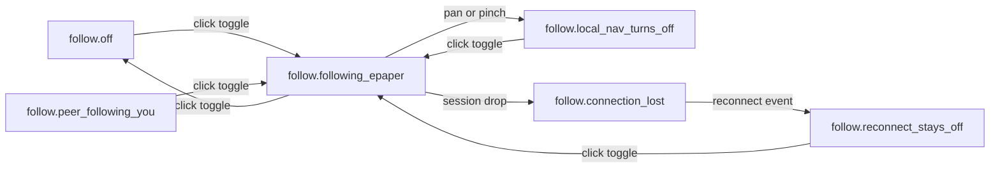

# [UI-IN-04] — Infini viewport-follow Epaper toggle

Iter-local UI design for [STORY-IN-036](../../stories/STORY-IN-036.md). One job: let the creator **opt in** to matching the connected tablet’s drawing region, or see that follow is off. HTML is a visual reference, not production Electron.

**Lock:** `.docs/DESIGN.md` and `.docs/design/index.md` are not edited this wave (SM stitches). This package **reconciles** the existing Infini contract (slate/ink, desktop hover) without forking tokens. Do not paint last-writer / token chrome ([ADR-0023](../../../../.docs/adr/ADR-0023-viewport-last-writer.md) superseded).

## Source

- REQ: [REQ-06](../../../../.docs/modules/infini/prd.md#viewport-follow)
- SRS UI: [SRS-IN-27](../../../../.docs/modules/infini/features/tablet-sync/srs-ui.md#srs-in-27-follow-toggle)
- SRS Logic: [SRS-IN-26](../../../../.docs/modules/infini/features/tablet-sync/srs-logic.md#srs-in-26-viewport-follow)
- SRS Quality: [SRS-IN-28](../../../../.docs/modules/infini/features/tablet-sync/srs-quality.md#srs-in-28-follow-quality)
- Domain: [viewport-follow](../../../../.docs/domain/viewport-follow.md)
- ADR: [ADR-0029](../../../../.docs/adr/ADR-0029-independent-cameras-viewport-follow.md)
- Story AC: [STORY-IN-036](../../stories/STORY-IN-036.md)
- Handoff: [2026-08-20-sm-to-designer-viewport-follow](../../handoffs/2026-08-20-sm-to-designer-viewport-follow.md)
- DESIGN.md: platform **desktop**, hover required
- Reference image: none
- **Not** parents: [SRS-IN-05](../../../../.docs/modules/infini/features/vector-document/srs-ui.md) (open/save), [SRS-IN-02](../../../../.docs/modules/infini/features/infinity-canvas/srs-ui.md) (canvas chrome — context only), [SRS-IN-24](../../../../.docs/modules/infini/features/tablet-sync/srs-ui.md#srs-in-24-pen-map-ui) / IN-034 (pen-button map)

## Experience bridge (campaign)

`tablet-sync` has **no** `srs-experience.md` / `srs-ui-multi-scene.md`. Campaign override (same as [UI-IN-03](../pen-button-map/ui-spec.md)): scene inventory = [SRS-IN-27](../../../../.docs/modules/infini/features/tablet-sync/srs-ui.md#srs-in-27-follow-toggle) **states matrix only**. One WindowFrame; journeys are in-scene state sequences, not push/sheet/modal. Did not invent Infini→Infini follow, a ToolChip tile, or last-writer chrome.

## Platform profile

| Field | Value |
|---|---|
| Profile | **desktop** (Electron; Infini) |
| `data-platform` | `desktop` |
| Target frames | min ~960×640 (DESIGN.md); navigator preview 1280×(vh−4rem) @ **100%** |
| Responsive strategy | Window resize; caption may hide below 960px; toggle + StatusZoom stay |
| Breakpoints / resize | World anchor = window center (UI-IN-01). No per-target HTML |
| Safe areas / fixed regions | FollowToggle + StatusZoom = trailing overlay; App mark leading. Not inside `WorldLayer` |
| Input model | pointer + keyboard; **hover required** |
| Nav paradigm | in-scene states on the existing canvas window (not a settings page, not a modal) |
| Target minimum | ≥24 px (SRS-IN-27 + desktop kit). Toggle visual hit **32 px** |
| Density | compact |
| Hover | **required** |
| Preview scale (navigator only) | `data-preview-scale="desktop"` at 100% |

## Screens / flow

| Screen | Purpose | Primary SRS |
|---|---|---|
| Infini canvas + follow toggle | Opt in to matching the tablet drawing region | [SRS-IN-27](../../../../.docs/modules/infini/features/tablet-sync/srs-ui.md#srs-in-27-follow-toggle) |

Session drop / reconnect have **no presenting control** — listed in the validation navigator. Product hops (toggle click, follower local-nav on the canvas) are relative `href`s.

## Layout regions

Region names **must match** HTML `data-region`. Tree = SRS-IN-27 + existing Electron client (SRS-IN-02) as **context**.

| Region | Parent | Contents / hierarchy | Component | States |
|---|---|---|---|---|
| WindowFrame | screen | Existing Electron client | — | default |
| CanvasStage | WindowFrame | Full-bleed interactive canvas (context; local-nav hop while following) | `.c-canvas-stage` | hover, focus, active / gesturing |
| WorldLayer | CanvasStage | Grid + figures under transform | `.c-world-layer` | local crop / applied tablet crop |
| FollowToggle | WindowFrame | Icon toggle + caption — **not** WorldLayer, Device Log, or pen-map | `.c-follow-toggle` | off, following, peer (off), unavailable |
| StatusZoom | WindowFrame | Zoom % readout (unchanged) | `.c-zoom-readout` | display |

**Placement vs StatusZoom (this design story):** trailing chrome cluster. FollowToggle sits **immediately leading** StatusZoom (top-trailing). 8 px gap. Neither covers the other. App mark stays top-leading. Follow is session chrome, not a tool.

**Containment:** FollowToggle is a child of WindowFrame. It does not pan with the world.

**Chrome relationship:** contrastive overlay (same family as StatusZoom — quiet chrome on slate paper). Not a card cluster (DESIGN.md banned).

**Optional drawing-region marker:** **omit**. SRS allows reuse only if it does not imply always-on match. Camera crop (world transform + zoom %) already shows apply-vs-local. A persistent region outline would read as shared picture.

## Closed control inventory

| id | Kind | Notes |
|---|---|---|
| `btn.viewport_follow` | icon toggle | Off / following Epaper / peer-following-you (pressing on turns Epaper follow off) / unavailable when no session |

No extra follow-mode canvas overlay. No ToolChip. No pen-map. No last-writer token.

## Component inventory

| Component | Kind | Source | Pattern id / CSS class | Variant / props | Used in regions |
|---|---|---|---|---|---|
| ViewportFollowToggle | system | build | `.c-follow-toggle` | off, hover, focus, active, pressed-on, peer, disabled | FollowToggle |
| FollowChrome | screen | build | `.c-follow-cluster` | with/without caption | FollowToggle |
| CanvasStage | screen | reuse UI-IN-01 | `.c-canvas-stage` | grab / grabbing | CanvasStage |
| ZoomReadout | screen | reuse UI-IN-01 | `.c-zoom-readout` | display | StatusZoom |
| WorldLayer | screen | reuse UI-IN-01 | `.c-world-layer` | transform | WorldLayer |

## Tokens used

Closed semantic set — [`tokens.json`](./tokens.json) / [`tokens.css`](./tokens.css). Subset of `.docs/design/tokens.json`. No invented danger hex. Following uses `primary` fill + caption text (not color alone). Unavailable uses opacity + caption + offline icon.

## Design system readiness

| Check | Evidence |
|---|---|
| DESIGN.md reconciled | `.docs/DESIGN.md` v0.1.0 — Infini slate/ink, desktop hover; **not edited** this wave |
| Project tokens valid | copied 1:1 into package subset + `--target-desktop` / `--follow-hit` |
| tokens.css generated | package `tokens.css` matches project roles |
| Component catalog complete | five rows → self-contained `.html` |
| Pattern-only reuse | scenes copy `.c-follow-toggle` / canvas classes |

## States (required)

| State id | Trigger | UI behaviour | AC / SRS |
|---|---|---|---|
| `follow.off` | Default; both off; or after explicit off. Session live | Toggle `aria-pressed=false`; caption “Follow off”; local camera 100% | REQ-06 / SRS-IN-27 |
| `follow.following_epaper` | `direction = epaper_to_infini` | Toggle on; caption “Following Epaper”; world crop = tablet viewport | REQ-06 |
| `follow.peer_following_you` | `direction = infini_to_epaper` | **This toggle is off** (not dual-on); caption “Epaper is following you”; click → following (peer off) | story AC off/disabled = visually off, still tappable |
| `follow.local_nav_turns_off` | Infini pan/pinch while following | Toggle off; canvas grabbing; crop stays where the gesture left it | REQ-06 local-nav |
| `follow.connection_lost` | Session dropped | Toggle unavailable/disabled; caption “No session”; follow off | REQ-06 |
| `follow.reconnect_stays_off` | Link back | Toggle enabled, still off; caption “Reconnected — follow stays off” | REQ-06 |

## Control states & reactivity (required)

Pointer profile: hover + focus-visible + active required. Proof: `viewport-follow-infini-states.html`.

| Control | hover* | focus-visible | active/press | disabled | loading | selected | error | Showcase file |
|---|---|---|---|---|---|---|---|---|
| `btn.viewport_follow` | ✓ | ✓ | ✓ | ✓ (no session) | — | `aria-pressed` when following | — | `viewport-follow-infini-states.html` |
| CanvasStage (local-nav) | ✓ grab | ✓ | ✓ grabbing | — | — | gesturing | — | `viewport-follow-infini-states.html` |

\* Desktop: hover required. Disabled still has live CSS. Peer is **not** disabled — click turns Epaper follow off.

## Interaction map

| Control | Action | Destination | Side-effect | Feedback | Nav kind |
|---|---|---|---|---|---|
| `btn.viewport_follow` (off, session live) | click | `follow.following_epaper` | set `epaper_to_infini`; Epaper follow off | hover lift · press tint · focus ring | in-scene |
| `btn.viewport_follow` (following) | click | `follow.off` | set `none` | same | in-scene |
| `btn.viewport_follow` (peer following you) | click | `follow.following_epaper` | turns Epaper follow off | same | in-scene |
| `btn.viewport_follow` (no session) | click or look | stays `connection_lost` | 0 follow-on | disabled; caption | — |
| CanvasStage while following | pan / pinch | `follow.local_nav_turns_off` | follower local-nav sets `none` | grabbing cursor | in-scene |
| Session drop | event | `follow.connection_lost` | force `none` | toggle unavailable | session-event (navigator) |
| Reconnect | event | `follow.reconnect_stays_off` | still `none` | toggle off, enabled | session-event (navigator) |

## Interaction & a11y

- Focus order: FollowToggle → CanvasStage. StatusZoom is not focusable.
- Keyboard: Enter/Space on toggle (native button/`role=button` link). Canvas focus-visible ring.
- Accessible names: see Copy table. Peer uses `aria-description` **and** visible caption.
- Contrast: ink on surface ≥4.5:1; primary button + onPrimary; focus ring ≥3:1.
- Targets: toggle 32×32 (≥24). ≥8 px from StatusZoom.
- Color independence: pressed fill **plus** caption **plus** `aria-pressed` **plus** distinct peer/offline icons.
- 200% zoom: trailing cluster wraps; caption may clip; toggle remains hittable.

## Copy

Draft for PM adopt — SRS-IN-27 has no copy table. Not written into `.docs/modules/**`.

| Key | String |
|---|---|
| `copy.follow.aria.off` | Follow Epaper |
| `copy.follow.aria.on` | Following Epaper |
| `copy.follow.aria.peer` | Follow Epaper |
| `copy.follow.aria.peer_desc` | Epaper is following you. Click to follow the tablet instead. |
| `copy.follow.aria.unavailable` | Follow Epaper unavailable |
| `copy.follow.caption.off` | Follow off |
| `copy.follow.caption.on` | Following Epaper |
| `copy.follow.caption.peer` | Epaper is following you |
| `copy.follow.caption.lost` | No session — follow off |
| `copy.follow.caption.reconnect` | Reconnected — follow stays off |
| `copy.follow.caption.local_nav` | Local pan turned follow off |
| `copy.follow.canvas` | Infinity canvas |
| `copy.follow.legend.off` | Independent cameras. Click follow to match the tablet. |
| `copy.follow.legend.on` | Infini applies the tablet viewport. Click follow to stop, or pan to turn off. |
| `copy.follow.legend.peer` | Epaper is following this window. This toggle stays off (exactly one direction). |
| `copy.follow.legend.local` | Pan/pinch while following turns follow off. Canvas stays here. |
| `copy.follow.legend.lost` | Connection lost. Follow is off and will not restore. |
| `copy.follow.legend.reconnect` | Session is back. Follow stays off until you opt in. |

## Trace matrix

| Region / state | SRS | Story AC | Notes |
|---|---|---|---|
| FollowToggle / off | SRS-IN-27 `follow.off` | icon toggle on desktop | not document chrome, not IN-034 |
| FollowToggle / following | `follow.following_epaper` | opt-in match tablet | `aria-pressed=true` |
| FollowToggle / peer | `follow.peer_following_you` | Infini toggle off (exactly one direction) | tappable → following |
| FollowToggle / local-nav | `follow.local_nav_turns_off` | pan while following → off | canvas hop |
| FollowToggle / lost | `follow.connection_lost` | auto off | unavailable |
| FollowToggle / reconnect | `follow.reconnect_stays_off` | does not restore | enabled off |
| StatusZoom | SRS-IN-02 / SRS-IN-27 | coexist | not covered |
| CanvasStage | SRS-IN-02 context | local-nav | not a follow overlay |

## SRS delta table (after HTML)

Re-read [SRS-IN-27](../../../../.docs/modules/infini/features/tablet-sync/srs-ui.md#srs-in-27-follow-toggle).

| SRS item | Design | Result |
|---|---|---|
| Region WindowFrame | `data-region="WindowFrame"` | match |
| Region FollowToggle | trailing cluster, WindowFrame child | match |
| Region StatusZoom | trailing, after toggle | match |
| Placement vs StatusZoom | design story: toggle leading zoom | match (decision recorded) |
| `btn.viewport_follow` icon toggle | `.c-follow-toggle` | match |
| Off / following / peer | three visual treatments; peer is off | match |
| `follow.off` | `viewport-follow-infini-off.html` | match |
| `follow.following_epaper` | `viewport-follow-infini-following-epaper.html` | match |
| `follow.peer_following_you` | `viewport-follow-infini-peer-following-you.html` | match |
| `follow.local_nav_turns_off` | `viewport-follow-infini-local-nav-turns-off.html` | match |
| `follow.connection_lost` | `viewport-follow-infini-connection-lost.html` | match |
| `follow.reconnect_stays_off` | `viewport-follow-infini-reconnect-stays-off.html` | match |
| Hit ≥24 px | 32 px visual | match |
| Hover required | `:hover` + focus-visible + active | match |
| Not inside WorldLayer | overlay cluster | match |
| Not Device Log / pen-map | no those controls | match |
| Not ToolChip / hand-tool tile | icon toggle only | match |
| No Infini→Infini follow | omitted | match |
| No last-writer chrome | omitted | match |
| No dual-on | peer scene toggle `aria-pressed=false` | match |
| No restore on reconnect | reconnect scene off | match |
| Drawing-region marker | omit (would imply always-on match) | omit — allowed |
| Extra follow overlay | none | match |
| Copy table | drafted in Spec only | gap-policy: PM adopt |
| `srs-experience.md` | campaign override | gap-policy: not thickened |

## Scenes (N scenarios → N self-contained HTML files)

| Scenario | File | Complex folder? | Notes |
|---|---|---|---|
| `follow.off` | `viewport-follow-infini-off.html` | no | primary → `hifi_html` |
| `follow.following_epaper` | `viewport-follow-infini-following-epaper.html` | no | toggle → off; canvas → local-nav |
| `follow.peer_following_you` | `viewport-follow-infini-peer-following-you.html` | no | toggle off; click → following |
| `follow.local_nav_turns_off` | `viewport-follow-infini-local-nav-turns-off.html` | no | after pan |
| `follow.connection_lost` | `viewport-follow-infini-connection-lost.html` | no | unavailable |
| `follow.reconnect_stays_off` | `viewport-follow-infini-reconnect-stays-off.html` | no | enabled off |

**States showcase (required):** `viewport-follow-infini-states.html`.

**Navigator:** `index.html` inlined `.scene-frame` articles, iframe `name="scene-preview"` `src="about:blank"`, `data-preview-scale="desktop"` at 100% (`min-height: 28rem`).

## HTML grey-box

n/a — fidelity hifi; no low-fi request.

## Icons / assets

| Icon | Kind | File | Used in |
|---|---|---|---|
| Follow (off) | system | `../system/assets/icon-viewport-follow-infini.svg` | off, local-nav, reconnect, states |
| Follow (on) | system | `../system/assets/icon-viewport-follow-infini-on.svg` | following, states |
| Follow (peer) | system | `../system/assets/icon-viewport-follow-infini-peer.svg` | peer, states |
| Follow (offline) | system | `../system/assets/icon-viewport-follow-infini-offline.svg` | connection-lost, states |

Unique names — not `icon-epaper-viewport-follow.svg`.

## Self-contained HTML components

| Name | Kind | File path | Variants demoed |
|---|---|---|---|
| ViewportFollowToggle | system | `../system/components/viewport-follow-toggle-infini.html` | off, hover, focus, press, on, peer, disabled |
| FollowChrome | screen | `./components/follow-chrome-infini.html` | cluster + StatusZoom |
| CanvasStage | screen | `./components/canvas-stage.html` | grab / grabbing |
| ZoomReadout | screen | `./components/zoom-readout.html` | display |
| WorldLayer | screen | `./components/world-layer.html` | figures |

## Quality evidence

| Check | Evidence / result |
|---|---|
| Existing system discovered | Infini tokens + UI-IN-01 canvas; UI-IN-03 settings is a different surface |
| Required platform frames covered | desktop 960×640 min; navigator 100% |
| Component/state coverage | toggle × off/on/peer/disabled + canvas grab |
| Structural audit | regions match SRS; no Device Log / pen-map invent |
| Accessibility audit | names, caption, 32 px hit, focus ring, not color-alone |
| Responsive/content resilience | caption hides <960; toggle stays |

## Open questions

None blocking. Copy table is Spec-drafted for PM adopt (not a CHL — SRS allowed Designer to place vs StatusZoom; copy was unspecified).

Experience stub: same campaign override as UI-IN-03 / UI-EP-07 — logged in designer→SM handoff.

## Gate checklist

See `html-ui-quality.md` and `ui-spec-gate.md`. Index row deferred to SM (lock).
