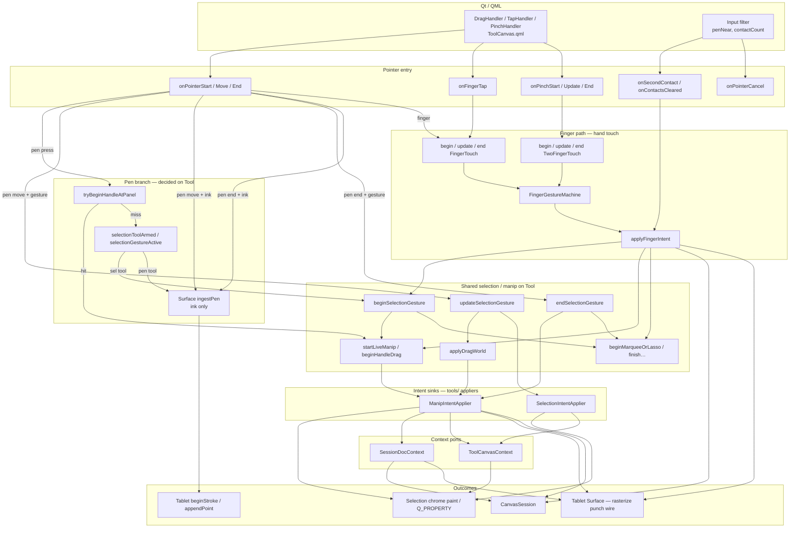

# ToolCanvasItem — event routing

ToolCanvas owns pointer/finger interaction and selection chrome. TabletCanvas owns
document ink, rasterize, and the sync wire. They share one `CanvasSession`.

**Target architecture (ADR-0033):** `ToolCanvasItem` + `tools::InputHub` are the
Interaction Router. Modes / Operations / HandTouch live under
[`epaper/drawing/tools/`](tools/). Design notes:
[`.docs/memory/epaper-tool-system-refactor.md`](../../.docs/memory/epaper-tool-system-refactor.md).

Phase 0–5: contracts + InputHub; Pen/Ink; Selection/Marquee/Lasso; HandTouch dispatch;
Move/Resize via ManipHost + HitTarget knob regions; DocContext/ToolContext adapters +
intent appliers (`applySelectionIntent` / `applyManipIntent` delegate to `tools/`).

Input enters through `ToolCanvas.qml` handlers (and a few `Input` Connections in
`Main.qml`). **Tool decides** whether a stylus sample is selection/handle work or
ink; only ink is forwarded with `ingestPen`.

## Normal paths

### Pen ink (pen tool)
Stylus with exclusive tool `pen` (and no active selection gesture):

`onPointer*(pen)` → `ingestPen` → `ingestMappedTablet` → `applyContactPress` →
`beginStroke` / `appendPoint` / `endStroke`.

Tablet ingest is **ink-only**. Stash + origin guard stay on that path.

### Pen marquee / lasso / pick-move (selection tool)
Stylus with `sel_rect` / `sel_freeform`. Handled entirely on Tool — no Tablet hop:

| Phase | Call chain |
|---|---|
| Press | `onPointerStart(pen)` → `tryBeginHandleAtPanel` **or** `beginSelectionGesture` → `startLiveManip` / `beginMarqueeOrLasso` |
| Drag | `onPointerMove(pen)` → `updateSelectionGesture` → marquee/lasso update **or** `applyDragWorld` |
| Release | `onPointerEnd(pen)` → `endSelectionGesture` → `finishMarqueeOrLasso` / `commitLiveManip` |

### Finger select / deselect
Capacitive tap with hand-touch armed:

`onFingerTap` (or short drag) → `beginFingerTouch` / `endFingerTouch` →
`FingerGestureMachine` → `applyFingerIntent` → may `setExclusiveTool(sel_freeform)`,
`beginSelectionGesture`, `clearSelection`, `refreshSelectionChrome`.

### Finger move / resize / marquee
Armed finger drag:

`onPointerStart(finger)` → `beginFingerTouch` → machine intents →
`beginSelectionGesture` / handle resize / marquee.

While locked to live manip or marquee:

`onPointerMove(finger)` → `updateFingerTouch` → (if live manip)
`updateSelectionGesture` → `applyDragWorld`.

Release: `endFingerTouch` → settle pan or `endSelectionGesture`.

### Two-finger pan / pinch
`PinchHandler` → `onPinch*` → `begin/update/endTwoFingerTouch` → camera via
`applyCameraRegion`. Aborts one-finger manip first.

### Pen near / second finger
`Main.qml` → `cancelHandTouch` + `cancelInteraction` / `onSecondContact` so
navigation outranks an in-flight one-finger manip without DragHandler.

Live manip suppress: Tool writes `CanvasSession::liveManipSuppressIds` and paints
the live ghost via `DocumentRenderer::renderSubtree`; Tablet rasterize omits those ids.

## Shared vs separate

### Same selection pipeline, two entry doors
`beginSelectionGesture` / `updateSelectionGesture` / `endSelectionGesture` are
shared. **Who calls them**:

- **Finger:** pointer → finger machine → `applyFingerIntent` → selection API.
- **Pen:** pointer → handle/selection branch on Tool → selection API directly.

No Tool → Tablet → Tool round trip for selection.

### Pen never uses `updateFingerTouch`
Pen selection moves call `updateSelectionGesture` from `onPointerMove`. Finger
live-manip moves still go `updateFingerTouch` → (machine) → `updateSelectionGesture`.

### Handle hit on both devices
Press: pen and finger both can call `tryBeginHandleAtPanel` (different hit sizes:
`kHandleHitDu` vs `kFingerHandleHitDu`). After that, pen continues via
`onPointerMove(pen)`; finger via `updateFingerTouch`.

### Ink vs selection is decided on Tool press
`onPointerStart(pen)` order: handle → selection tool → else `ingestPen`. Once a
selection gesture is active, move/end stay on Tool even if the exclusive tool
changes mid-gesture until `endSelectionGesture`.
