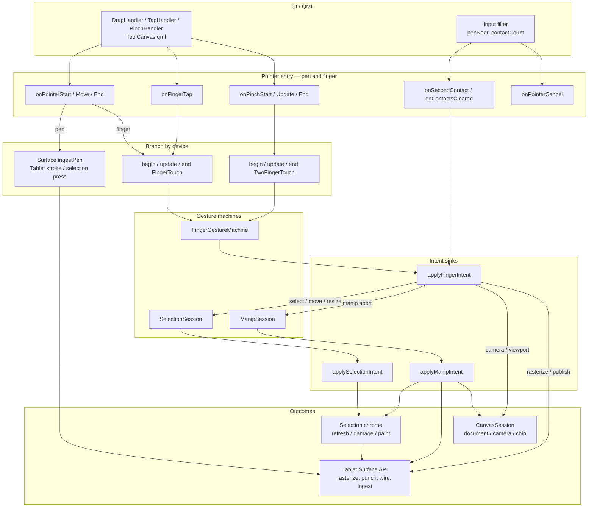

# ToolCanvasItem — event routing

ToolCanvas owns pointer/finger interaction and selection chrome. TabletCanvas owns
document ink, rasterize, and the sync wire. They share one `CanvasSession`; Tool
calls Tablet only through the Surface API.

Input enters through `ToolCanvas.qml` handlers (and a few `Input` Connections in
`Main.qml`), not through Tablet.

## Use cases

### Pen ink
User draws with the stylus. `onPointerStart/Move/End` see `pen=true` and call
`TabletCanvasItem::ingestPen`. Tool does not run the finger machine. Live ink and
`append_ink` stay on Tablet.

### Finger select / deselect
User taps a SmartGroup (or empty canvas) with hand-touch armed. `onFingerTap` or
finger drag runs `beginFingerTouch` → `endFingerTouch`. `FingerGestureMachine`
returns intents; `applyFingerIntent` may force `sel_freeform`, start a selection
gesture, clear selection, and refresh chrome. Knobs/enclose update via
`refreshSelectionChrome` → QML properties.

### Finger move / resize
User grabs a selected box or a knob. Press resolves to live manip
(`startLiveManip` / `beginHandleDrag`). Moves go
`updateFingerTouch` → `updateSelectionGesture` → `applyDragWorld` →
`applyManipIntent`. Tablet punches the origin hole (`notifyOriginPunch`); Tool
paints the live ghost; Infini gets `publishManipPreview`.

### Marquee / lasso
Empty press in a selection tool starts `beginMarqueeOrLasso`. Drag updates the
overlay path; release runs `finishMarqueeOrLasso` → selection set → chrome.

### Two-finger pan / pinch
`PinchHandler` drives `onPinch*`. One-finger manip is aborted; `FingerGestureMachine`
two-finger path updates the camera through `applyCameraRegion` on the session.
Tablet rasterizes because it listens to `cameraChanged`.

### Pen near / second finger
`Main.qml` Connections call `cancelHandTouch` or `onSecondContact` so navigation
outranks an in-flight one-finger manip without going through DragHandler.
